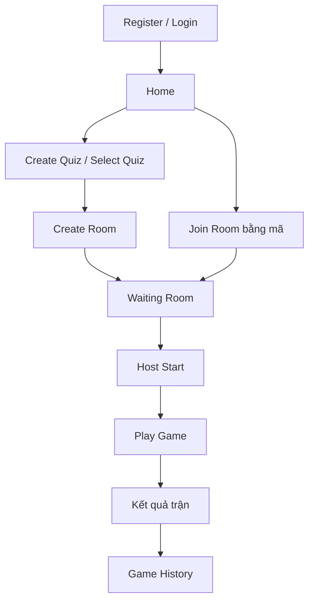
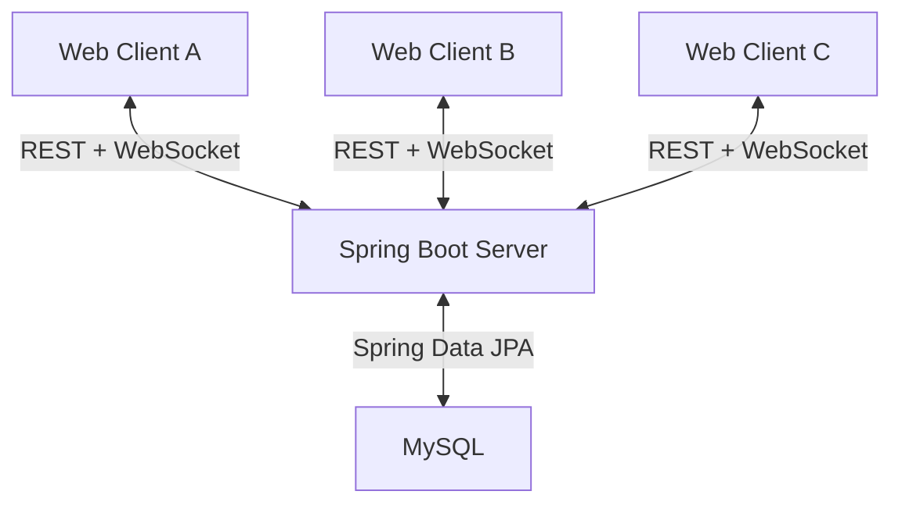
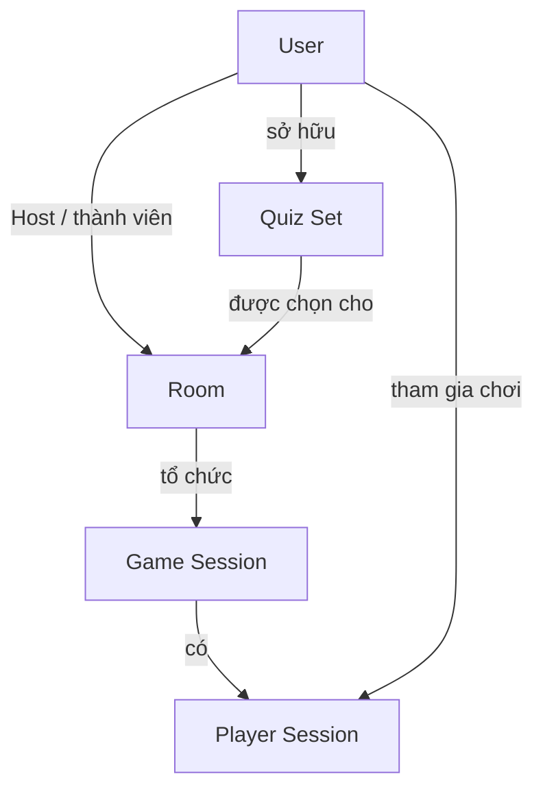
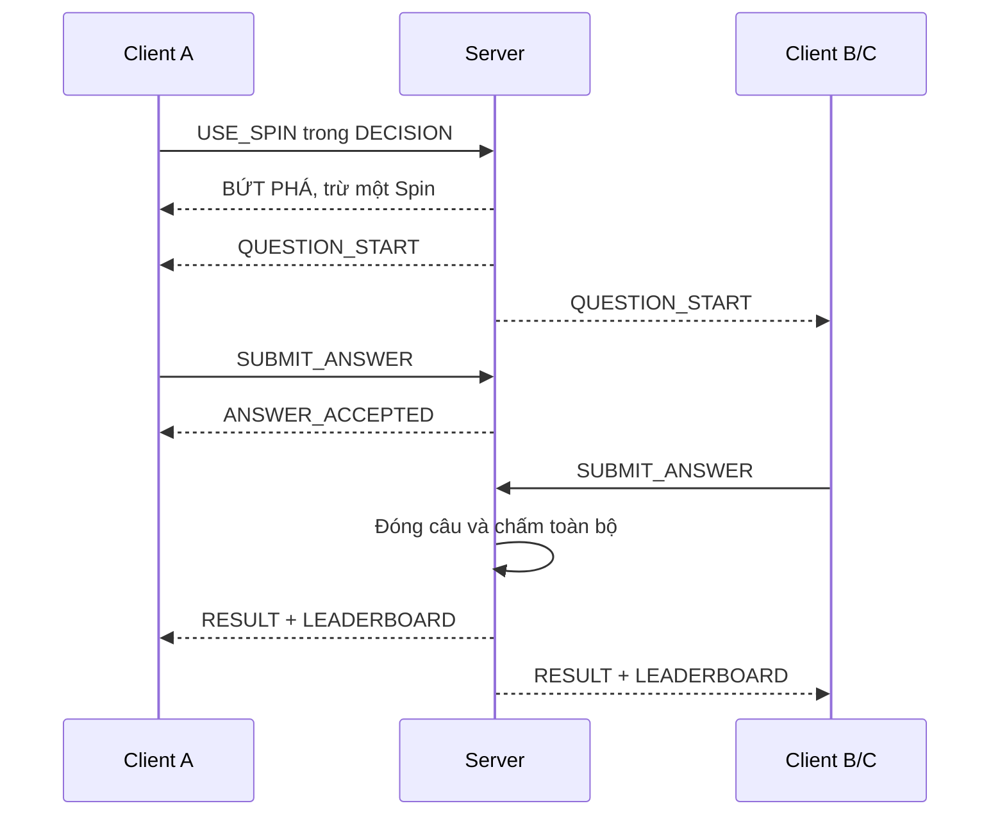

# TASKS — Quiz Client/Server: cập nhật sau triển khai

## Trạng thái và cách chạy

Người dùng xác nhận đã thực hiện các task của project và yêu cầu cập nhật sau triển khai ngày 07/10/2026. Đây là một đợt sửa liên quan nhiều task, không chạy lại tuần tự Task 0–15. Mức hoàn thành theo người dùng khác evidence đã kiểm chứng: xem [project-status](docs/project-status.md); Task 15 trước cập nhật vẫn PARTIAL về LAN/hồ sơ môn/contribution. Giữ lịch sử kiểm thử và yêu cầu các task bên dưới để tham chiếu; không scaffold lại. Không tự commit/push.

Phạm vi cập nhật: Task 2/5/7/8/9/10/11A/12/13/14/15; Task 6 giữ công thức. Gợi ý model lịch sử không tự đổi cấu hình. Cho phép sửa phần liên quan nhiều task để nghiệm thu yêu cầu này; quy tắc chỉ chạy task được giao áp dụng cho lần giao task riêng.

## Phạm vi bản sửa

- Tinh gọn phần đọc tài liệu, cập nhật docs và chạy kiểm tra trong tất cả prompt.
- Giữ package-by-feature, task ID/thứ tự, gameplay, API scope, concurrency, transaction, idempotency/reconnect và tiêu chí nghiệm thu.
- Docs phát triển chỉ ghi thông tin cần cho task sau; báo cáo/sơ đồ/kết quả thực nghiệm đầy đủ hoàn thiện ở Task 15.
- Không giảm test correctness hoặc bỏ kiểm chứng MySQL khi thay persistence/transaction. Không cam kết task sẽ xong trong thời gian cố định.
- Phụ lục Overview nguồn giữ nguyên. Khi tài liệu môn trong project có yêu cầu cụ thể, áp dụng đúng yêu cầu đó; không coi mức tải hay số lượt đo do bộ task đề xuất là ngưỡng bắt buộc của thầy.

## Quy tắc chung từ Task 2.5 trở đi

### Nguồn chuẩn và xử lý mâu thuẫn

Khi có mâu thuẫn, áp dụng thứ tự sau trong đúng phạm vi:

1. Gameplay đã được người dùng chốt trong Overview / docs/gameplay-rules.md. Bản trích phải khớp nguồn; nếu có cập nhật người dùng mới hơn, ghi quyết định có nguồn và đồng bộ hai bản. Nếu chưa biết bản nào mới hơn hoặc hai nguồn cùng mức mâu thuẫn, hỏi đúng điểm đó.
2. Requirement bắt buộc của task hiện tại về phạm vi và nghiệm thu. Không hiểu requirement task là quyền thay gameplay hoặc đổi quyết định nền tảng không liên quan.
3. docs/implementation-decisions.md đối với implementation đã freeze. Nếu task đòi hỏi thay lựa chọn đã freeze, phải có blocker/lỗi thực tế hoặc yêu cầu người dùng và ghi lý do; không thay âm thầm.
4. Technical Design V2 nếu có.
5. Proposal nếu có.
6. Code hiện tại hoặc suy luận của AI. Code là bằng chứng hành vi đang có, không tự trở thành luật nghiệp vụ nếu trái nguồn chuẩn.

docs/rest-api-contract.md và docs/websocket-contract.md là bản canonical cho giao tiếp đã triển khai. Task thêm/sửa API phải cập nhật contract và code cùng lần thay đổi; không cho phép contract trái gameplay. Khi contract và code khác nhau, đối chiếu nguồn để sửa, không tùy ý chọn bản thuận tiện. Tài liệu môn gốc, nếu có, là căn cứ cho yêu cầu môn/nộp bài; không coi lời đối chiếu trong Overview là đã đọc trực tiếp tài liệu môn.

Nếu thiếu business rule quyết định điểm, quyền hoặc Winner, dừng đúng phần phụ thuộc, hỏi người dùng và tiếp tục phần độc lập. Quyết định kỹ thuật thông thường tự thực hiện trong phạm vi được giao. Không yêu cầu người dùng tự tạo contract hay file chuẩn bị.

### Cách làm tập trung, docs ngắn và kiểm tra theo ảnh hưởng

**Đọc:** đọc AGENTS.md áp dụng, prompt task hiện tại, trạng thái gần nhất và quyết định kiến trúc liên quan. Source/contract/Overview chỉ đọc phần phục vụ module đang sửa; đọc rộng hơn khi cần lần theo dependency hoặc tái hiện lỗi có căn cứ. Task 0 khảo sát ban đầu, Task 13–14 kiểm tra toàn hệ thống và Task 15 đối chiếu môn/bàn giao là các ngoại lệ cần đọc rộng hơn. Không đọc lại toàn bộ TASKS/Overview hoặc dò mọi file ở mỗi task.

**Docs phát triển:** project-status cập nhật một mục ngắn cho task (kết quả, test/evidence, blocker/chưa kiểm chứng). implementation-decisions chỉ thêm quyết định mới hoặc thay đổi quan trọng, không chép lại lựa chọn đã freeze. Contract REST/WS cập nhật đúng endpoint/message/field/quyền/error vừa đổi; đủ type/required/nullability/scope và ví dụ khi hữu ích, không viết hàng chục JSON lặp. Không tạo roadmap/doc/nhật ký debug mới; lỗi đã sửa tóm tắt trong kết quả task. README chỉ sửa lệnh/config/hướng dẫn chạy thực sự đổi. Không cập nhật course checklist mỗi task nếu không có yêu cầu môn hoặc bằng chứng mới.

**Test:** trong lúc sửa chạy test liên quan; khi ổn chạy build và kiểm tra regression phù hợp một lượt trên diff cuối. Unit test thuần không yêu cầu MySQL/Server. Khi thay Repository, transaction, constraint, mapping hoặc Spring wiring/REST/WS integration, chạy kiểm tra tương ứng; MySQL thật bắt buộc để tuyên bố persistence/constraint/transaction đã đạt. Task 13 chạy suite hệ thống, Task 14 chạy regression cho lỗi mới và Task 15 kiểm tra run/experiment/bàn giao. Không chạy full suite, startup Server hoặc đọc toàn log nhiều lần khi code/config không đổi và không có mối lo chưa giải quyết. Thay đổi mới/lỗi mới thì chạy lại phần bị ảnh hưởng.

Không tắt/bỏ test bắt buộc để nhanh hơn; không giả kết quả test/experiment. Thiếu môi trường ghi rõ và chuẩn bị lệnh tái lập, không dùng H2/mock để tuyên bố MySQL đã kiểm chứng. Không retry dependency/DB timeout vô hạn; tìm nguyên nhân, báo blocker nếu không giải quyết được trong phạm vi. Lưu evidence đủ, không chép toàn log vào Markdown.

**Task 15:** README/báo cáo technical paper, sơ đồ, bảng đối chiếu contribution/evidence, experimental setup/results/discussion/references và checklist nộp bài theo tài liệu môn phải đầy đủ. Quy tắc docs ngắn trong lúc phát triển không được dùng để lược bỏ tài liệu nộp thầy hoặc số liệu thật. Giữ log/CSV ngay khi đo để không mất evidence; trình bày hoàn chỉnh ở task cuối.

**Dừng:** chỉ làm task được gửi. Khi nghiệm thu đạt, báo kết quả ngắn và dừng; không mở rộng refactor hoặc tự làm task sau. Một task được DONE không tự biến các flow LAN/experiment chưa chạy thành đã kiểm chứng.

### Package theo feature

Giữ base package và tên main Application hiện có. Main Application ở package gốc để scan các feature bên dưới; không tự đổi namespace hoặc artifactId.

| Package | Chủ sở hữu và subpackage khi có class |
|---|---|
| common | config/exception/response/util thật sự dùng chung; không chứa nghiệp vụ |
| auth | controller/service/dto/request/dto/response/security cho xác thực REST/WS |
| user | entity/repository/enums/service/dto thuộc danh tính User |
| quiz | entity/repository/enums/service/controller/dto/request/dto/response |
| room | entity/repository/enums/service/controller/dto/request/dto/response |
| game | entity/repository/enums/service/engine/controller/dto; runtime/model khi có state thuần game |
| realtime | websocket/message/command/message/event/message/common/session/timer/idempotency/connection |

Không tạo global entity/repository/enums/service/controller/dto chứa các nghiệp vụ lẫn nhau. Subpackage layer bên trong từng feature được phép. Không tạo package rỗng, class placeholder hoặc service/interface vô dụng chỉ để đủ sơ đồ. REST DTO mới dùng dto/request và dto/response trong feature; không di chuyển WebSocket message vào đó. DTO là dữ liệu giao tiếp, không trả JPA Entity trực tiếp ra API.

Enum thuộc domain nào đặt ở domain đó; không tạo global enums. common chỉ chứa phần có nhu cầu dùng chung thật. Configuration WebSocket thuộc realtime/websocket; configuration authentication thuộc auth/security; không sao chép cùng cấu hình vào common/security và auth/security. Nếu source đã có cấu hình dùng chung thì chọn một nơi sở hữu và ghi rõ.

### Mapping domain bắt buộc đối chiếu với source

| Loại class hiện có | Đích sở hữu |
|---|---|
| User / UserRepository / enum của User | user/entity, user/repository, user/enums |
| Quiz, Question / repository / visibility, status | quiz/entity, quiz/repository, quiz/enums |
| Room, RoomMember / repository / RoomState, membership enum | room/entity, room/repository, room/enums |
| GameSession, GameMember, PlayerSession, GameQuestion, Answer, UserActiveGame | game/entity; repository và enum tương ứng trong game |
| ScoreEngine, Ranking, input/output scoring thuần | game/engine; subpackage model nếu có nhu cầu |
| Game lifecycle, scoring orchestration, history, snapshot nghiệp vụ | game/service; game/controller và game/dto khi có REST |
| WebSocket adapter và wire command/event/envelope | realtime/websocket và realtime/message |
| Queue, ingress sequencer, timer, replay cache, socket registry | realtime/session, timer, idempotency, connection |

Đây là mapping theo trách nhiệm, không phải yêu cầu tạo tất cả class. Tên và số class lấy từ source thật; không tạo bản thứ hai của Entity hoặc Repository để hợp sơ đồ.

### Ranh giới game và realtime

game chứa nghiệp vụ, state/runtime thuần game, Score Engine, ranking và orchestration persistence. realtime chứa transport và runtime hạ tầng: connection, tuần tự hóa command/timer, scheduler, replay cache. realtime adapter có thể gọi service/use-case của game, room, auth; không chứa bảng điểm hoặc tự cập nhật entity thay nghiệp vụ.

ScoreEngine input → output độc lập, không dùng WebSocket, scheduler, Repository, network DTO hoặc random Spin. game/service điều phối transaction và gọi engine. Snapshot dữ liệu game dựng ở game/service + game/dto; realtime chuyển thành wire snapshot/event.

Không để game/service phụ thuộc concrete WebSocket handler/message transport rồi realtime handler lại phụ thuộc game/service tạo vòng DI. Khi cần callback cho scheduler/event sink/processor, dùng ranh giới nhỏ có nhu cầu thực tế hoặc cơ chế Spring sẵn có; không xây hệ interface lớn. Event/model thuần nghiệp vụ không import wire command/event. Queue điều phối tuần tự nhưng transaction/scoring vẫn thuộc service nghiệp vụ. Kiểm tra không có circular bean dependency và không bật allow-circular-references để che lỗi.

### Contract canonical và thời điểm hoàn thiện

- docs/rest-api-contract.md: method/path, auth/quyền, request/response field/type/required/nullability, status/error code, scope dữ liệu, side effects. Không ghi password hash hoặc correctAnswer vào public response.
- docs/websocket-contract.md: raw WS/STOMP đã chọn, URL/destination, cách auth của browser, type/target/questionIndex/requestId, scope private/room/game, payload, ACK/error/event, revision/ordering, deadline/server time và retry.
- Task 2.5 tạo/cập nhật phần thực tế đã có; phần chưa triển khai chỉ ghi PLANNED theo task, không giả có endpoint/message.
- Task 3 chốt và triển khai auth REST/WS cùng endpoint/handshake cơ sở, không gameplay. Task 4 REST Quiz; Task 5 REST Room + Waiting WS; Task 8 Start/lifecycle contract; Task 9 gameplay; Task 10 reconnect; Task 11B history/cancel/cleanup. Frontend luôn đọc hai contract và báo mismatch.
- Task không thay communication contract thì không sửa contract chỉ để tạo diff. Không duplicate source chuẩn vào README hoặc chat; README liên kết hai file canonical.

### Freeze quyết định kỹ thuật

docs/implementation-decisions.md có bảng: decision, value, status PROPOSED/FROZEN/PENDING, task/source, lý do, điều kiện kiểm tra. Freeze phần đã có bằng chứng; không coi công nghệ chưa chọn là đã freeze.

- Task 2.5 freeze package architecture, stack frontend hiện có, migration tool, test framework và Clock/time abstraction đã thực sự có/chốt. Không đổi tool để refactor.
- Task 3 freeze authentication và raw WS/STOMP khi triển khai auth handshake. Nếu đã freeze từ Task 0 thì dùng lại.
- Task 7 freeze chi tiết monotonic duration/epoch deadline/clock test và ingress ordering. Mốc deadline của phase bắt đầu lúc Server mở phase.
- Task 9/10 freeze scope fingerprint/retry retention và snapshot revision theo contract thực tế.
- Task sau chỉ đổi quyết định nền tảng vì blocker/lỗi có bằng chứng hoặc người dùng yêu cầu. Ghi reason, phần chịu ảnh hưởng và kiểm tra lại; không tự đổi framework/version/transport vì sở thích.

Không thêm DDD framework, hexagonal nhiều tầng, CQRS, Event Sourcing, Redis, Kafka, microservice, multi-module Maven, distributed lock hoặc failover chỉ để tổ chức package.

### Hai điểm gameplay chưa đủ nguồn trong file được gửi

Overview mục 8.9 chưa chốt ưu tiên khi câu cuối đồng thời có ONE_SURVIVOR/ALL_ELIMINATED và COMPLETED; có final ranking khi ALL_ELIMINATED nhưng chưa nói rõ có Official Winner hay chỉ standings. Không tự coi hai lựa chọn này là người dùng đã xác nhận. Tìm quyết định có nguồn trong project trước; nếu vẫn thiếu, hỏi và ghi PENDING. Không chặn Task 2.5/3/4 vì các điểm này. Task 8 và các flow Final phụ thuộc phải chờ xác nhận đúng phần này.

## TASK 0–7: các task đã hoàn thành

Các prompt 0–7 đã được tinh gọn để tham chiếu, không phải yêu cầu chạy lại hoặc thay evidence đã có. Trạng thái DONE do người dùng xác nhận. Phần từ Task 8 là công việc còn lại.

## TASK 0 Đọc repository và thống nhất tối thiểu trước code

**Trạng thái: DONE theo người dùng — chỉ tham chiếu, không chạy lại.**

Model gợi ý: Astra / High

```text
Khảo sát ban đầu là ngoại lệ cần đọc rộng; docs chuẩn bị vừa đủ dùng, không viết trước báo cáo cuối hoặc contract chưa triển khai. Trạng thái hiện tại đã DONE: chỉ dùng prompt này nếu người dùng giao lại riêng.
Đọc AGENTS.md áp dụng, prompt task hiện tại và quy tắc làm tập trung trong TASKS.md; đọc trạng thái gần nhất và quyết định kiến trúc liên quan, không khảo sát lại toàn project. Đối chiếu source/contract/Overview đúng phần cần sửa; gặp mâu thuẫn gameplay chưa chốt thì hỏi đúng điểm đó và tiếp tục phần độc lập.
Giữ Web Client + REST/WebSocket + Spring Boot + JPA + MySQL, Localhost/LAN, một Server/DB, package-by-feature và stack đã freeze. Server quyết định gameplay; Host là quyền Room. Giữ bảng điểm, Recovery xét basePenalty, effect mới không áp dụng câu tạo streak; không thêm Cloud/Redis/Kafka/failover.
Tái sử dụng code thật; tự implement và kiểm tra đúng task, không yêu cầu tôi chuẩn bị file thủ công. Không nâng dependency, refactor diện rộng hoặc tạo contract giả. Quyết định kỹ thuật mới ghi ngắn gọn; dùng tài liệu chính thức khi cần xác minh API/version.
Thực hiện TASK 0 cho Competitive Multiplayer Network Quiz System.
Tôi có thể chỉ đặt TASKS.md này vào một project trống. File đã chứa Overview nguồn ở cuối; bạn tự đọc và tự chuẩn bị, không yêu cầu tôi tạo thêm tài liệu thiết kế.
Tìm và đọc AGENTS.md nếu có, file task và Overview (tên có thể khác). Nếu chỉ có file Overview riêng mà chưa có TASKS.md, dùng Overview đó và tự tạo TASKS.md theo 16 bước: 0 khảo sát; 1 scaffold; 2 DB; 3 auth; 4 quiz; 5 room; 6 scoring; 7 queue/timer; 8 lifecycle; 9 WS/idempotency; 10 reconnect; 11 UI; 12 history/cancel/cleanup; 13 test; 14 review; 15 experiment/bàn giao. Không ghi đè TASKS.md đã có.
Proposal, Technical Design V2, Topics, Instruction, Submission và README là tài liệu bổ sung nếu có. Liệt kê tài liệu thiếu; không giả định đã đọc và không dừng chỉ vì thiếu chúng. Chưa có tài liệu môn thì checklist ghi yêu cầu chưa đối chiếu trực tiếp, không xác nhận đã đạt môn.
Kiểm tra toàn bộ source, build, frontend, DB, authentication, REST/WS, game logic và test. Nếu project trống, ghi rõ bắt đầu mới. Không đánh dấu module có code là đã chạy đúng.
Tạo docs/project-status.md, docs/implementation-decisions.md và docs/course-requirements-checklist.md. Tự trích đủ gameplay, toàn bộ bảng điểm và Recovery từ Overview thành docs/gameplay-rules.md; kiểm tra bản trích không đổi luật. Giữ tài liệu gốc. Dùng TASKS.md làm task chính, không tạo roadmap trùng.
Chọn kỹ thuật tối giản theo source hiện có: frontend, auth REST/WS, raw WS hoặc STOMP, module, migration, format command/ACK/error/event, thời gian, test. Nếu project trống, tự chọn stack đơn giản phù hợp nhóm sinh viên và ghi lý do; không bắt tôi chọn framework trước khi bắt đầu.
Lập bảng các điểm phải xử lý ở task tương ứng: Host eliminated vẫn Cancel; Start atomic cùng Room/chéo Room; USER_ACTIVE_GAME gồm Spectator; idempotency Room trước khi có GameSession; fingerprint type/target/index/payload; ingress ordering command/timer; stale timer no-op; snapshot có revision và đầy đủ theo phase; runtime/broadcast chỉ sau DB commit; failure policy hữu hạn; Answer ACCEPT chưa chấm khi Cancel.
Ghi các luật còn chưa chốt thật sự ảnh hưởng kết quả (ví dụ ưu tiên endReason nếu nguồn chưa chốt), không tự thêm gameplay. Vẫn hoàn thành phần khảo sát không phụ thuộc.
TASK 0 chỉ khảo sát và tạo tài liệu. Không scaffold, triển khai gameplay, nâng dependency hoặc chạy migration thay đổi DB. Kết thúc nêu Task 1 sẽ làm gì theo trạng thái repo thật.

Chỉ hoàn thành task đang được giao. Không tự chuyển task sau.
Chạy test liên quan trong lúc sửa; sau diff cuối chạy build/regression phù hợp một lượt. Kiểm chứng MySQL/REST/WS khi task tác động chúng; không lặp full suite/startup đã đạt nếu code không đổi. Giữ các kiểm tra bắt buộc của task, không giả kết quả hoặc dùng H2/mock để tuyên bố MySQL đạt; thiếu môi trường ghi rõ.
Docs: project-status thêm kết quả task ngắn; decisions chỉ ghi quyết định mới; contract chỉ sửa phần API/message thay đổi; README chỉ sửa lệnh/config đổi. Không tạo doc mới khi chưa cần; file chuẩn bắt buộc còn thiếu thì tạo tối thiểu. Không chép nhật ký debug. Báo bằng tiếng Việt: phần làm, file chính, lệnh/kết quả, blocker/chưa kiểm chứng và một flow ngắn. DONE khi nghiệm thu đạt, thiếu thì PARTIAL/BLOCKED; dừng, không tự commit/push hoặc chuyển task.

```

Nghiệm thu: biết trạng thái source thật, có danh sách task và điểm kỹ thuật cần xử lý; chưa cần tài liệu API dài cho mọi module.

## TASK 1 Cấu hình project chạy được

**Trạng thái: DONE theo người dùng — chỉ tham chiếu, không chạy lại.**

Model gợi ý: Sol / Medium

```text
Đọc/sửa build, config và hướng dẫn chạy liên quan; nghiệm thu startup với MySQL thật khi khả dụng. Không chép lại các docs kiến trúc không đổi.
Đọc AGENTS.md áp dụng, prompt task hiện tại và quy tắc làm tập trung trong TASKS.md; đọc trạng thái gần nhất và quyết định kiến trúc liên quan, không khảo sát lại toàn project. Đối chiếu source/contract/Overview đúng phần cần sửa; gặp mâu thuẫn gameplay chưa chốt thì hỏi đúng điểm đó và tiếp tục phần độc lập.
Giữ Web Client + REST/WebSocket + Spring Boot + JPA + MySQL, Localhost/LAN, một Server/DB, package-by-feature và stack đã freeze. Server quyết định gameplay; Host là quyền Room. Giữ bảng điểm, Recovery xét basePenalty, effect mới không áp dụng câu tạo streak; không thêm Cloud/Redis/Kafka/failover.
Tái sử dụng code thật; tự implement và kiểm tra đúng task, không yêu cầu tôi chuẩn bị file thủ công. Không nâng dependency, refactor diện rộng hoặc tạo contract giả. Quyết định kỹ thuật mới ghi ngắn gọn; dùng tài liệu chính thức khi cần xác minh API/version.
Thực hiện TASK 1 dựa trên trạng thái và quyết định của TASK 0.
Tạo hoặc sửa cấu hình Spring Boot, JPA, MySQL, build và Web Client theo repo hiện có.
Giữ version tương thích của project; không nâng cấp dependency hàng loạt.
Tạo cấu hình mẫu không chứa credential thật, hướng dẫn DB và lệnh chạy.
Cho phép localhost và cấu hình LAN theo môi trường; không mở origin vô điều kiện.
Kiểm tra build và khởi động Server; phân biệt build thành công với kết nối MySQL thành công.
Chỉ hoàn thành task đang được giao. Không tự chuyển task sau.
Chạy test liên quan trong lúc sửa; sau diff cuối chạy build/regression phù hợp một lượt. Kiểm chứng MySQL/REST/WS khi task tác động chúng; không lặp full suite/startup đã đạt nếu code không đổi. Giữ các kiểm tra bắt buộc của task, không giả kết quả hoặc dùng H2/mock để tuyên bố MySQL đạt; thiếu môi trường ghi rõ.
Docs: project-status thêm kết quả task ngắn; decisions chỉ ghi quyết định mới; contract chỉ sửa phần API/message thay đổi; README chỉ sửa lệnh/config đổi. Không tạo doc mới khi chưa cần; file chuẩn bắt buộc còn thiếu thì tạo tối thiểu. Không chép nhật ký debug. Báo bằng tiếng Việt: phần làm, file chính, lệnh/kết quả, blocker/chưa kiểm chứng và một flow ngắn. DONE khi nghiệm thu đạt, thiếu thì PARTIAL/BLOCKED; dừng, không tự commit/push hoặc chuyển task.

```

Nghiệm thu: build được; Server chạy với MySQL khi có DB; README có hướng dẫn tái lập.

## TASK 2 Database và constraints

Cập nhật sau triển khai 07/10/2026: Flyway V3 đổi default Decision thành7000ms và Room DRAFT/WAITING cũ; không sửa V1/V2 hoặc snapshot Game ACTIVE/FINISHED. Không thêm bảng cho UI.

**Trạng thái: DONE theo người dùng — chỉ tham chiếu, không chạy lại.**

Model gợi ý: Sol / High

```text
Đọc schema/migration/entity/repository và constraints liên quan; MySQL thật là kiểm tra trọng tâm. ERD/schema phải đúng; trình bày báo cáo chi tiết để Task 15, không bỏ constraint test.
Đọc AGENTS.md áp dụng, prompt task hiện tại và quy tắc làm tập trung trong TASKS.md; đọc trạng thái gần nhất và quyết định kiến trúc liên quan, không khảo sát lại toàn project. Đối chiếu source/contract/Overview đúng phần cần sửa; gặp mâu thuẫn gameplay chưa chốt thì hỏi đúng điểm đó và tiếp tục phần độc lập.
Giữ Web Client + REST/WebSocket + Spring Boot + JPA + MySQL, Localhost/LAN, một Server/DB, package-by-feature và stack đã freeze. Server quyết định gameplay; Host là quyền Room. Giữ bảng điểm, Recovery xét basePenalty, effect mới không áp dụng câu tạo streak; không thêm Cloud/Redis/Kafka/failover.
Tái sử dụng code thật; tự implement và kiểm tra đúng task, không yêu cầu tôi chuẩn bị file thủ công. Không nâng dependency, refactor diện rộng hoặc tạo contract giả. Quyết định kỹ thuật mới ghi ngắn gọn; dùng tài liệu chính thức khi cần xác minh API/version.
Thực hiện TASK 2.
Triển khai schema/migration và entity/repository cho USER, QUIZ, QUESTION,
ROOM, ROOM_MEMBER, GAME_SESSION, GAME_MEMBER, PLAYER_SESSION, GAME_QUESTION,
ANSWER, USER_ACTIVE_GAME theo Overview và decisions đã ghi.
Enforce FK, NOT NULL, enum/value hợp lệ và uniqueness đúng nghiệp vụ.
Một Answer chỉ liên kết PlayerSession và GameQuestion của cùng GameSession.
PLAYER_SESSION phải tương ứng GAME_MEMBER có participation PLAYER.
Chốt trạng thái membership và hành vi Leave rồi Join lại với UNIQUE(room,user).
Giữ elimination trong lịch sử; không cascade xóa lịch sử khi sửa/xóa Quiz.
Lưu snapshot nội dung/cấu hình; reference ảnh phải ổn định.
Chốt biểu diễn Answer đã ACCEPT nhưng chưa scoring khi Cancel, không gán sai CORRECT/WRONG.
Cung cấp ERD và schema đúng với implementation; test các constraint quan trọng trên MySQL.
GAME_QUESTION có UNIQUE(game_session_id,order_index). Chốt answer_status gồm trạng thái ACCEPTED_UNSCORED hoặc tương đương; timestamp nullable khi NO_ANSWER; thời gian tính bằng ms. Snapshot cả Momentum/Recovery và giữ dấu vết elimination.
Chỉ hoàn thành task đang được giao. Không tự chuyển task sau.
Chạy test liên quan trong lúc sửa; sau diff cuối chạy build/regression phù hợp một lượt. Kiểm chứng MySQL/REST/WS khi task tác động chúng; không lặp full suite/startup đã đạt nếu code không đổi. Giữ các kiểm tra bắt buộc của task, không giả kết quả hoặc dùng H2/mock để tuyên bố MySQL đạt; thiếu môi trường ghi rõ.
Docs: project-status thêm kết quả task ngắn; decisions chỉ ghi quyết định mới; contract chỉ sửa phần API/message thay đổi; README chỉ sửa lệnh/config đổi. Không tạo doc mới khi chưa cần; file chuẩn bắt buộc còn thiếu thì tạo tối thiểu. Không chép nhật ký debug. Báo bằng tiếng Việt: phần làm, file chính, lệnh/kết quả, blocker/chưa kiểm chứng và một flow ngắn. DONE khi nghiệm thu đạt, thiếu thì PARTIAL/BLOCKED; dừng, không tự commit/push hoặc chuyển task.

```

Nghiệm thu: schema tạo được, không Answer chéo trận/duplicate; lịch sử không phụ thuộc nội dung Quiz đang sửa.

## TASK 2.5 Chuẩn hóa cấu trúc codebase trước khi tiếp tục

**Trạng thái: DONE theo người dùng — chỉ tham chiếu, không chạy lại.**

Model gợi ý: Sol / High. Nếu gặp dependency vòng phức tạp chưa giải quyết được, có thể dùng Astra / High để review đúng phần đó.

```text
Chỉ thực hiện TASK 2.5 của Competitive Multiplayer Network Quiz System.
Tôi đã hoàn thành Task 0–2 theo xác nhận; chưa chạy Task 3.
Đọc AGENTS.md áp dụng, phần Task 2.5/quy tắc kiến trúc, trạng thái gần nhất,
quyết định kiến trúc và source/reference bị ảnh hưởng bởi refactor.
Contract/README chỉ đọc khi có reference liên quan; không đọc lại toàn Overview.
Giữ trạng thái 0–2; kiểm tra source/evidence thật, không giả đã kiểm chứng.

1. Khảo sát trước khi sửa
- Đọc source production, test, build, cấu hình và migration hiện có.
- Xác định base package/main Application, các class/package hiện tại,
  Spring scanning, Entity scanning, Repository scanning, JPQL DTO constructor,
  reflection/class name trong config và test.
- Đọc git status/diff nếu là repository; bảo toàn sửa đổi có sẵn của người dùng.
- Chạy build/tests hiện có làm baseline nếu môi trường cho phép.
  Ghi lỗi có trước và thiếu DB/tool; không sửa lỗi bằng cách bỏ/disable test.
- Lập bảng Old package/class → New package/class dựa trên trách nhiệm.
  Ghi mapping vào Codebase Architecture trong implementation-decisions.

2. Refactor thật theo package-by-feature
- Giữ base package và main Application ở root hiện có.
- User/entity/repository/enum → user; Quiz/Question → quiz;
  Room/RoomMember → room; GameSession/GameMember/PlayerSession/GameQuestion/
  Answer/UserActiveGame → game. Entity, repository, enum ở subpackage của feature.
- Thành phần auth nếu đã có → auth; không implement login/JWT mới.
- Common chỉ cho config/exception/response/util dùng chung thật.
- Game rule, score/ranking thuần → game/engine nếu đã có;
  game orchestration/history/snapshot → game/service và game/dto.
- WS adapter/wire message → realtime/websocket và realtime/message;
  queue/timer/idempotency/connection → realtime subpackage tương ứng nếu đã có.
- Thực hiện di chuyển class, sửa package/import, reference và test tương ứng.
  Không để bản class cũ trùng bản mới hoặc tồn tại global-layer nghiệp vụ.
- REST DTO có sẵn vào feature/dto/request hoặc response; wire DTO ở realtime/message.
- Không tạo class/package rỗng hoặc implementation của task chưa chạy.
- Không tạo dependency vòng game ↔ concrete WS. Đối chiếu ranh giới trong TASKS.md;
  không bật allow-circular-references hoặc interface thừa để che lỗi.

3. Bảo toàn hành vi và persistence
- Không đổi gameplay, bảng điểm, table/column/entity name, FK/constraint,
  Enum persisted values/thứ tự ordinal, cascade, query semantics, REST behavior.
- Khi JPQL/config có fully-qualified class name cũ, sửa đúng package mới.
- Giữ @Entity name và entity/repository discover đúng sau đổi Java package.
- Không đổi migration đã chạy, không tạo/chạy migration mới chỉ vì package.
  Không reset DB, không dùng ddl-auto=create/create-drop/update để sửa scan lỗi.
- So sánh migration/schema trước–sau; package refactor không sinh diff schema.
- Nếu phát hiện lỗi nghiệp vụ/schema có trước, ghi backlog đúng task sở hữu;
  không tự mở rộng refactor sang sửa business/schema. Sửa lỗi package/import/scan
  do refactor trong Task 2.5; lỗi khác gây blocker thì báo rõ.
- Không implement Authentication, gameplay WS, Score Engine, Room feature hoặc UI mới.
  Không nâng dependency, đổi frontend/transport/migration tool hay khởi tạo project lại.

4. Cập nhật tài liệu trong phạm vi
- docs/project-status.md: giữ Task 0–2 và phân biệt DONE theo người dùng với evidence;
  thêm Task 2.5, lệnh/kết quả thật, phần chưa kiểm chứng và Task 3 kế tiếp.
- docs/implementation-decisions.md: thêm Codebase Architecture, mapping, owners,
  game/realtime boundary, DTO convention, dependency direction và freeze status.
- docs/rest-api-contract.md và docs/websocket-contract.md: ghi contract đã có thật;
  phần chưa có ghi PLANNED theo task. Không bịa endpoint hoặc triển khai gameplay.
- Không chép lại gameplay hoặc đồng loạt tạo roadmap trùng TASKS.md.

5. Kiểm tra sau refactor
- Chạy lại build/tests phù hợp bằng tool/version hiện có.
- Kiểm tra không còn import/reference package cũ ngoài mapping/lịch sử tài liệu;
  mỗi Entity/Repository đúng một class; không circular bean dependency.
- Nếu MySQL/test DB có sẵn, startup với schema hiện có bằng chế độ an toàn:
  xác nhận Entity/Repository discover đúng, không apply pending migration ngoài task.
  Kiểm tra cấu hình startup trước khi chạy, không làm mất dữ liệu.
- Không có MySQL thì compile/unit test vẫn làm; ghi startup/JPA integration
  CHƯA KIỂM CHỨNG và lệnh để chạy lại. Không dùng H2/mock để khẳng định MySQL đã đạt.
- DONE khi build/tests bắt buộc đạt và refactor được kiểm chứng không phá scan/runtime
  theo kiểm tra khả dụng; thiếu kiểm tra startup/JPA bắt buộc thì PARTIAL.
  Lỗi baseline chưa giải quyết gây blocker cũng phải báo, không ghi DONE giả.

6. Báo cáo bằng tiếng Việt rồi dừng
- Mapping thực tế, file đã di chuyển/thay đổi và cấu trúc sau refactor.
- Lệnh/kết quả trước–sau, MySQL startup đã kiểm chứng hay chưa.
- Xác nhận không đổi gameplay/schema/migration; blocker nếu có.
- File docs đã cập nhật, trạng thái Task 2.5 và điều kiện để chạy Task 3.
Không tự chạy Task 3. Không tự commit/push. Không yêu cầu tôi di chuyển class thủ công.
```

Nghiệm thu: class theo feature, mapping có thật, build/tests đạt, không duplicate Entity/Repository, scan được kiểm chứng trong điều kiện khả dụng; không đổi schema/gameplay. Startup/MySQL chưa kiểm chứng phải ghi riêng, không tuyên bố DONE đầy đủ nếu còn thiếu kiểm tra bắt buộc.

## TASK 3 Authentication và permission

**Trạng thái: DONE theo người dùng — chỉ tham chiếu, không chạy lại.**

Model gợi ý: Sol / High

```text
Tập trung auth/security/user và WS handshake; dùng policy context cho module gameplay chưa có. Test auth REST/WS/MySQL liên quan một lượt sau diff cuối, không dựng Game Engine mới.
Đọc AGENTS.md áp dụng, prompt task hiện tại và quy tắc làm tập trung trong TASKS.md; đọc trạng thái gần nhất và quyết định kiến trúc liên quan, không khảo sát lại toàn project. Đối chiếu source/contract/Overview đúng phần cần sửa; gặp mâu thuẫn gameplay chưa chốt thì hỏi đúng điểm đó và tiếp tục phần độc lập.
Giữ Web Client + REST/WebSocket + Spring Boot + JPA + MySQL, Localhost/LAN, một Server/DB, package-by-feature và stack đã freeze. Server quyết định gameplay; Host là quyền Room. Giữ bảng điểm, Recovery xét basePenalty, effect mới không áp dụng câu tạo streak; không thêm Cloud/Redis/Kafka/failover.
Tái sử dụng code thật; tự implement và kiểm tra đúng task, không yêu cầu tôi chuẩn bị file thủ công. Không nâng dependency, refactor diện rộng hoặc tạo contract giả. Quyết định kỹ thuật mới ghi ngắn gọn; dùng tài liệu chính thức khi cần xác minh API/version.
Thực hiện TASK 3.
Package: auth/controller, auth/service, auth/dto/request và response, auth/security; User Entity/Repository vẫn ở user. Không tạo Account Entity trùng User.
Hoàn thiện auth REST và auth handshake/endpoint WS cơ sở theo transport đã chọn; freeze lựa chọn này nếu chưa chốt. Chưa triển khai gameplay WS của Task 9.
Permission matrix có các trạng thái Player/Game chưa được triển khai thì tách policy test bằng context thuần; test tích hợp thực sự với lifecycle/gameplay hoàn thiện ở Task 8–10/13, không tạo full Game Engine trong Task 3 để test quyền. Ghi rõ mức bằng chứng.
Cập nhật REST Register/Login/Logout và WS browser authentication, unauthorized/expired/logout behavior trong hai contract canonical.
Triển khai Register/Login/Logout và authentication context REST/WebSocket theo lựa chọn đã ghi.
Hash password; không serialize password_hash hoặc tin userId trong message.
Chốt cách trình duyệt truyền auth khi mở WebSocket, lỗi hết hạn và logout.
Kiểm tra quyền theo User, Room, GameMember, PlayerState và phase.
Host + ELIMINATED vẫn có quyền Cancel; mất quyền Answer/Spin/Star.
Test User không thuộc Room/Game, không phải Host, tài khoản giả và kết nối chưa auth.
Chỉ hoàn thành task đang được giao. Không tự chuyển task sau.
Chạy test liên quan trong lúc sửa; sau diff cuối chạy build/regression phù hợp một lượt. Kiểm chứng MySQL/REST/WS khi task tác động chúng; không lặp full suite/startup đã đạt nếu code không đổi. Giữ các kiểm tra bắt buộc của task, không giả kết quả hoặc dùng H2/mock để tuyên bố MySQL đạt; thiếu môi trường ghi rõ.
Docs: project-status thêm kết quả task ngắn; decisions chỉ ghi quyết định mới; contract chỉ sửa phần API/message thay đổi; README chỉ sửa lệnh/config đổi. Không tạo doc mới khi chưa cần; file chuẩn bắt buộc còn thiếu thì tạo tối thiểu. Không chép nhật ký debug. Báo bằng tiếng Việt: phần làm, file chính, lệnh/kết quả, blocker/chưa kiểm chứng và một flow ngắn. DONE khi nghiệm thu đạt, thiếu thì PARTIAL/BLOCKED; dừng, không tự commit/push hoặc chuyển task.

```

Nghiệm thu: đúng User cho cả REST/WS; không thể giả danh hoặc Start/Cancel trái quyền.

Nghiệm thu kiến trúc: class đúng feature, không tạo global-layer nghiệp vụ hoặc dependency vòng; contract canonical khớp code khi có thay đổi API/message.


## TASK 4 Quiz CRUD và sample data

**Trạng thái: DONE theo người dùng — chỉ tham chiếu, không chạy lại.**

Model gợi ý: Sol / Medium

```text
Tập trung quiz/service/repository/controller/DTO/image và contract Quiz; test permission/validation/history preservation liên quan, không rerun mọi gameplay test chưa bị ảnh hưởng.
Đọc AGENTS.md áp dụng, prompt task hiện tại và quy tắc làm tập trung trong TASKS.md; đọc trạng thái gần nhất và quyết định kiến trúc liên quan, không khảo sát lại toàn project. Đối chiếu source/contract/Overview đúng phần cần sửa; gặp mâu thuẫn gameplay chưa chốt thì hỏi đúng điểm đó và tiếp tục phần độc lập.
Giữ Web Client + REST/WebSocket + Spring Boot + JPA + MySQL, Localhost/LAN, một Server/DB, package-by-feature và stack đã freeze. Server quyết định gameplay; Host là quyền Room. Giữ bảng điểm, Recovery xét basePenalty, effect mới không áp dụng câu tạo streak; không thêm Cloud/Redis/Kafka/failover.
Tái sử dụng code thật; tự implement và kiểm tra đúng task, không yêu cầu tôi chuẩn bị file thủ công. Không nâng dependency, refactor diện rộng hoặc tạo contract giả. Quyết định kỹ thuật mới ghi ngắn gọn; dùng tài liệu chính thức khi cần xác minh API/version.
Thực hiện TASK 4.
Package: Quiz/Question Entity/Repository/Enum/Service/Controller và REST DTO trong quiz. Không return Entity trực tiếp hoặc lộ correctAnswer qua mapper/serializer.
Cập nhật docs/rest-api-contract.md cho Create/List/Get/Edit/Delete Quiz, auth/scope, field validation, owner view và public metadata view; image upload/access nếu triển khai.
Triển khai tạo/sửa/xóa/xem Quiz theo PUBLIC/PRIVATE và quyền Owner.
Question có đúng 4 options, đúng một correctAnswer A/B/C/D; ảnh tùy chọn.
Non-owner của PUBLIC Quiz chỉ được metadata/sử dụng, không được lấy correctAnswer qua REST.
PRIVATE chỉ Owner quản lý/sử dụng. Không hard delete làm hỏng lịch sử.
Tạo sample data đủ tối thiểu 3 tài khoản Player và một Quiz 10 câu của tài khoản Author khác.
Tác giả không được chơi Quiz tự tạo nhưng được Host Spectate.
Nếu có ảnh, hoàn thiện lưu/truy cập để snapshot không bị thay thế; không bỏ optional image đã chốt.
Ghi contract thực tế và test quyền/validation.
Chỉ hoàn thành task đang được giao. Không tự chuyển task sau.
Chạy test liên quan trong lúc sửa; sau diff cuối chạy build/regression phù hợp một lượt. Kiểm chứng MySQL/REST/WS khi task tác động chúng; không lặp full suite/startup đã đạt nếu code không đổi. Giữ các kiểm tra bắt buộc của task, không giả kết quả hoặc dùng H2/mock để tuyên bố MySQL đạt; thiếu môi trường ghi rõ.
Docs: project-status thêm kết quả task ngắn; decisions chỉ ghi quyết định mới; contract chỉ sửa phần API/message thay đổi; README chỉ sửa lệnh/config đổi. Không tạo doc mới khi chưa cần; file chuẩn bắt buộc còn thiếu thì tạo tối thiểu. Không chép nhật ký debug. Báo bằng tiếng Việt: phần làm, file chính, lệnh/kết quả, blocker/chưa kiểm chứng và một flow ngắn. DONE khi nghiệm thu đạt, thiếu thì PARTIAL/BLOCKED; dừng, không tự commit/push hoặc chuyển task.

```

Nghiệm thu: Quiz dùng được; không rò đáp án; đủ sample data để demo đúng luật Author.

Nghiệm thu kiến trúc: class đúng feature, không tạo global-layer nghiệp vụ hoặc dependency vòng; contract canonical khớp code khi có thay đổi API/message.


## TASK 5 Room, thành viên và Host

Cập nhật sau triển khai 07/10/2026: Decision cố định7000ms khi create/edit/Start và Room quay về WAITING; Answer vẫn theo Room config.

**Trạng thái: DONE theo người dùng — chỉ tham chiếu, không chạy lại.**

Model gợi ý: Sol / High

```text
Tập trung Room/membership và Waiting WS; giữ race/rollback/duplicate test cần thiết, không triển khai Start/scoring/timer hoặc viết lại mọi contract.
Đọc AGENTS.md áp dụng, prompt task hiện tại và quy tắc làm tập trung trong TASKS.md; đọc trạng thái gần nhất và quyết định kiến trúc liên quan, không khảo sát lại toàn project. Đối chiếu source/contract/Overview đúng phần cần sửa; gặp mâu thuẫn gameplay chưa chốt thì hỏi đúng điểm đó và tiếp tục phần độc lập.
Giữ Web Client + REST/WebSocket + Spring Boot + JPA + MySQL, Localhost/LAN, một Server/DB, package-by-feature và stack đã freeze. Server quyết định gameplay; Host là quyền Room. Giữ bảng điểm, Recovery xét basePenalty, effect mới không áp dụng câu tạo streak; không thêm Cloud/Redis/Kafka/failover.
Tái sử dụng code thật; tự implement và kiểm tra đúng task, không yêu cầu tôi chuẩn bị file thủ công. Không nâng dependency, refactor diện rộng hoặc tạo contract giả. Quyết định kỹ thuật mới ghi ngắn gọn; dùng tài liệu chính thức khi cần xác minh API/version.
Thực hiện TASK 5.
Package: room/entity, repository, enums, service, controller và REST DTO. Waiting Room wire command/event/adapter trong realtime/message và realtime/websocket, dùng auth/transport Task 3.
Hoàn thiện Waiting Room networking ở task này; Task 9 mở rộng gameplay, không viết lại transport.
Pre-game request scope và fingerprint được ghi contract; implement room-scoped serialization/dedup cho side effect đang có, chuẩn bị để Task 8 Start dùng cùng boundary. Chưa tạo GameSession gameplay ở Task 5.
Cập nhật REST Create/Get/List/Edit/Open/Close và WS Join/Leave/Remove/RoomUpdated theo kênh thực tế đã chọn, bao gồm danh sách thành viên và quyền dữ liệu.
Triển khai DRAFT/WAITING/ACTIVE/CLOSED; create/edit/open/close/join/leave/remove theo quyền/state.
Host có RoomMember; có thể lưu nhiều Draft và chọn Participate/Spectate trước Start.
Room ACTIVE không đổi Quiz/config/participation và không thêm Player vào trận hiện tại.
Chốt đồng bộ Room để Join/Leave/config không chen vào Start làm sai roster snapshot.
Room chỉ một ACTIVE Game; User chỉ một ACTIVE Game gồm Host Spectator.
Chốt scope requestId cho command theo Room, đặc biệt START_GAME chưa có gameSessionId.
Triển khai và ghi request/response/broadcast của Waiting Room.
Chỉ hoàn thành task đang được giao. Không tự chuyển task sau.
Chạy test liên quan trong lúc sửa; sau diff cuối chạy build/regression phù hợp một lượt. Kiểm chứng MySQL/REST/WS khi task tác động chúng; không lặp full suite/startup đã đạt nếu code không đổi. Giữ các kiểm tra bắt buộc của task, không giả kết quả hoặc dùng H2/mock để tuyên bố MySQL đạt; thiếu môi trường ghi rõ.
Docs: project-status thêm kết quả task ngắn; decisions chỉ ghi quyết định mới; contract chỉ sửa phần API/message thay đổi; README chỉ sửa lệnh/config đổi. Không tạo doc mới khi chưa cần; file chuẩn bắt buộc còn thiếu thì tạo tối thiểu. Không chép nhật ký debug. Báo bằng tiếng Việt: phần làm, file chính, lệnh/kết quả, blocker/chưa kiểm chứng và một flow ngắn. DONE khi nghiệm thu đạt, thiếu thì PARTIAL/BLOCKED; dừng, không tự commit/push hoặc chuyển task.

```

Nghiệm thu: quản lý Room đúng state; roster/cấu hình có thể khóa nhất quán khi Start.

Nghiệm thu kiến trúc: class đúng feature, không tạo global-layer nghiệp vụ hoặc dependency vòng; contract canonical khớp code khi có thay đổi API/message.


## TASK 6 Score Engine độc lập và test bảng luật

**Trạng thái: DONE theo người dùng — chỉ tham chiếu, không chạy lại.**

Model gợi ý: Sol / High

```text
Chỉ engine/model/enum và test thuần. Chạy test engine rồi build/unit regression phù hợp; không startup Server/MySQL nếu không tác động DB/config. Docs không ghi lại toàn bảng điểm đã có nguồn.
Đọc AGENTS.md áp dụng, prompt task hiện tại và quy tắc làm tập trung trong TASKS.md; đọc trạng thái gần nhất và quyết định kiến trúc liên quan, không khảo sát lại toàn project. Đối chiếu source/contract/Overview đúng phần cần sửa; gặp mâu thuẫn gameplay chưa chốt thì hỏi đúng điểm đó và tiếp tục phần độc lập.
Giữ Web Client + REST/WebSocket + Spring Boot + JPA + MySQL, Localhost/LAN, một Server/DB, package-by-feature và stack đã freeze. Server quyết định gameplay; Host là quyền Room. Giữ bảng điểm, Recovery xét basePenalty, effect mới không áp dụng câu tạo streak; không thêm Cloud/Redis/Kafka/failover.
Tái sử dụng code thật; tự implement và kiểm tra đúng task, không yêu cầu tôi chuẩn bị file thủ công. Không nâng dependency, refactor diện rộng hoặc tạo contract giả. Quyết định kỹ thuật mới ghi ngắn gọn; dùng tài liệu chính thức khi cần xác minh API/version.
Thực hiện TASK 6. Đọc đầy đủ mục Cách chơi và bảng Spin/Star trong Overview.
Package: game/engine cho scoring/ranking/input-output thuần; game/service chỉ orchestration đã có cần gọi engine. Không implement transaction/lifecycle mới thuộc Task 8.
Engine không import JPA Entity, Repository, realtime/message hoặc WebSocket; dùng input/output có data cần tính. Không random Spin trong scoring, không đọc clock/network/DB bên trong calculate.
Expected result phải lấy từ bảng gameplay, không copy implementation để tạo expected. Không sửa communication contract nếu task chỉ thêm pure engine.
Tạo Score Engine dễ test, không phụ thuộc WebSocket và không random lại Spin trong scoring.
Giữ normal +10/-4/-1, initial 20, score<0 eliminated; score=0 còn sống.
Triển khai đúng tất cả scoring mode, streak, Momentum và Recovery.
Recovery dùng basePenalty âm: min(basePenalty+3,0), consume kể cả final=0;
base=0 hoặc Correct giữ Recovery. Effect mới không áp dụng câu tạo streak.
Sau cập nhật score, elimination trước; chỉ người còn sống được cập nhật/cấp streak effect.
NO_ANSWER reset cả streak; Spin/Star không thay cách đếm outcome.
Test toàn bộ bảng điểm; Recovery -1,-4,-7,-22,0; năm wrong từ 20 đạt 0 rồi wrong tiếp loại;
Momentum, effect coexist, không stack, eliminated không nhận effect mới.
Không suy ra luật mới nếu tài liệu thiếu; đối chiếu nguồn và ghi đúng vấn đề.
Chỉ hoàn thành task đang được giao. Không tự chuyển task sau.
Chạy test liên quan trong lúc sửa; sau diff cuối chạy build/regression phù hợp một lượt. Kiểm chứng MySQL/REST/WS khi task tác động chúng; không lặp full suite/startup đã đạt nếu code không đổi. Giữ các kiểm tra bắt buộc của task, không giả kết quả hoặc dùng H2/mock để tuyên bố MySQL đạt; thiếu môi trường ghi rõ.
Docs: project-status thêm kết quả task ngắn; decisions chỉ ghi quyết định mới; contract chỉ sửa phần API/message thay đổi; README chỉ sửa lệnh/config đổi. Không tạo doc mới khi chưa cần; file chuẩn bắt buộc còn thiếu thì tạo tối thiểu. Không chép nhật ký debug. Báo bằng tiếng Việt: phần làm, file chính, lệnh/kết quả, blocker/chưa kiểm chứng và một flow ngắn. DONE khi nghiệm thu đạt, thiếu thì PARTIAL/BLOCKED; dừng, không tự commit/push hoặc chuyển task.

```

Nghiệm thu: test có expected result từ luật, đủ tổ hợp Spin/Star và biên Recovery.

Nghiệm thu kiến trúc: class đúng feature, không tạo global-layer nghiệp vụ hoặc dependency vòng; contract canonical khớp code khi có thay đổi API/message.


## TASK 7 Session Queue, ingress và timer

Cập nhật sau triển khai 07/10/2026: Tái sử dụng PhaseWindow/SessionQueue timer cho RESULT1500ms; session/question/phase/token guard và deadline monotonic. Không sleep worker; timer Cancel/stale/duplicate không mở câu mới.

**Trạng thái: DONE theo người dùng — chỉ tham chiếu, không chạy lại.**

Model gợi ý: Astra / High

```text
Tập trung queue/ingress/timer, clock và race test điều khiển được. Test hạ tầng thuần không cần DB; chỉ kiểm chứng Spring wiring nếu thay wiring. Không triển khai lifecycle Task 8.
Đọc AGENTS.md áp dụng, prompt task hiện tại và quy tắc làm tập trung trong TASKS.md; đọc trạng thái gần nhất và quyết định kiến trúc liên quan, không khảo sát lại toàn project. Đối chiếu source/contract/Overview đúng phần cần sửa; gặp mâu thuẫn gameplay chưa chốt thì hỏi đúng điểm đó và tiếp tục phần độc lập.
Giữ Web Client + REST/WebSocket + Spring Boot + JPA + MySQL, Localhost/LAN, một Server/DB, package-by-feature và stack đã freeze. Server quyết định gameplay; Host là quyền Room. Giữ bảng điểm, Recovery xét basePenalty, effect mới không áp dụng câu tạo streak; không thêm Cloud/Redis/Kafka/failover.
Tái sử dụng code thật; tự implement và kiểm tra đúng task, không yêu cầu tôi chuẩn bị file thủ công. Không nâng dependency, refactor diện rộng hoặc tạo contract giả. Quyết định kỹ thuật mới ghi ngắn gọn; dùng tài liệu chính thức khi cần xác minh API/version.
Thực hiện TASK 7.
Package: realtime/session cho serial processor/ingress, realtime/timer cho scheduling. State/question/phase nghiệp vụ thuộc game; scheduler không sở hữu bảng điểm.
Triển khai serial queue bằng callback/handler có trách nhiệm rõ, không nhét toàn bộ GameService vào realtime hoặc tạo concrete dependency vòng.
Freeze monotonic duration, epoch/server time hiển thị, clock injection cho test. Timer mang đúng game/question/phase/token; sequence/timestamp/enqueue có điểm tuyến tính hóa chung.
Task 7 kiểm chứng hạ tầng queue với handler/test khả dụng; Task 8 nối lifecycle thật. Không giả test queue là full trận đã chạy.
Triển khai queue xử lý tuần tự mỗi GameSession và ingress sequencer dùng chung cho command/timer.
Gắn timestamp chính thức, sequence và enqueue nguyên tử; không lấy timestamp trước một lock
rồi để scheduler vượt request đã ingress. Không tin timestamp Client.
Xét request time<deadline; time>=deadline bị từ chối dù timer chưa chạy.
Clock xét duration cần ổn định; chốt chuyển sang deadline hiển thị Client.
Timer phải mang session/question/phase; đóng lặp hoặc timer cũ phải no-op.
Chuẩn bị boundary cho Task 8 đóng sớm khi mọi Player hợp lệ của câu (kể cả disconnected) đã có valid Answer và mỗi câu chỉ chấm một lần; Task 7 kiểm chứng boundary bằng handler/state test, không implement scoring transaction.
Nhiều Game có thể tiến triển trên worker pool, không một worker toàn hệ thống.
Không giữ mỗi Game một thread vô hạn nếu không cần; cleanup queue sau thời gian retry đã chốt.
Test clock điều khiển được và ordering deadline-1/deadline/deadline+1;
request ingress trước Close nhưng processor bị chậm vẫn được xét trước Close.
Chỉ hoàn thành task đang được giao. Không tự chuyển task sau.
Chạy test liên quan trong lúc sửa; sau diff cuối chạy build/regression phù hợp một lượt. Kiểm chứng MySQL/REST/WS khi task tác động chúng; không lặp full suite/startup đã đạt nếu code không đổi. Giữ các kiểm tra bắt buộc của task, không giả kết quả hoặc dùng H2/mock để tuyên bố MySQL đạt; thiếu môi trường ghi rõ.
Docs: project-status thêm kết quả task ngắn; decisions chỉ ghi quyết định mới; contract chỉ sửa phần API/message thay đổi; README chỉ sửa lệnh/config đổi. Không tạo doc mới khi chưa cần; file chuẩn bắt buộc còn thiếu thì tạo tối thiểu. Không chép nhật ký debug. Báo bằng tiếng Việt: phần làm, file chính, lệnh/kết quả, blocker/chưa kiểm chứng và một flow ngắn. DONE khi nghiệm thu đạt, thiếu thì PARTIAL/BLOCKED; dừng, không tự commit/push hoặc chuyển task.

```

Nghiệm thu: test tái hiện Timer/Answer race có kết quả xác định; state các Room không lẫn nhau.

Nghiệm thu kiến trúc: class đúng feature, không tạo global-layer nghiệp vụ hoặc dependency vòng; contract canonical khớp code khi có thay đổi API/message.


## TASK 8 Start Game, snapshot và vòng đời

Cập nhật sau triển khai 07/10/2026: DECISION7000ms→OPEN theo Room→CLOSED/SCORING→RESULT1500ms sau commit→DECISION. Terminal persist/cleanup ngay sau scoring; deadline trình bày câu cuối dùng chung, không mở Decision terminal; Cancel trong RESULT hủy chuyển tiếp.

**Trạng thái: đã triển khai theo người dùng; tham chiếu cập nhật.**

Model gợi ý: Sol / High

```text
Kế thừa Room boundary Task 5, Score Engine Task 6 và queue/timer Task 7. Chỉ đọc game/lifecycle/persistence và điểm nối với Room/realtime. MySQL transaction/constraints và race Start/scoring là kiểm tra bắt buộc; không dựng UI, full gameplay WS Task 9 hay History API Task 11B.
Đọc AGENTS.md áp dụng, prompt task hiện tại và quy tắc làm tập trung trong TASKS.md; đọc trạng thái gần nhất và quyết định kiến trúc liên quan, không khảo sát lại toàn project. Đối chiếu source/contract/Overview đúng phần cần sửa; gặp mâu thuẫn gameplay chưa chốt thì hỏi đúng điểm đó và tiếp tục phần độc lập.
Giữ Web Client + REST/WebSocket + Spring Boot + JPA + MySQL, Localhost/LAN, một Server/DB, package-by-feature và stack đã freeze. Server quyết định gameplay; Host là quyền Room. Giữ bảng điểm, Recovery xét basePenalty, effect mới không áp dụng câu tạo streak; không thêm Cloud/Redis/Kafka/failover.
Tái sử dụng code thật; tự implement và kiểm tra đúng task, không yêu cầu tôi chuẩn bị file thủ công. Không nâng dependency, refactor diện rộng hoặc tạo contract giả. Quyết định kỹ thuật mới ghi ngắn gọn; dùng tài liệu chính thức khi cần xác minh API/version.
Thực hiện TASK 8.
Package: game/service cho lifecycle/scoring transaction/snapshot, game/entity/repository/enums cho persistence; không đặt Timer/Connection/IdempotencyService vào game/service.
Start dùng room-scoped synchronization trước khi có GameSession, handoff rõ sang session processor của Task 7; idempotency pre-game không đợi đến Task 9 mới bảo vệ Start.
Dùng USER_ACTIVE_GAME uniqueness cho User ở mọi participation kể cả Host Spectator, GAME_MEMBER là roster bất biến. Không broadcast Start/Result trước DB commit.
Chốt endReason/Winner bằng nguồn có xác nhận. Hai điểm PENDING trong TASKS.md nếu chưa được giải quyết thì hỏi trước khi code nhánh kết thúc liên quan; không tự đoán Winner.
DB failure policy phải đã có retry hữu hạn và terminal error behavior từ task này; Task 11B hoàn thiện persistence/history/cleanup, không để active game kẹt chờ task sau. Nếu DB tiếp tục mất, terminal runtime error/notification phải phân biệt với persisted success; cleanup durable chỉ hoàn tất khi DB ghi được.
Cập nhật Start, snapshot/config, state/deadline/server time và event lifecycle có thật trong canonical contract; command/event transport gameplay hoàn thiện ở Task 9.
START_GAME kiểm tra Host, WAITING, ít nhất  3 Player, 10–50 câu, author restriction và active-user constraint.
Tạo GameMember, PlayerSession, GameQuestion/config snapshot và USER_ACTIVE_GAME trong transaction.
Start đồng thời cùng Room chỉ một trận; Start chéo Room cùng User chỉ một transaction thành công.
Khởi tạo 20 điểm, floor(N/10) Spin và 1 Star; cố định thứ tự và config toàn trận.
Triển khai DECISION→OPEN→CLOSED→SCORING→RESULT; scoring tất cả Player còn chơi trong một operation.
Giai đoạn mới và deadline mới phải bắt đầu theo thời điểm Server thực sự mở giai đoạn.
Result công bố sau commit; kiểm tra điều kiện kết thúc sau chấm cả câu.
Ghi rõ ưu tiên endReason khi điều kiện trùng; dùng luật Winner đã chốt, hỏi nếu chưa có nguồn rõ.
Test sửa Quiz sau Start không đổi trận và hai Start đồng thời.
Scoring tính vào trạng thái tạm, persist toàn câu trong transaction; chỉ cập nhật runtime/broadcast sau commit. Khi rollback phải có retry hữu hạn/backoff và trạng thái lỗi rõ ràng, không kẹt SCORING. Chuẩn bị điểm tích hợp policy Task 11B.
Chỉ hoàn thành task đang được giao. Không tự chuyển task sau.
Chạy test liên quan trong lúc sửa; sau diff cuối chạy build/regression phù hợp một lượt. Kiểm chứng MySQL/REST/WS khi task tác động chúng; không lặp full suite/startup đã đạt nếu code không đổi. Giữ các kiểm tra bắt buộc của task, không giả kết quả hoặc dùng H2/mock để tuyên bố MySQL đạt; thiếu môi trường ghi rõ.
Docs: project-status thêm kết quả task ngắn; decisions chỉ ghi quyết định mới; contract chỉ sửa phần API/message thay đổi; README chỉ sửa lệnh/config đổi. Không tạo doc mới khi chưa cần; file chuẩn bắt buộc còn thiếu thì tạo tối thiểu. Không chép nhật ký debug. Báo bằng tiếng Việt: phần làm, file chính, lệnh/kết quả, blocker/chưa kiểm chứng và một flow ngắn. DONE khi nghiệm thu đạt, thiếu thì PARTIAL/BLOCKED; dừng, không tự commit/push hoặc chuyển task.

```

Nghiệm thu: chạy một trận từ đầu tới cuối qua Server; snapshot và ACTIVE constraint đúng.

Nghiệm thu kiến trúc: class đúng feature, không tạo global-layer nghiệp vụ hoặc dependency vòng; contract canonical khớp code khi có thay đổi API/message.


## TASK 9 Gameplay WebSocket và idempotency

Cập nhật sau triển khai 07/10/2026: Tái sử dụng deadlineEpochMs/remainingMs cho RESULT và cửa sổ trình bày FINISHED bình thường; không command next. QUESTION_RESULT→elimination→leaderboard→GAME_END→RoomUpdated; action ACK không correctness.

Model gợi ý: Sol / High

```text
Tập trung WS adapter/messages, replay cache và điểm nối GameService. Test command/retry/commit thật liên quan; giữ các case concurrent và retry sau FINISHED, không refactor transport đã đúng.
Đọc AGENTS.md áp dụng, prompt task hiện tại và quy tắc làm tập trung trong TASKS.md; đọc trạng thái gần nhất và quyết định kiến trúc liên quan, không khảo sát lại toàn project. Đối chiếu source/contract/Overview đúng phần cần sửa; gặp mâu thuẫn gameplay chưa chốt thì hỏi đúng điểm đó và tiếp tục phần độc lập.
Giữ Web Client + REST/WebSocket + Spring Boot + JPA + MySQL, Localhost/LAN, một Server/DB, package-by-feature và stack đã freeze. Server quyết định gameplay; Host là quyền Room. Giữ bảng điểm, Recovery xét basePenalty, effect mới không áp dụng câu tạo streak; không thêm Cloud/Redis/Kafka/failover.
Tái sử dụng code thật; tự implement và kiểm tra đúng task, không yêu cầu tôi chuẩn bị file thủ công. Không nâng dependency, refactor diện rộng hoặc tạo contract giả. Quyết định kỹ thuật mới ghi ngắn gọn; dùng tài liệu chính thức khi cần xác minh API/version.
Thực hiện TASK 9.
Package: realtime/websocket, realtime/message/command, event, common và realtime/idempotency. Business effect/resources/Answer cập nhật qua game/service, engine thuần ở game/engine.
Kế thừa WS auth/Waiting đã có ở Task 3/5, không tạo socket server hoặc message envelope thứ hai.
Fingerprint bao gồm action type, target, questionIndex và canonical payload; scope User+Room cho pre-game, User+GameSession cho gameplay. Check/replay trước phase validation nhưng vẫn kiểm tra authenticated identity và request mismatch.
Cache put và runtime update phải theo commit; transaction rollback không cache ACCEPT. Spin random trong action processing rồi persist/replay cùng kết quả; không draw lại vì retry.
Cập nhật đầy đủ field/type/required/nullability/scope/error của command/event vào docs/websocket-contract.md: DECISION_STARTED, QUESTION_STARTED, ANSWER_ACK, Spin/Star, RESULT, PLAYER_ELIMINATED, Leaderboard, GAME_ENDED và RoomUpdated sau End. Các tên có thể khác nhưng semantic phải đủ và nhất quán.
Retain retry sau FINISHED bằng route/cache còn sống theo TTL đã chốt; không xóa queue/cache ngay End khiến retry bị loại trước lookup.
Kết nối các command/event trong contract đã ghi với Game Engine. Message JSON có target và questionIndex 1..N.
Định nghĩa đầy đủ payload/error cho Decision, Question, Answer ACK, Spin, Star, Result, Elimination,
Leaderboard và End. Result phải có cập nhật streak/effect đủ cho Client, không chỉ điểm.
Validate auth/permission/state/resource; Spin→Star được, Star→Spin không được; Khó khăn không Star.
Một valid Answer/player/question dù Client đổi requestId; ACK không có correctness.
Idempotency check→business→persist→cache trong cùng session processor.
Fingerprint gồm action type,target,index,payload; retry cùng command trả response gốc trước validate phase.
Scope Room cho pre-game command; Game cho gameplay. Retain sau finished theo Overview và decisions đã ghi.
Spin resource/effect chỉ được commit một lần; DB fail không trả ACCEPT thành công.
Test đồng thời cùng ID, khác ID cùng Answer, retry sau close/finished và cùng ID khác index/type.
Chỉ hoàn thành task đang được giao. Không tự chuyển task sau.
Chạy test liên quan trong lúc sửa; sau diff cuối chạy build/regression phù hợp một lượt. Kiểm chứng MySQL/REST/WS khi task tác động chúng; không lặp full suite/startup đã đạt nếu code không đổi. Giữ các kiểm tra bắt buộc của task, không giả kết quả hoặc dùng H2/mock để tuyên bố MySQL đạt; thiếu môi trường ghi rõ.
Docs: project-status thêm kết quả task ngắn; decisions chỉ ghi quyết định mới; contract chỉ sửa phần API/message thay đổi; README chỉ sửa lệnh/config đổi. Không tạo doc mới khi chưa cần; file chuẩn bắt buộc còn thiếu thì tạo tối thiểu. Không chép nhật ký debug. Báo bằng tiếng Việt: phần làm, file chính, lệnh/kết quả, blocker/chưa kiểm chứng và một flow ngắn. DONE khi nghiệm thu đạt, thiếu thì PARTIAL/BLOCKED; dừng, không tự commit/push hoặc chuyển task.

```

Nghiệm thu: full message flow đúng; không trừ/random/chấm hai lần; scope private/broadcast đúng.

Nghiệm thu kiến trúc: class đúng feature, không tạo global-layer nghiệp vụ hoặc dependency vòng; contract canonical khớp code khi có thay đổi API/message.


## TASK 10 Reconnect và multiple connection

Cập nhật sau triển khai 07/10/2026: Reconnect RESULT nhận câu đã chấm và thời gian còn lại; FINISHED có thể còn cửa sổ trình bày, hết hạn lấy Final. Snapshot phục hồi nhãn, không phát lại toast/delta; state cũ cùng revision/serverTime thấp không ghi đè.

Model gợi ý: Sol / High

```text
Tập trung registry/socket replacement, reconnect/snapshot và ordering. Test phases/resources/connection generation liên quan; không viết lại gameplay hoặc triển khai UI Task 12.
Đọc AGENTS.md áp dụng, prompt task hiện tại và quy tắc làm tập trung trong TASKS.md; đọc trạng thái gần nhất và quyết định kiến trúc liên quan, không khảo sát lại toàn project. Đối chiếu source/contract/Overview đúng phần cần sửa; gặp mâu thuẫn gameplay chưa chốt thì hỏi đúng điểm đó và tiếp tục phần độc lập.
Giữ Web Client + REST/WebSocket + Spring Boot + JPA + MySQL, Localhost/LAN, một Server/DB, package-by-feature và stack đã freeze. Server quyết định gameplay; Host là quyền Room. Giữ bảng điểm, Recovery xét basePenalty, effect mới không áp dụng câu tạo streak; không thêm Cloud/Redis/Kafka/failover.
Tái sử dụng code thật; tự implement và kiểm tra đúng task, không yêu cầu tôi chuẩn bị file thủ công. Không nâng dependency, refactor diện rộng hoặc tạo contract giả. Quyết định kỹ thuật mới ghi ngắn gọn; dùng tài liệu chính thức khi cần xác minh API/version.
Thực hiện TASK 10.
Package: realtime/connection và realtime/session cho socket registry/replacement/reconnect transport; dựng snapshot nghiệp vụ ở game/service + game/dto rồi map sang realtime message.
Giữ 1 active gameplay socket/User không reset UserActiveGame hoặc PlayerSession. Chốt connection epoch/generation và quy tắc xử lý command cũ đã enqueue để tránh socket cũ tác động sau replacement sai chính sách.
Cập nhật docs/websocket-contract.md cho RECONNECT, SESSION_REPLACED, revision/event ordering, snapshot từng phase và FINISHED. Snapshot Host Spectator player=null; RESULT có kết quả câu vừa chấm; không lộ correctAnswer/câu tương lai trong OPEN.
Tối đa 1 active gameplay socket/User; socket mới thay socket cũ, gửi SESSION_REPLACED.
Socket cũ disconnect không làm socket mới offline; chốt quyền command cũ đã enqueue khi replacement xảy ra.
RECONNECT kiểm tra GameMember và trả snapshot ACTIVE hoặc FINISHED theo gameSessionId.
Snapshot đủ theo phase: role,question/options đúng lúc,deadline,score,streak,resources,currentSpin,
Star chọn cho câu,alreadyAnswered,leaderboard và result khi phase RESULT.
Host Spectator không có player object; không lộ đáp án trong OPEN hoặc câu tương lai.
Chốt snapshot/event ordering hoặc state revision để Client không rollback vì snapshot/event cũ.
Không reset score/streak/answer/timer/resources; Server tiếp tục NO_ANSWER khi offline.
Giữ effect/result đã ACCEPT; không cam kết server-crash recovery.
Test ngắt nối trước/sau Answer/Spin/Star, phase thay đổi khi offline, eliminated và finished.
Chỉ hoàn thành task đang được giao. Không tự chuyển task sau.
Chạy test liên quan trong lúc sửa; sau diff cuối chạy build/regression phù hợp một lượt. Kiểm chứng MySQL/REST/WS khi task tác động chúng; không lặp full suite/startup đã đạt nếu code không đổi. Giữ các kiểm tra bắt buộc của task, không giả kết quả hoặc dùng H2/mock để tuyên bố MySQL đạt; thiếu môi trường ghi rõ.
Docs: project-status thêm kết quả task ngắn; decisions chỉ ghi quyết định mới; contract chỉ sửa phần API/message thay đổi; README chỉ sửa lệnh/config đổi. Không tạo doc mới khi chưa cần; file chuẩn bắt buộc còn thiếu thì tạo tối thiểu. Không chép nhật ký debug. Báo bằng tiếng Việt: phần làm, file chính, lệnh/kết quả, blocker/chưa kiểm chứng và một flow ngắn. DONE khi nghiệm thu đạt, thiếu thì PARTIAL/BLOCKED; dừng, không tự commit/push hoặc chuyển task.

```

Nghiệm thu: Client có dữ liệu render lại đúng; không mất resource, không hoàn lượt đã dùng.

Nghiệm thu kiến trúc: class đúng feature, không tạo global-layer nghiệp vụ hoặc dependency vòng; contract canonical khớp code khi có thay đổi API/message.


## TASK 11A Web Client Account, Quiz, Room và Waiting

Cập nhật sau triển khai 07/10/2026: Waiting ẩn Revision trên UI nhưng giữ revision đồng bộ; Quyết định lấy decisionDurationMs từ Server (7 giây). Nhãn/vai trò/quyền còn lại giữ nguyên.

Model gợi ý: Sol / High

```text
Chỉ Account/Quiz/Room/Waiting UI và endpoints/messages sử dụng. Chạy frontend build/test và smoke flow này; Backend regression chỉ khi backend đổi, không dựng gameplay/history UI.
Chỉ thực hiện TASK 11A; đây là phần đầu của Task 11 cũ.
Đọc AGENTS.md áp dụng, prompt task hiện tại và quy tắc làm tập trung trong TASKS.md; đọc trạng thái gần nhất và quyết định kiến trúc liên quan, không khảo sát lại toàn project. Đối chiếu source/contract/Overview đúng phần cần sửa; gặp mâu thuẫn gameplay chưa chốt thì hỏi đúng điểm đó và tiếp tục phần độc lập.
Giữ Web Client + REST/WebSocket + Spring Boot + JPA + MySQL, Localhost/LAN, một Server/DB, package-by-feature và stack đã freeze. Server quyết định gameplay; Host là quyền Room. Giữ bảng điểm, Recovery xét basePenalty, effect mới không áp dụng câu tạo streak; không thêm Cloud/Redis/Kafka/failover.
Tái sử dụng code thật; tự implement và kiểm tra đúng task, không yêu cầu tôi chuẩn bị file thủ công. Không nâng dependency, refactor diện rộng hoặc tạo contract giả. Quyết định kỹ thuật mới ghi ngắn gọn; dùng tài liệu chính thức khi cần xác minh API/version.
Frontend task đọc đủ endpoint/message liên quan trong hai contract canonical để tích hợp đúng.
Giữ frontend stack đã freeze; không scaffold frontend thứ hai hoặc đổi auth/transport.
Backend Task 3–10 là dữ liệu thật; nếu thấy API sai contract, tái hiện và sửa mismatch
trong phạm vi tích hợp, ghi quyết định, không tạo mock response để báo hoàn thành.

Triển khai màn Register/Login/Logout, Home, Quiz Create/List/Get/Edit/Delete theo quyền,
image khi có, My Rooms/Create/Edit/Open/Close/Join/Leave/Remove và Waiting Room.
Đầy đủ validation/loading/error; không hiển thị đáp án owner cho non-owner.
Host chọn Participate/Spectate trước Start; roster và cấu hình lấy state Server.
Waiting Room dùng WS contract Task 5 và auth Task 3, không polling/mock thay networking.
Dùng cơ chế requestId/revision/auth đã có; xử lý SESSION_REPLACED không tranh reconnect.
Tạo đường điều hướng vào Game; Start dùng contract Task 8–9 đã chạy.
Không triển khai toàn bộ màn gameplay/history ở Task 11A: phần này thuộc Task 12 mới.
Không báo đã chơi end-to-end chỉ vì thao tác Waiting Room đạt.

Kiểm tra tài khoản khác nhau trên browser/profile riêng; auth persistence/logout,
Quiz owner vs non-owner, public/private, join/update roster ở ít nhất 3 Client,
Host Spectator với 3 Player khác và validation cấu hình Start.
Đối chiếu backend test/contract khi chưa có công cụ browser; nêu UI chưa kiểm chứng.
Chỉ hoàn thành task đang được giao, không tự chuyển task sau; không commit/push khi chưa yêu cầu.
Chạy test liên quan trong lúc sửa; sau diff cuối chạy build/regression phù hợp một lượt. Kiểm chứng MySQL/REST/WS khi task tác động chúng; không lặp full suite/startup đã đạt nếu code không đổi. Giữ các kiểm tra bắt buộc của task, không giả kết quả hoặc dùng H2/mock để tuyên bố MySQL đạt; thiếu môi trường ghi rõ.
Docs: project-status thêm kết quả task ngắn; decisions chỉ ghi quyết định mới; contract chỉ sửa phần API/message thay đổi; README chỉ sửa lệnh/config đổi. Không tạo doc mới khi chưa cần; file chuẩn bắt buộc còn thiếu thì tạo tối thiểu. Không chép nhật ký debug. Báo bằng tiếng Việt: phần làm, file chính, lệnh/kết quả, blocker/chưa kiểm chứng và một flow ngắn. DONE khi nghiệm thu đạt, thiếu thì PARTIAL/BLOCKED; dừng, không tự commit/push hoặc chuyển task.
```

Nghiệm thu: Account/Quiz/Room/Waiting thao tác dữ liệu thật, đúng quyền, nhiều Client thấy roster Server; frontend build đạt. Task tiếp theo là 11B, không nhảy thẳng sang UI History khi API còn chưa hoàn thiện.


## TASK 11B History, Cancel, lỗi DB và startup cleanup

Model gợi ý: Sol / High

```text
Chỉ History/Cancel/DB-failure/cleanup và contract tương ứng. MySQL rollback/terminal/startup kiểm tra thật khi khả dụng; không implement History UI, không lập thêm framework retry.
Đọc AGENTS.md áp dụng, prompt task hiện tại và quy tắc làm tập trung trong TASKS.md; đọc trạng thái gần nhất và quyết định kiến trúc liên quan, không khảo sát lại toàn project. Đối chiếu source/contract/Overview đúng phần cần sửa; gặp mâu thuẫn gameplay chưa chốt thì hỏi đúng điểm đó và tiếp tục phần độc lập.
Giữ Web Client + REST/WebSocket + Spring Boot + JPA + MySQL, Localhost/LAN, một Server/DB, package-by-feature và stack đã freeze. Server quyết định gameplay; Host là quyền Room. Giữ bảng điểm, Recovery xét basePenalty, effect mới không áp dụng câu tạo streak; không thêm Cloud/Redis/Kafka/failover.
Tái sử dụng code thật; tự implement và kiểm tra đúng task, không yêu cầu tôi chuẩn bị file thủ công. Không nâng dependency, refactor diện rộng hoặc tạo contract giả. Quyết định kỹ thuật mới ghi ngắn gọn; dùng tài liệu chính thức khi cần xác minh API/version.
Thực hiện TASK 11B.
Task này là Task 12 Backend cũ, chuyển lên trước Task 12 UI mới để tháo dependency History/Cancel.
Package: history query/service/REST controller/DTO trong game; không tạo history feature riêng chỉ vì một controller/service. Timer/connection/replay vẫn ở realtime.
Kế thừa DB-failure policy đã chạy từ Task 8, không để game hoạt động đến đây mới có đường thoát lỗi. Hoàn thiện test/durable cleanup.
Hoàn thiện REST History list/detail với permission, pagination khi cần, standings, answer/result/effect timeline và Accepted-Unscored đúng policy Task 2.
Hoàn thiện Cancel command/REST theo canonical contract, Host eliminated vẫn Cancel; runtime/broadcast/durable state nhất quán sau commit. Cleanup terminal state không xóa retry cache ngay lập tức.
SERVER_INTERRUPTED có standings và hasOfficialWinner=false theo end bất thường, không tự biến thành thắng bình thường. DB còn mất thì không giả cleanup/history đã commit; giữ runtime terminal error và ghi phần pending durable cleanup.
Cập nhật docs/rest-api-contract.md (History) và docs/websocket-contract.md (Cancel/End/RoomUpdated) trước Task 12 UI. Chốt field nullability của Answer chưa chấm, endReason, official winner và snapshot final.
Test bằng client/API thật ở Backend, không implement UI History trong Task 11B. Task 12 sẽ nối UI vào endpoint đã chạy.
Lưu History và final state theo nguồn luật; eliminated giữ lịch sử và score đóng băng.
Cancel/scoring cùng queue: chấm toàn câu rồi cancel hoặc cancel trước thì không chấm câu đó.
Persist Answer đã nhận theo chính sách Task2; không ép kết quả chưa chấm thành NO_ANSWER.
Cancel không official winner; ServerInterrupted không tuyên bố kết quả thắng của trận bình thường.
Giải phóng USER_ACTIVE_GAME và Room khi kết thúc trong transaction nhất quán.
Startup đánh dấu ACTIVE bỏ lại FINISHED/SERVER_INTERRUPTED, Room về WAITING và dọn active-user.
Định nghĩa DB-failure policy hữu hạn: rollback không broadcast thành công, không partial runtime,
không để Game kẹt vĩnh viễn; ghi lựa chọn vào decisions trước triển khai.
Không phục hồi game đang chạy sau crash. Test cancellation order, rollback và startup stale-state.
Chỉ hoàn thành task đang được giao. Không tự chuyển task sau.
Chạy test liên quan trong lúc sửa; sau diff cuối chạy build/regression phù hợp một lượt. Kiểm chứng MySQL/REST/WS khi task tác động chúng; không lặp full suite/startup đã đạt nếu code không đổi. Giữ các kiểm tra bắt buộc của task, không giả kết quả hoặc dùng H2/mock để tuyên bố MySQL đạt; thiếu môi trường ghi rõ.
Docs: project-status thêm kết quả task ngắn; decisions chỉ ghi quyết định mới; contract chỉ sửa phần API/message thay đổi; README chỉ sửa lệnh/config đổi. Không tạo doc mới khi chưa cần; file chuẩn bắt buộc còn thiếu thì tạo tối thiểu. Không chép nhật ký debug. Báo bằng tiếng Việt: phần làm, file chính, lệnh/kết quả, blocker/chưa kiểm chứng và một flow ngắn. DONE khi nghiệm thu đạt, thiếu thì PARTIAL/BLOCKED; dừng, không tự commit/push hoặc chuyển task.

```

Nghiệm thu: History đúng; cancel không partial score; restart không khóa User/Room vĩnh viễn.

Nghiệm thu kiến trúc: history thuộc game; hai canonical contract đủ để Task 12 nối UI; không broadcast persisted success khi DB chưa commit.


## TASK 12 Web Client Gameplay, Reconnect, Final và History hoàn chỉnh

Cập nhật sau triển khai 07/10/2026: Câu hỏi+4 đáp án, leaderboard bên phải có bật/tắt và giữ trong cùng trận/reconnect; thời gian hiển thị giây. Toast3s sau ACK Spin/Star, không lặp replay/snapshot; Chơi thường không hoàn tài nguyên. ACK khóa Answer/ẩn Gửi; RESULT chung1500ms xanh đúng/đỏ sai đã chọn, reduced motion và nhãn; delta riêng, Spectator/eliminated quan sát. Bỏ bảng kết quả mọi người khỏi gameplay; giữ History.

Model gợi ý: Sol / High

```text
Chỉ hoàn thiện Game/Final/History UI trên module đã có. Test browser thật cho flow được giao; Backend tests chỉ chạy lại khi backend đổi hoặc có integration concern. Không viết lại auth/Room.
Chỉ thực hiện TASK 12 mới, phần gameplay của Task 11 cũ.
Đọc AGENTS.md áp dụng, prompt task hiện tại và quy tắc làm tập trung trong TASKS.md; đọc trạng thái gần nhất và quyết định kiến trúc liên quan, không khảo sát lại toàn project. Đối chiếu source/contract/Overview đúng phần cần sửa; gặp mâu thuẫn gameplay chưa chốt thì hỏi đúng điểm đó và tiếp tục phần độc lập.
Giữ Web Client + REST/WebSocket + Spring Boot + JPA + MySQL, Localhost/LAN, một Server/DB, package-by-feature và stack đã freeze. Server quyết định gameplay; Host là quyền Room. Giữ bảng điểm, Recovery xét basePenalty, effect mới không áp dụng câu tạo streak; không thêm Cloud/Redis/Kafka/failover.
Tái sử dụng code thật; tự implement và kiểm tra đúng task, không yêu cầu tôi chuẩn bị file thủ công. Không nâng dependency, refactor diện rộng hoặc tạo contract giả. Quyết định kỹ thuật mới ghi ngắn gọn; dùng tài liệu chính thức khi cần xác minh API/version.
Frontend task đọc đủ endpoint/message liên quan trong hai contract canonical để tích hợp đúng.
Điều kiện đầu vào: Account/Quiz/Room/Waiting Task 11A và Backend History/Cancel/cleanup
Task 11B đã đạt; dùng stack, auth và transport hiện có, không tạo client mới.
Kiểm tra các API/message cần tích hợp đã có thật; thiếu thì sửa đúng blocker liên quan,
không mock thành công hoặc kéo cả task tương lai vào để lấp thiếu.

Nối Start → DECISION → OPEN → RESULT → Final; cả Host Participate và Spectate,
Player eliminated quan sát và Host eliminated vẫn có nút Cancel đúng quyền.
Decision cho Spin trước rồi optional Star; Star riêng khóa Spin, Khó khăn không Star;
chỉ mở action khi Server state cho phép, hiển thị resource/ACK/error rõ ràng.
Answer gửi một lựa chọn hợp lệ; Server quyết định điểm/effect/ranking/elimination.
Countdown chỉ hiển thị deadline/server time; Client không tự đóng/chấm câu.
Giữ requestId khi retry cùng command; không đổi ID chỉ vì response bị mất.
Snapshot/revision ordering theo Task 10; dữ liệu cũ không ghi đè event mới.
Reconnect không reset state/resources, không tạo PlayerSession mới; snapshot RESULT
có kết quả vừa chấm; Host Spectator player=null render được.
SESSION_REPLACED dừng auto-reconnect socket cũ, tránh hai tab tranh nhau vô hạn.

Hoàn thiện Final/History list/detail và Cancel UI bằng Backend Task 11B thật.
Phân biệt Winner/standings theo luật đã xác nhận; CANCELLED/SERVER_INTERRUPTED
không tự tuyên bố Official Winner. RoomUpdated sau End đưa phòng về trạng thái đúng.
Nối điều hướng Home/History/Waiting, xử lý response lỗi/auth hết hạn/network unavailable.
Không dùng TODO placeholder hoặc yêu cầu thao tác DB thủ công để hoàn thành một trận.

Kiểm tra 3 Account trên browser/profile riêng chơi hết trận; kịch bản Host Spectator
có 3 Player khác; Spin/Star/Answer, NO_ANSWER, elimination, ngắt nối/reconnect,
socket replacement, retry ACK mất, Cancel và History/Room sau End.
Build frontend và chạy test phù hợp; ghi evidence flow đã chạy và phần thiếu môi trường.
Nếu không có browser/DB, chuẩn bị kịch bản/lệnh tái lập và ghi chưa kiểm chứng,
không gọi PARTIAL là end-to-end thành công.
Chỉ hoàn thành task đang được giao, không tự chuyển task sau; không commit/push khi chưa yêu cầu.
Chạy test liên quan trong lúc sửa; sau diff cuối chạy build/regression phù hợp một lượt. Kiểm chứng MySQL/REST/WS khi task tác động chúng; không lặp full suite/startup đã đạt nếu code không đổi. Giữ các kiểm tra bắt buộc của task, không giả kết quả hoặc dùng H2/mock để tuyên bố MySQL đạt; thiếu môi trường ghi rõ.
Docs: project-status thêm kết quả task ngắn; decisions chỉ ghi quyết định mới; contract chỉ sửa phần API/message thay đổi; README chỉ sửa lệnh/config đổi. Không tạo doc mới khi chưa cần; file chuẩn bắt buộc còn thiếu thì tạo tối thiểu. Không chép nhật ký debug. Báo bằng tiếng Việt: phần làm, file chính, lệnh/kết quả, blocker/chưa kiểm chứng và một flow ngắn. DONE khi nghiệm thu đạt, thiếu thì PARTIAL/BLOCKED; dừng, không tự commit/push hoặc chuyển task.
```

Nghiệm thu: nhiều Player chơi qua UI và xem History/Cancel bằng API thật; frontend/backend tích hợp; không cần sửa DB thủ công. Task 13 chỉ kiểm thử rộng hơn, không phải nơi để bù feature UI bắt buộc còn thiếu.


## TASK 13 Bộ test hệ thống

Cập nhật sau triển khai 07/10/2026: Test Decision7000 câu đầu/sau, Room cũ/migration và snapshot bất biến, hai Answer duration, RESULT1500 và reconnect còn lại, Cancel/terminal/stale timer. Giữ deadline/rollback/replay; browser màu/delta/ẩn bảng/no-repeat toast/Host spectator.

Model gợi ý: Sol / High

```text
Task này chủ đích kiểm thử hệ thống: giữ full suite/integration MySQL và các case bắt buộc. Tái sử dụng tests/evidence đang còn đúng, bổ sung thiếu; không tạo test trùng hoặc chạy lại toàn suite sau mỗi sửa nhỏ.
Đọc AGENTS.md áp dụng, prompt task hiện tại và quy tắc làm tập trung trong TASKS.md; đọc trạng thái gần nhất và quyết định kiến trúc liên quan, không khảo sát lại toàn project. Đối chiếu source/contract/Overview đúng phần cần sửa; gặp mâu thuẫn gameplay chưa chốt thì hỏi đúng điểm đó và tiếp tục phần độc lập.
Giữ Web Client + REST/WebSocket + Spring Boot + JPA + MySQL, Localhost/LAN, một Server/DB, package-by-feature và stack đã freeze. Server quyết định gameplay; Host là quyền Room. Giữ bảng điểm, Recovery xét basePenalty, effect mới không áp dụng câu tạo streak; không thêm Cloud/Redis/Kafka/failover.
Tái sử dụng code thật; tự implement và kiểm tra đúng task, không yêu cầu tôi chuẩn bị file thủ công. Không nâng dependency, refactor diện rộng hoặc tạo contract giả. Quyết định kỹ thuật mới ghi ngắn gọn; dùng tài liệu chính thức khi cần xác minh API/version.
Thực hiện TASK 13.
Điều kiện đầu vào: Task 11A, 11B và 12 mới đã được nghiệm thu, cùng các module Backend trước đó. Không kiểm thử theo số Task 11/12 cũ.
Test Java theo cùng feature bên dưới src/test/java/<base-package>; test hạ tầng realtime tách test game/engine. Frontend test theo stack hiện có, dùng canonical REST/WS contracts.
Kiểm tra thêm JPA discovery/package regression, không circular bean DI, contract-code-UI khớp nhau, History/Cancel UI thật, snapshot nullability/scope và evidence MySQL.
Không bắt buộc framework architecture-test mới chỉ để kiểm tra package; dùng kiểm tra cấu trúc/build/context phù hợp. Không disable test có lỗi để đạt DONE.
Tạo test có thể tái lập cho gameplay,permission,REST/WS,DB constraints và session concurrency.
Bao phủ deadline,duplicate,Spin/Star,Recovery,Host eliminated cancel,author restriction,
Start cùng Room/chéo Room,Timer cũ,Reconnect,Replacement,Cancel vs Scoring,DB failure,Startup cleanup.
Chạy nhiều Room đồng thời để kiểm tra isolation. Giữ expected rejection tách system error.
Race test dùng synchronization/clock điều khiển để tái hiện, không chỉ dựa sleep ngẫu nhiên.
Báo lệnh chạy, case đạt/thất bại và phần môi trường chưa test được.
Sửa lỗi trong phạm vi, không đổi gameplay để test pass; lưu evidence thật.
Chỉ hoàn thành task đang được giao. Không tự chuyển task sau.
Chạy test liên quan trong lúc sửa; sau diff cuối chạy build/regression phù hợp một lượt. Kiểm chứng MySQL/REST/WS khi task tác động chúng; không lặp full suite/startup đã đạt nếu code không đổi. Giữ các kiểm tra bắt buộc của task, không giả kết quả hoặc dùng H2/mock để tuyên bố MySQL đạt; thiếu môi trường ghi rõ.
Docs: project-status thêm kết quả task ngắn; decisions chỉ ghi quyết định mới; contract chỉ sửa phần API/message thay đổi; README chỉ sửa lệnh/config đổi. Không tạo doc mới khi chưa cần; file chuẩn bắt buộc còn thiếu thì tạo tối thiểu. Không chép nhật ký debug. Báo bằng tiếng Việt: phần làm, file chính, lệnh/kết quả, blocker/chưa kiểm chứng và một flow ngắn. DONE khi nghiệm thu đạt, thiếu thì PARTIAL/BLOCKED; dừng, không tự commit/push hoặc chuyển task.

```

Nghiệm thu: bộ test chạy được và lỗi trọng yếu đã xử lý; test MySQL không chỉ giả bằng DB khác.

Nghiệm thu kiến trúc: class đúng feature, không tạo global-layer nghiệp vụ hoặc dependency vòng; contract canonical khớp code khi có thay đổi API/message.


## TASK 14 Review kỹ thuật cuối

Cập nhật sau triển khai 07/10/2026: Review config/migration/lifecycle/RESULT timer, ACK, terminal ordering, reconnect và UI; giữ Score Engine/ranking, regression theo diff.

Model gợi ý: Astra / High

```text
Task review toàn hệ thống là ngoại lệ cần trace rộng; không review lại vô hạn. Có lỗi thì sửa và chạy regression bị ảnh hưởng; không rerun benchmark/suite đã đạt nếu không có thay đổi hoặc concern mới.
Đọc AGENTS.md áp dụng, prompt task hiện tại và quy tắc làm tập trung trong TASKS.md; đọc trạng thái gần nhất và quyết định kiến trúc liên quan, không khảo sát lại toàn project. Đối chiếu source/contract/Overview đúng phần cần sửa; gặp mâu thuẫn gameplay chưa chốt thì hỏi đúng điểm đó và tiếp tục phần độc lập.
Giữ Web Client + REST/WebSocket + Spring Boot + JPA + MySQL, Localhost/LAN, một Server/DB, package-by-feature và stack đã freeze. Server quyết định gameplay; Host là quyền Room. Giữ bảng điểm, Recovery xét basePenalty, effect mới không áp dụng câu tạo streak; không thêm Cloud/Redis/Kafka/failover.
Tái sử dụng code thật; tự implement và kiểm tra đúng task, không yêu cầu tôi chuẩn bị file thủ công. Không nâng dependency, refactor diện rộng hoặc tạo contract giả. Quyết định kỹ thuật mới ghi ngắn gọn; dùng tài liệu chính thức khi cần xác minh API/version.
Thực hiện TASK 14 như technical reviewer.
Điều kiện đầu vào: Task 13 cùng Task 11A/11B/12 mới; review architecture đã freeze trong Task 2.5.
Review class owner, dependency game/realtime, pure ScoreEngine, Entity/Repository scan, enum ownership, DTO leak và canonical-contract drift. Chỉ refactor phần có lỗi/chứng cứ trong phạm vi, không thiết kế lại architecture.
Đọc implementation thật và requirements; trace command từ auth→ingress→queue→DB→broadcast→UI.
Tìm race,deadlock,stale timer,duplicate side effect,correctAnswer leak,permission bypass,
partial scoring,snapshot ordering và cross-room state corruption.
Kiểm tra cache sau FINISHED,pre-game START retry và DB/runtime commit consistency.
Không báo lỗi chỉ theo suy đoán: chỉ ra flow tái hiện hoặc test; phân loại severity.
Sửa lỗi nghiêm trọng có căn cứ và chạy test liên quan; không refactor diện rộng hoặc thêm gameplay.
Đối chiếu Topic2/Instruction bằng bảng requirement→module→test/evidence; không đánh dấu experiment hoàn tất khi chưa đo.
Chỉ hoàn thành task đang được giao. Không tự chuyển task sau.
Chạy test liên quan trong lúc sửa; sau diff cuối chạy build/regression phù hợp một lượt. Kiểm chứng MySQL/REST/WS khi task tác động chúng; không lặp full suite/startup đã đạt nếu code không đổi. Giữ các kiểm tra bắt buộc của task, không giả kết quả hoặc dùng H2/mock để tuyên bố MySQL đạt; thiếu môi trường ghi rõ.
Docs: project-status thêm kết quả task ngắn; decisions chỉ ghi quyết định mới; contract chỉ sửa phần API/message thay đổi; README chỉ sửa lệnh/config đổi. Không tạo doc mới khi chưa cần; file chuẩn bắt buộc còn thiếu thì tạo tối thiểu. Không chép nhật ký debug. Báo bằng tiếng Việt: phần làm, file chính, lệnh/kết quả, blocker/chưa kiểm chứng và một flow ngắn. DONE khi nghiệm thu đạt, thiếu thì PARTIAL/BLOCKED; dừng, không tự commit/push hoặc chuyển task.

```

Nghiệm thu: không còn lỗi nghiêm trọng đã biết; có trace kiến trúc và kiểm tra yêu cầu môn.

Nghiệm thu kiến trúc: class đúng feature, không tạo global-layer nghiệp vụ hoặc dependency vòng; contract canonical khớp code khi có thay đổi API/message.


## TASK 15 Experiment, README và gói bàn giao

Cập nhật sau triển khai 07/10/2026: Đồng bộ luật/contract/hướng dẫn/demo/báo cáo/ảnh mới và evidence. Giữ CSV/log/hash/thực nghiệm06/10/2026 là Decision5000ms, chưa đo lại benchmark; không suy ra LAN từ loopback.

Model gợi ý: Sol / High

```text
Đây là task phải làm tài liệu môn đầy đủ và thực nghiệm thật, không áp dụng docs ngắn để lược bỏ báo cáo/README/evidence. Đọc tài liệu môn gốc trong project; mẫu README môn khác README ứng dụng.
Đọc AGENTS.md áp dụng, prompt task hiện tại và quy tắc làm tập trung trong TASKS.md; đọc trạng thái gần nhất và quyết định kiến trúc liên quan, không khảo sát lại toàn project. Đối chiếu source/contract/Overview đúng phần cần sửa; gặp mâu thuẫn gameplay chưa chốt thì hỏi đúng điểm đó và tiếp tục phần độc lập.
Giữ Web Client + REST/WebSocket + Spring Boot + JPA + MySQL, Localhost/LAN, một Server/DB, package-by-feature và stack đã freeze. Server quyết định gameplay; Host là quyền Room. Giữ bảng điểm, Recovery xét basePenalty, effect mới không áp dụng câu tạo streak; không thêm Cloud/Redis/Kafka/failover.
Tái sử dụng code thật; tự implement và kiểm tra đúng task, không yêu cầu tôi chuẩn bị file thủ công. Không nâng dependency, refactor diện rộng hoặc tạo contract giả. Quyết định kỹ thuật mới ghi ngắn gọn; dùng tài liệu chính thức khi cần xác minh API/version.
Thực hiện TASK 15.
Điều kiện đầu vào: Task 14 đã xử lý lỗi trọng yếu; Task 11A/11B/12 mới đã tích hợp frontend/backend thật.
README giải thích feature ownership, entry points, REST/WS canonical contract và đường trace auth→ingress→queue→service→engine→commit→event→UI, đủ để sinh viên đọc code.
Chạy kiểm tra từ cấu hình mẫu và MySQL theo README; smoke test Register/Login → Quiz → Room → Start → Spin/Star/Answer → Reconnect → Result/Final → History/Cancel. Không dùng mock API cho bản bàn giao.
Checklist đối chiếu không còn module placeholder/TODO bắt buộc hoặc UI button chưa nối. Experiment môi trường thiếu ghi PARTIAL, không giả số liệu hay tuyên bố demo LAN đã chạy trên nhiều máy khi chỉ test cùng máy.
Tạo benchmark harness với mỗi Client Account riêng; các mức 3/5/10/20 Client là kế hoạch đo của bộ task, không phải ngưỡng thầy bắt buộc. Ưu tiên đo đúng phạm vi 3–4 người chơi Wi-Fi và reliability/contribution; mở rộng tải theo mục tiêu đánh giá đã chốt. Nhiều Room khi scenario cần; ghi số Client/Room đã đo thực tế.
Test idempotency baseline giữ 1 Spin/q và 1 Answer/q nhưng không replay cache;
proposed replay response gốc. Test reconnect baseline có kết nối lại nhưng không full snapshot.
Baseline chỉ là cấu hình thử nghiệm có ghi rõ, không bật mặc định trong demo.
Đo server processing latency,original-response recovery,duplicate side effects,
state mismatch/invariant violation, snapshot-response time; nếu gọi client resync time
thì đo tới Client apply snapshot, không chỉ Server sent.
Clock duration dùng nhất quán; công bố điểm bắt đầu/kết thúc và mẫu số success rate.
Kế hoạch đo đề xuất:ít nhất  30 lần/scenario reliability khi khả thi,ít nhất  3 round/mức load; báo số lần thực tế.
Lưu CSV/log môi trường/seed/config và tạo bảng từ dữ liệu thật. Không bịa số nếu chưa chạy.
Nêu rõ same-machine CPU/RAM/network-stack và không suy ra Internet latency.
Nếu có LAN, chạy demo/test giữa máy thật, không yêu cầu Cloud.
Hoàn thiện README theo mẫu môn nếu có, nếu thiếu dùng cấu trúc:install,DB,config,server/client,test,experiment,novelty,limitations,references.
Tạo khung final report theo Instruction nếu có; chưa có thì dùng cấu trúc báo cáo dự án thông thường và ghi checklist cần đối chiếu. Chỉ viết Results từ số liệu thật.
Đọc Submission/Instruction nếu có để lấy chính xác tên file và cách bàn giao. Nếu thiếu, không tự khẳng định quy định USB/Drive/tên file; ghi chưa đối chiếu.
Ghi checklist còn lại:Compilatio,thông tin nhóm,đóng góp thực tế,kiểm tra build/run máy mới.
Không tuyên bố đã đạt Compilatio khi chưa có kết quả kiểm tra.
Chỉ hoàn thành task đang được giao. Không tự chuyển task sau.
Chạy test liên quan trong lúc sửa; sau diff cuối chạy build/regression phù hợp một lượt. Kiểm chứng MySQL/REST/WS khi task tác động chúng; không lặp full suite/startup đã đạt nếu code không đổi. Giữ các kiểm tra bắt buộc của task, không giả kết quả hoặc dùng H2/mock để tuyên bố MySQL đạt; thiếu môi trường ghi rõ.
Hoàn thiện README, báo cáo, sơ đồ và results/evidence theo tài liệu môn; cập nhật project-status/checklist bàn giao với kết quả thật. Decisions chỉ thêm quyết định mới. Không giả test/experiment, Compilatio hay LAN đã chạy. Báo file bàn giao, lệnh/kết quả, contribution/evidence và phần còn thiếu; DONE khi nghiệm thu đạt, thiếu thì PARTIAL/BLOCKED. Dừng, không tự commit/push.

```

Nghiệm thu: có dữ liệu thật và cách tái lập; source chạy theo README; báo cáo/bàn giao đúng tài liệu môn.

Nghiệm thu kiến trúc: class đúng feature, không tạo global-layer nghiệp vụ hoặc dependency vòng; contract canonical khớp code khi có thay đổi API/message.


## Prompt sửa task hiện tại

```text
Sửa task đang làm, không chuyển tiếp. Task hiện tại là [điền ID: 2.5/3/.../11A/11B/12/...].
Đọc AGENTS.md nếu có, TASKS.md, docs/project-status.md, implementation-decisions
và canonical REST/WebSocket contract. Nếu ID chưa điền, suy ra từ trạng thái task
và kết quả gần nhất; có mâu thuẫn thì xác nhận đúng ID, không chọn task sau.
Tuân theo package-by-feature đã freeze và ranh giới game/realtime.
Chỉ đọc source/tài liệu liên quan lỗi tôi gửi, tái hiện rồi sửa nguyên nhân thuộc task.
Chạy regression bị ảnh hưởng; không full-suite/startup lặp nếu code không đổi.
Docs chỉ ghi trạng thái/decision/contract mới ngắn gọn, không tạo nhật ký sửa lỗi.
Giữ gameplay/schema/stack; không làm lại Task 0–2 hoặc module đã đúng.
Nếu đang Task 2.5, chỉ sửa package/import/scan/refactor regression,
không implement Authentication hoặc gameplay để làm test pass.
Chạy lại kiểm tra bị ảnh hưởng, cập nhật docs/contract khi behavior giao tiếp đổi,
báo bằng chứng thật, phần còn vướng và trạng thái. Không disable test để đạt DONE.
Dừng để tôi review, không tự commit/push.
```

## Prompt tiếp tục trong phiên Codex mới

```text
Tôi tiếp tục project hiện tại, không bắt đầu project mới.
Đọc AGENTS.md nếu có, TASKS.md, project-status, implementation-decisions và canonical
REST/WebSocket contract; kiểm tra source/git diff, giữ thay đổi hiện có.
Tôi đã hoàn thành đến Task 7; tiếp theo là Task 8. Không chạy lại 0–7.
Chỉ đọc phần trạng thái/quyết định/source phục vụ task được giao; tuân package-by-feature
và quy tắc docs ngắn/test theo ảnh hưởng. Không đọc lại toàn bộ tài liệu mỗi phiên.
Tôi sẽ gửi prompt cho một task cụ thể; chỉ thực hiện task đó, chạy kiểm tra và dừng.
Nếu task được gửi kèm tin này thì thực hiện ngay trong phạm vi đó.
```

## Bước chạy tiếp theo

Hiện tại: đã hoàn thành đến **Task 7** theo người dùng. Tiếp theo: **Task 8 — Sol / High**.
Task 8 đạt thì chạy Task 9. Nếu PARTIAL/BLOCKED, sửa đúng phần vướng; không làm lại task đã đạt, không xóa source hoặc quay về Task 0.

Hai điểm endReason/Winner ở mục chờ xác nhận: tìm quyết định đã chốt trong project trước; nếu còn thiếu thì hỏi đúng điểm đó trước khi code nhánh kết thúc. Không tự chọn luật để chạy nhanh.

---

## Phụ lục Overview nguồn

# PROJECT CONCEPT & SYSTEM DESIGN OVERVIEW
## Competitive Multiplayer Network Quiz System

**Môn:** Lập trình mạng · **Topic 2:** Phát triển game mạng  
**Nhóm:** 3–4 sinh viên · **Triển khai:** Localhost/LAN, một Server và một Database

**Mục đích:** giúp giảng viên và các thành viên hiểu hệ thống, cách chơi, kiến trúc và các vấn đề mạng cần giải quyết. Tài liệu tổng hợp Proposal và các quyết định đã chốt; không phải Proposal mới hoặc thiết kế class/code/API. Các contribution và thực nghiệm đều ở trạng thái dự kiến.

## 1. Giới thiệu hệ thống

Đây là game Quiz thi đấu qua mạng. Người dùng đăng nhập, chọn bộ câu hỏi, tạo hoặc tham gia phòng và trả lời cùng những người khác. Trong trận, người chơi theo dõi điểm, bảng xếp hạng và tự chọn thời điểm sử dụng vòng quay chiến thuật (Spin), Ngôi sao Hy vọng (Hope Star).

Đây là game mạng vì mỗi người dùng điều khiển một Client, gửi hành động tới Server và nhận trạng thái trận chung qua mạng. Server điều phối câu hỏi, thời gian, chấm điểm và kết quả; các Client không vận hành những trận riêng biệt.

Mục tiêu chính là tạo một trận Quiz có luật rõ ràng và giao tiếp mạng nhất quán, kể cả khi nhiều người thao tác đồng thời, request được gửi lại hoặc Client mất kết nối.

Hệ thống chạy trên Localhost hoặc các máy cùng LAN/Wi-Fi. Một máy chạy Spring Boot Server và MySQL; người chơi truy cập bằng trình duyệt. Chưa đặt mục tiêu triển khai production trên Internet.

## 2. Một người dùng sẽ sử dụng hệ thống như thế nào?



| Bước | Người dùng nhìn thấy và thực hiện |
|---|---|
| Register/Login | Tạo tài khoản hoặc đăng nhập tài khoản đã có |
| Home | Truy cập Quiz, phòng của mình, tham gia phòng và lịch sử |
| Create/Select Quiz | Người tổ chức tạo bộ câu hỏi hoặc chọn bộ có quyền sử dụng |
| Create Room | Đặt cấu hình phòng, chọn Quiz, thời gian trả lời và giới hạn Player |
| Join Room | Người chơi nhập mã phòng; không phải tự tạo hoặc sở hữu Quiz |
| Waiting Room | Xem thành viên; Host chọn tham gia hoặc quan sát và chuẩn bị trận |
| Host Start | Host yêu cầu bắt đầu; Server kiểm tra điều kiện rồi tạo Game Session |
| Play Game | Quyết định tài nguyên trước câu, trả lời, nhận kết quả và leaderboard |
| Kết quả | Trận bình thường có final leaderboard; trận CANCELLED chỉ có standings, không có Winner chính thức |
| Game History | Xem lại thông tin và kết quả đã lưu |

Luồng tạo/chọn Quiz dành cho người tổ chức; người tham gia có thể đi thẳng từ Home tới Join Room. Một User có thể lưu nhiều Draft Room để dùng sau.

## 3. Kiến trúc tổng thể



| Thành phần | Hiểu đơn giản | Vai trò |
|---|---|---|
| Web Client | Trang web chạy trong trình duyệt của mỗi người | Hiển thị và gửi thao tác |
| Server | Chương trình trung tâm chạy trên máy Server | Quyết định và đồng bộ trạng thái |
| Database | Nơi lưu dữ liệu lâu dài | Tài khoản, Quiz, phòng, lịch sử và kết quả |
| JPA | Thành phần Server dùng để truy cập dữ liệu | Đọc/ghi MySQL; không phải kênh giao tiếp Client |

Client giao tiếp với Server; Server truy cập Database. Client không kết nối trực tiếp tới MySQL.

**Host ≠ Server.** Host là một User có quyền quản lý Room và vẫn sử dụng Web Client. Host không tự chấm điểm hoặc điều khiển đồng hồ của Server. Máy chạy Server có thể đồng thời mở một trình duyệt để chơi, nhưng ứng dụng Server và Client vẫn là hai thành phần khác nhau.

## 4. Client làm gì?

| Nhóm | Trách nhiệm Client |
|---|---|
| Account | Register, Login, Logout; gửi thông tin cần thiết và hiển thị kết quả xác thực |
| Quiz/Room | Tạo/chọn Quiz theo quyền, tạo Room, Join Room, xem thành viên và cấu hình |
| Gameplay | Nhận câu hỏi, chọn/gửi đáp án, yêu cầu Spin/Star, hiển thị Score/Streak/effect/Leaderboard |
| Realtime | Nhận câu mới, kết quả, Join/Leave, Elimination, Game End và trạng thái kết nối |

Client **không tự quyết định** Correct Answer, Score, Spin Result, deadline, Elimination hoặc Ranking. Client có thể hiển thị countdown từ thông tin Server, nhưng countdown trên giao diện không quyết định request còn hợp lệ hay không.

Ví dụ: B bấm đáp án C. Client chỉ gửi lựa chọn C; Server kiểm tra và xác định kết quả. Việc người dùng sửa điểm hiển thị trong trình duyệt không thay đổi điểm thật trên Server.

## 5. Server làm gì?

**Server Authoritative State:** tất cả trạng thái gameplay quan trọng do Server xác định.

| Nhóm | Server chịu trách nhiệm |
|---|---|
| Authentication | Xác thực tài khoản và danh tính gửi hành động; kiểm tra quyền |
| Quiz Management | Lưu Quiz, kiểm tra bốn lựa chọn/một đáp án đúng, áp dụng quyền PUBLIC/PRIVATE |
| Room Management | Lưu Draft, mở phòng, quản lý thành viên/mã phòng và quyền Host |
| Game Session Management | Kiểm tra Start, tạo lần chơi, khóa Player và cấu hình, điều phối tiến trình/kết thúc |
| Game State | Giữ giai đoạn câu, deadline, đáp án đã nhận, tài nguyên, streak và trạng thái Player |
| Score Engine | Chọn bảng điểm, áp dụng Momentum/Recovery, cập nhật điểm và loại người |
| Ranking | Xếp điểm giảm dần, thời gian tăng dần và xử lý đồng hạng |
| Connection Management | Theo dõi kết nối/ngắt kết nối; tách connection state khỏi player state |
| Reconnect | Xác thực người trở lại và trả trạng thái hiện tại |
| Idempotency | Nhận diện request đã xử lý và trả kết quả cũ, không tác động lần hai |
| Persistence | Lưu dữ liệu lâu dài, lịch sử và kết quả; xử lý trạng thái ACTIVE bỏ lại sau restart |

Trước mỗi trận, Server cố định câu hỏi, đáp án, thứ tự random và cấu hình gameplay cho Game Session. Sửa Quiz gốc sau đó không làm thay đổi trận đang chạy.

## 6. Các khái niệm dữ liệu chính

| Khái niệm | Ý nghĩa | Ví dụ |
|---|---|---|
| User | Danh tính/tài khoản đăng nhập | User A |
| Quiz Set | Bộ câu hỏi tái sử dụng | Java Basics |
| Question | Một câu với bốn lựa chọn, một đáp án đúng, ảnh tùy chọn | Câu hỏi về kế thừa Java |
| Room | Không gian tổ chức, cấu hình và thành viên | Room học Java tối thứ 6 |
| Room Member | Quan hệ một User thuộc Room | B tham gia Room đó |
| Game Session | Một lần chơi cụ thể | Lần chơi thứ 3 trong Room |
| Player Session | State/kết quả của một Player trong lần chơi | B có 35 điểm và một Spin còn lại |
| Answer | Ghi nhận kết quả của một Player ở một lượt câu | B chọn C, thời gian Server đo và điểm thay đổi |

**Quiz Set ≠ Room ≠ Game Session.** Quiz là nội dung, Room là nơi tổ chức, Game Session là một lần diễn ra trận. Một Quiz có thể dùng trong nhiều Room; một Room có nhiều Game Session theo lịch sử.



Sơ đồ là quan hệ khái niệm, chưa phải ERD. Host có ROOM_MEMBER; Host quan sát không có PLAYER_SESSION. User không cần sở hữu Quiz để chơi. USER hiện đại diện Account, không mặc định có thêm bảng Account riêng.

Room đi qua DRAFT → WAITING → ACTIVE → WAITING; CLOSED là khi đóng phòng. FINISHED thuộc Game Session. Mỗi Room tối đa một Game Session ACTIVE; mỗi User tối đa một Game Session ACTIVE dù là Host, Player hay Spectator.

## 7. REST và WebSocket dùng vào việc gì?

REST phù hợp với thao tác lấy/lưu dữ liệu theo yêu cầu. WebSocket giữ một kênh giao tiếp để Server chủ động gửi sự kiện khi trận thay đổi.

| Kênh | Thao tác tiêu biểu | Ví dụ dễ hiểu |
|---|---|---|
| HTTP/REST | Register, Login, Create Quiz, Get Quiz, Create Room, History | Người dùng yêu cầu xem lịch sử; Server trả danh sách |
| WebSocket | Join Room, Start Game, Question Start, Submit Answer, Spin, Star, Leaderboard, Elimination, Game End, đồng bộ lại sau reconnect | Host Start; Server gửi sự kiện bắt đầu tới các Client trong phòng |

Get Quiz luôn theo quyền. Người không phải Owner của PUBLIC Quiz chỉ được xem metadata và sử dụng Quiz; không được lấy đáp án đúng trước trận. PRIVATE Quiz chỉ Owner quản lý/sử dụng.

Các message sử dụng JSON. JOIN_ROOM/SUBMIT_ANSWER là hành động Client gửi; QUESTION_START/LEADERBOARD/GAME_END là sự kiện Server gửi. Reconnect bao gồm thiết lập lại kết nối và nhận state từ Server. Endpoint và destination cụ thể sẽ thiết kế sau.

## 8. Cách chơi

### 8.1. Chuẩn bị và đầu trận

| Điều kiện/tài nguyên | Quy tắc |
|---|---|
| Player tối thiểu | 3 người thực sự chơi; Host chỉ tính khi Participate |
| Câu hỏi | 10–50 |
| Điểm ban đầu | 20/người |
| Hope Star | 1/người/trận, có ngay từ đầu |
| Spin | floor(questionCount / 10), có ngay từ đầu |
| Decision Phase | Cố định 7 giây trước mỗi câu, gồm câu đầu |
| Thời gian câu | Host cấu hình trước trận, do Server quản lý |

| Số câu | Spin/người |
|---:|---:|
| 10–19 | 1 |
| 20–29 | 2 |
| 30–39 | 3 |
| 40–49 | 4 |
| 50 | 5 |

Tác giả không được chơi Quiz của mình; vẫn được Host và quan sát. Muốn Host đồng thời chơi, chọn PUBLIC Quiz của người khác hoặc Quiz hệ thống. PUBLIC cho phép sử dụng, không cho phép sửa/xóa Quiz người khác.

### 8.2. Điểm thường và elimination

| Kết quả | Thay đổi điểm |
|---|---:|
| Correct | +10 |
| Wrong | −4 |
| NO_ANSWER | −1 |

Score = 0 vẫn chơi. Score < 0 thì ELIMINATED. Người bị loại có điểm đóng băng, không Answer/Spin/Star hoặc tiếp tục streak; vẫn xem trận và leaderboard.

### 8.3. Win/Lose Streak

Streak đếm theo Correct/Wrong, kể cả khi dùng Spin/Star. Correct tăng winStreak và reset loseStreak; Wrong tăng loseStreak và reset winStreak. NO_ANSWER reset cả hai.

Đạt năm Correct liên tiếp cấp Momentum rồi reset winStreak về 0. Đạt năm Wrong liên tiếp cấp Recovery rồi reset loseStreak về 0, nếu Player còn sống sau câu đó.

### 8.4. Momentum

Lần Correct tiếp theo được cộng thêm 3 điểm vào phần thưởng của scoring mode hiện tại. Ví dụ thường +10 → +13; Bứt phá +18 → +21; Star riêng +25 → +28.

Momentum chỉ tiêu thụ khi Correct; Wrong/NO_ANSWER không làm mất effect. Tối đa một Momentum, không tích dồn.

### 8.5. Recovery

Recovery là hiệu ứng giúp người chơi **giảm 3 điểm phạt trong lần bị phạt tiếp theo**, nhưng không biến mức phạt thành điểm thưởng.

Người chơi nhận một Recovery sau **5 câu trả lời sai liên tiếp**, nếu vẫn chưa bị loại sau khi tính điểm câu thứ 5. Khi đó, `loseStreak` được reset về 0.

Recovery được giữ cho đến khi người chơi gặp một **mức phạt gốc âm**:

- Nếu trả lời đúng, Recovery vẫn còn.
- Nếu mức phạt gốc bằng 0, Recovery không được áp dụng và vẫn còn.
- Nếu mức phạt gốc âm, Recovery được áp dụng rồi tiêu thụ, kể cả khi mức phạt sau xử lý trở thành 0.

Mỗi người chơi giữ tối đa một Recovery. Recovery và Momentum có thể cùng tồn tại.

**Công thức**

`basePenalty` là mức phạt trước khi áp dụng Recovery.

Nếu `basePenalty < 0` và người chơi đang có Recovery:

```text
finalPenalty = min(basePenalty + 3, 0)
→ Recovery bị tiêu thụ
```

Nếu `basePenalty = 0`, không áp dụng Recovery và tiếp tục giữ hiệu ứng.

| Mức phạt gốc | Sau Recovery | Trạng thái Recovery |
|---:|---:|---|
| −1 | 0 | Bị tiêu thụ |
| −4 | −1 | Bị tiêu thụ |
| −7 | −4 | Bị tiêu thụ |
| −22 | −19 | Bị tiêu thụ |
| 0 | 0 | Vẫn còn |

**Ví dụ với 20 điểm đầu trận**

Người chơi trả lời sai liên tiếp năm câu thường, mỗi câu bị trừ 4 điểm:

| Thời điểm | Điểm |
|---|---:|
| Ban đầu | 20 |
| Sai câu 1 | 20 → 16 |
| Sai câu 2 | 16 → 12 |
| Sai câu 3 | 12 → 8 |
| Sai câu 4 | 8 → 4 |
| Sai câu 5 | 4 → 0 |

Sau câu sai thứ 5, người chơi có **0 điểm nên vẫn sống** và nhận một Recovery.

Nếu câu tiếp theo lại trả lời sai thường:

```text
Mức phạt gốc: −4
Recovery giảm phạt 3 điểm
Mức phạt cuối: −1

Score: 0 → −1
→ ELIMINATED
```

**Recovery chỉ giảm mức phạt, không bảo đảm người chơi sống sót.**

Effect mới nhận ở câu tạo streak **không áp dụng ngược vào chính câu đó**. Server tính điểm và kiểm tra elimination trước khi cấp Recovery. Nếu điểm xuống dưới 0 ngay ở câu sai thứ 5, người chơi bị ELIMINATED và **không nhận Recovery cho câu sau**.

### 8.6. Spin và từng effect

Spin chỉ dùng trong DECISION, tối đa một Spin/Player/câu. Server chấp nhận thì trừ lượt và chọn effect; không hủy/không reroll. Effect chỉ áp dụng cho câu ngay sau Decision Phase.

| Effect | Trọng số ban đầu | Correct | Wrong | NO_ANSWER | Ý nghĩa |
|---|---:|---:|---:|---:|---|
| Tăng thưởng | 25% | +15 | −4 | −1 | Thưởng đúng cao hơn, phạt như thường |
| An toàn | 20% | +8 | −2 | 0 | Giảm thưởng để giảm phạt |
| Bứt phá | 25% | +18 | −7 | −3 | Thưởng và phạt đều tăng |
| Tăng tốc | 15% | +22 | −10 | −4 | Cơ hội tăng điểm lớn với rủi ro cao |
| Quyết định | 10% | +28 | −15 | −7 | Tác động điểm mạnh nhất trong Spin riêng |
| Khó khăn | 5% | +8 | −6 | −2 | Effect bất lợi; vẫn có thể kiếm điểm nếu đúng |

Effect đã xuất hiện không lặp với cùng Player trong trận. Pool người khác không đổi. Sau mỗi lần loại effect, Server chuẩn hóa lại trọng số tương đối còn lại; các tỷ lệ trên không giữ nguyên cho mọi lần quay.

Ví dụ loại Tăng thưởng có trọng số 25, tổng còn 75: trọng số An toàn 20 tương ứng xác suất lần sau 20/75. Server không chuyển các effect còn lại thành xác suất bằng nhau.

### 8.7. Hope Star riêng và Star + Spin

Star là lựa chọn chủ động, dùng một lần/trận và chỉ trong DECISION. Dùng riêng thì khóa Star; không Spin tiếp trong cùng Decision Phase. Muốn kết hợp, phải Spin trước, nhận effect rồi chọn Star.

| Scoring mode có Star | Correct | Wrong | NO_ANSWER |
|---|---:|---:|---:|
| Star riêng | +25 | −14 | −7 |
| Tăng thưởng + Star | +30 | −4 | −1 |
| An toàn + Star | +20 | −2 | 0 |
| Bứt phá + Star | +30 | −12 | −6 |
| Tăng tốc + Star | +35 | −16 | −8 |
| Quyết định + Star | +40 | −22 | −10 |
| Khó khăn + Star | Không cho phép | Không cho phép | Không cho phép |

Star không luôn tăng phạt: Tăng thưởng/An toàn + Star tăng thưởng và giữ phạt. Các tổ hợp khác có rủi ro cao hơn. Không có cơ chế cướp/chuyển điểm, tấn công hoặc loại trực tiếp người khác.

Không bắt buộc dùng hết tài nguyên. Nếu hết DECISION mà chưa có lựa chọn hợp lệ, chơi thường. Nếu Server đã chấp nhận Spin/Star, lựa chọn vẫn áp dụng dù Client mất mạng hoặc response đến muộn. Không kéo dài Decision Phase để bù response trễ.

### 8.8. Leaderboard

Xếp Score giảm dần, sau đó Total Answer Time tăng dần. Bằng cả hai thì đồng hạng theo kiểu 1,1,3. Correct/Wrong tính thời gian Server đo; NO_ANSWER tính toàn bộ thời gian câu.

Ví dụ: A và B cùng 50 điểm, A có tổng 40 giây, B 48 giây thì A đứng trước. Đây là minh họa luật, không phải số liệu đo của hệ thống.

### 8.9. Kết thúc trận

| endReason | Điều kiện |
|---|---|
| COMPLETED | Hết câu hỏi |
| ONE_SURVIVOR | Chỉ còn một Player chưa bị loại |
| ALL_ELIMINATED | Không còn Player sống sau khi chấm toàn bộ câu |
| CANCELLED | Host hủy hợp lệ trong ACTIVE |

Server chấm toàn bộ Player của câu trước khi kiểm tra kết thúc; không dùng thứ tự request để chọn Winner. Xếp hạng theo điểm/thời gian đã chốt; ALL_ELIMINATED vẫn có final ranking. CANCELLED không có Winner chính thức, chỉ có current standings. Thứ tự ưu tiên nếu nhiều điều kiện cùng xảy ra sẽ làm rõ trong State Machine.

## 9. Flow của một Question

| State | Player được làm gì? | Server làm gì? | Khi nào chuyển? |
|---|---|---|---|
| DECISION | Không dùng gì, Spin, Star, hoặc Spin rồi Star | Kiểm tra quyền/tài nguyên, chọn effect, ghi nhận lựa chọn | Hết decision deadline |
| QUESTION_OPEN | Chọn và gửi một đáp án hợp lệ | Gửi câu/lựa chọn, quản lý deadline, nhận đáp án và ACK | Tất cả Player của câu đã Answer hoặc hết giờ |
| QUESTION_CLOSED | Không gửi đáp án mới hợp lệ | Khóa nhận đáp án, xác định NO_ANSWER | Chuyển sang chấm câu |
| SCORING | Chờ kết quả | Chọn bảng điểm, dùng effect đã có, cập nhật Score, Elimination và streak | Chấm toàn bộ câu xong |
| RESULT | Xem câu hỏi, đáp án đúng xanh/sai đã chọn đỏ và delta riêng; leaderboard có bật/tắt | Công bố sau scoring commit, nhịp chung1500ms; terminal đã lưu ranking/cleanup | Hết cửa sổ: DECISION câu tiếp hoặc Final |

Trong OPEN: receivedAt < deadline là điều kiện thời gian để có thể chấp nhận; receivedAt >= deadline thì hết giờ. Request vẫn cần đúng danh tính, state và chưa Answer. Client không tự khai báo thời gian để kéo dài hạn.

Scoring theo thứ tự: xác định kết quả → chọn scoring mode → áp dụng Momentum/Recovery đã có → cập nhật điểm → nếu dưới 0 thì loại và dừng streak → nếu còn sống thì cập nhật streak/cấp effect cho câu sau.

**Ví dụ một câu:** A có 20 điểm và dùng Spin, Server chọn Bứt phá. A không dùng Star. Câu mở, A gửi đáp án B. Server gửi ANSWER_ACCEPTED, chưa tiết lộ đúng/sai. Khi tất cả đã trả lời hoặc hết hạn, câu đóng. Nếu A đúng, không có Momentum thì +18, đạt 38 điểm; nếu sai thì −7, còn 13. Server công bố sau khi chấm cả câu và commit; hiển thị chung1500ms rồi tự chuyển tiếp. Decision7000ms; thời gian xếp hạng không cộng Decision/RESULT.



Đây là luồng khái niệm, chưa xác định WebSocket destination hay cấu trúc payload cụ thể.

## 10. Một trận hoàn chỉnh với 3 Player

**Scenario minh họa luật, không phải kết quả experiment.** Chọn Quiz PUBLIC 10 câu do một User khác tạo, thời gian 30 giây/câu. A tạo Room, chọn Participate; B và C Join. A không phải tác giả Quiz, nên cả ba được chơi.

### 10.1. Chuẩn bị và câu đầu

A gửi START_GAME. Server kiểm tra quyền, ba Player đủ điều kiện, giới hạn ACTIVE; tạo Session, snapshot và thứ tự câu. Mỗi người có 20 điểm, một Spin, một Star.

Trong DECISION câu 1: A không dùng gì; B dùng Spin nhận Bứt phá, không Star; C dùng Star riêng. Khi OPEN, cả ba gửi Answer và chỉ nhận ACK. A đúng, B sai, C sai: sau scoring A = 30, B = 13, C = 6. Server broadcast leaderboard; chưa ai bị loại.

### 10.2. B mất kết nối rồi trở lại

Trong OPEN câu 2, B mất kết nối trước khi gửi đáp án. Server vẫn chạy, A/C vẫn trả lời, B vẫn là Player của câu nên Server chưa đóng sớm chỉ vì B offline.

B reconnect khi còn thời gian. Server trả câu hiện tại, deadline cũ, Score 13, Spin 0, Star chưa dùng. B không nhận lại Spin đã dùng ở câu 1. B gửi Answer hợp lệ trước hạn và đúng; Server ACK, sau đóng câu B được +10.

### 10.3. Diễn biến điểm toàn trận

| Câu | A: hành động/kết quả → điểm | B: hành động/kết quả → điểm | C: hành động/kết quả → điểm |
|---:|---|---|---|
| Đầu | 20 | 20 | 20 |
| 1 | Thường, đúng → 30 | Bứt phá, sai → 13 | Star riêng, sai → 6 |
| 2 | Thường, đúng → 40 | Reconnect, thường, đúng → 23 | Thường, sai → 2 |
| 3 | Thường, đúng → 50 | Thường, sai → 19 | Thường, sai → −2; bị loại |
| 4 | Thường, đúng → 60 | Thường, đúng → 29 | Điểm đóng băng −2 |
| 5 | Thường, đúng → 70; nhận Momentum | Thường, sai → 25 | Quan sát |
| 6 | Thường, đúng + Momentum → 83 | Thường, đúng → 35 | Quan sát |
| 7 | Thường, đúng → 93 | Thường, đúng → 45 | Quan sát |
| 8 | Thường, đúng → 103 | Thường, sai → 41 | Quan sát |
| 9 | Thường, đúng → 113 | Thường, đúng → 51 | Quan sát |
| 10 | Thường, đúng → 123 | Thường, đúng → 61 | Quan sát |

A dùng Momentum đã có ở câu 6, cộng 13 thay vì 10. Sau năm câu đúng tiếp theo (6–10), A có thể nhận Momentum mới nhưng trận đã hết, nên effect không tạo thêm điểm. Không bắt buộc dùng hết tài nguyên.

C bị loại ở câu 3 nhưng còn hai người sống nên trận tiếp tục. Sau câu 10, endReason = COMPLETED. Leaderboard cuối: A 123, B 61, C −2; điểm khác nhau nên không cần dùng tie-break thời gian trong ví dụ.

Server lưu kết quả; Room trở lại WAITING. Các User xem Game History hoặc chuẩn bị trận mới. Scenario thể hiện Client thao tác, Server xử lý, broadcast, reconnect và persistence trong cùng một luồng.

## 11. Concurrency

A, B, C có thể gửi Answer gần như đồng thời. Timer cũng có thể yêu cầu CLOSE_QUESTION trong lúc request đang đến. Hai tab cùng Account có thể gửi cùng hành động.

| Invariant cần giữ | Lý do |
|---|---|
| Một valid Answer/Player/lượt câu | Không đổi đáp án hoặc ghi nhận hai lần bằng request ID mới |
| Deadline thống nhất | Client không tự kéo dài hạn; timer và nhận request không quyết định trái nhau |
| Score được cập nhật đúng một lần | Retry hoặc hai tác vụ scoring không cộng/trừ lặp |
| Một lần scoring mỗi lượt câu | Không chấm lại câu đã hoàn tất |
| Tài nguyên không bị dùng vượt số còn lại | Hai thao tác đồng thời không cùng thấy một Star còn sẵn rồi cùng dùng |
| State/Room được cô lập | Hành động/timer của Room A không làm thay đổi Room B |
| ACTIVE User được kiểm tra giữa Room | Hai Room không đồng thời nhận cùng User vào trận ACTIVE |

Mỗi Session cần vùng đồng bộ riêng; Technical Design V2 chọn xử lý tuần tự bằng queue cho mỗi Game Session; transaction bảo vệ cập nhật Database. Chi tiết triển khai được hoàn thiện trong task tương ứng. Dùng collection thread-safe không tự bảo đảm cả chuỗi kiểm tra–cập nhật là nguyên tử.

Cancel và scoring phải có thứ tự nhất quán: hoặc chấm xong cả câu rồi Cancel, hoặc Cancel được chấp nhận trước và câu chưa bắt đầu scoring không được chấm một phần.

Đây là phần trọng tâm Lập trình mạng: nhiều kết nối tạo nhiều sự kiện đồng thời lên state dùng chung. UI và CRUD không giải quyết được những xung đột này.

## 12. Disconnect và Reconnect

**B đang chơi → mất kết nối → trận tiếp tục → B kết nối lại → Server trả state hiện tại.**

| Tình huống | Sau reconnect |
|---|---|
| Spin còn 2, Star chưa dùng | Tài nguyên chưa dùng vẫn còn nếu không có action hợp lệ tiêu thụ trong thời gian đó |
| Spin đã hết, Star đã dùng | Không cấp lại |
| USE_SPIN đã ACCEPT rồi mất mạng | Lượt đã trừ, effect vẫn áp dụng cho câu đó |
| USE_HOPE_STAR đã ACCEPT rồi mất mạng | Star đã sử dụng, không hoàn lại |
| Đã gửi Answer hợp lệ | Answer vẫn được giữ, không cho gửi một Answer mới |
| Câu còn mở | Chỉ có thời gian còn lại |
| Câu đã đóng | Không Answer câu cũ |
| Trận đã kết thúc | Nhận final state/kết quả |

Reconnect không reset Score, Streak, Timer, Answer hoặc tài nguyên. Server tiếp tục chấm câu khi B offline; điểm/streak hiện tại có thể đã thay đổi do NO_ANSWER. “Giữ state” nghĩa là giữ tiến trình thật của Server, không quay ngược về lúc B disconnect.

Player State và Connection State độc lập: PLAYING + DISCONNECTED hợp lệ. Người offline chưa Answer vẫn tính trong danh sách của câu; Server chờ tới deadline rồi xử lý NO_ANSWER bằng mức phạt đúng scoring mode.

Reliable Reconnection chỉ áp dụng khi Server còn chạy. Host đóng trình duyệt không dừng Server; nhưng nếu máy chạy Server bị tắt, trận không được cam kết phục hồi. Startup cleanup phải xử lý ACTIVE bị bỏ lại và giải phóng Room/User; Technical Design V2 sử dụng endReason = SERVER_INTERRUPTED.

## 13. Idempotent Messaging

Idempotency giúp một thao tác được gửi lại vẫn chỉ tạo một tác động.

| Bước | Trạng thái Server |
|---|---|
| Ban đầu | remainingSpins = 2 |
| Client gửi USE_SPIN, REQ-100 | Server kiểm tra và xử lý |
| Xử lý lần đầu | Effect = Bứt phá; remainingSpins = 1; giữ response |
| Response bị mất | Client chưa biết kết quả |
| Client gửi lại cùng REQ-100, cùng payload | Server trả lại Bứt phá; remainingSpins vẫn 1 |

Không random lần hai và không trừ lượt lần hai. Phạm vi request ID là User + GameSession + requestId. Cùng ID nhưng payload khác trả INVALID_REQUEST_ID.

Request đã xử lý được retry sau khi câu đóng vẫn trả response cũ; không đổi thành QUESTION_CLOSED. Việc tra kết quả cũ vẫn phải thực hiện trong ngữ cảnh danh tính đã được xác thực.

Idempotency khác giới hạn một Answer: gửi hai ID mới không cho phép trả lời hai lần. Cả hai cơ chế đều cần vì trong hệ thống mạng, Client có thể không biết Server đã xử lý trước khi mất kết nối/response.

## 14. Novelty / Contributions

**Proposed Contribution:** chưa có implementation/experiment để tuyên bố hiệu quả. Các kỹ thuật này không được trình bày như phát minh mới trên thế giới; contribution của nhóm là cơ chế đã thiết kế, triển khai và kiểm chứng trong bài toán Quiz này.

### 14.1. Technical Contributions

| Contribution | Vấn đề giải quyết | Cách chứng minh dự kiến |
|---|---|---|
| Reliable Reconnection | Client trở lại mà không reset trận hoặc mất state | Ngắt nối trước/sau Answer/Spin; kiểm tra state khôi phục đúng, tỷ lệ thành công và thời gian resync |
| Idempotent Messaging | Retry làm tác động lặp | Gửi cùng request nhiều lần, cả đồng thời và khi response mất; đếm tác động điểm/tài nguyên, so với baseline vẫn giữ giới hạn tài nguyên/đáp án nhưng không có request replay cache |
| Server-side authoritative/shared state synchronization | Các Client sai lệch hoặc hành động đồng thời phá state | Test sai quyền/deadline/đáp án lặp, nhiều Room và timer đồng thời; đo độ trễ đồng bộ và số vi phạm invariants |

Server authoritative là nền tảng kiến trúc. Để mô tả contribution, cần giải thích cơ chế cụ thể của nhóm và bằng chứng, không chỉ ghi “sử dụng WebSocket”.

### 14.2. Gameplay Contribution

Survival Score, Momentum/Recovery, Spin và Hope Star tạo lựa chọn giữa giữ điểm và tận dụng cơ hội. Player có thể dựa vào kiến thức, giữ tài nguyên hoặc tìm cơ hội bứt phá.

Chứng minh khác biệt chức năng bằng test bảng điểm và tổ hợp; kiểm tra balance bằng mô phỏng chiến lược với giả định được công bố. Không khẳng định “hấp dẫn hơn”, “công bằng hơn” hoặc “tăng tỷ lệ thắng” khi chưa đánh giá tương ứng.

### 14.3. Experiment Plan ở mức tổng quan

Baseline dự kiến là phiên bản Quiz tối giản do nhóm xác định; với từng contribution có thể dùng cấu hình bật/tắt cơ chế để so sánh, giữ cùng tải và kịch bản lỗi. Chưa quyết định chi tiết benchmark trong tài liệu này.

Các mức tải dự kiến: 3, 5, 10, 20 Client. Metric trọng tâm: độ trễ phản hồi/đồng bộ, thời gian resync, tỷ lệ khôi phục đúng và số tác động lặp/vi phạm state. Thu thập log, bảng kết quả và mô tả môi trường; không điền số liệu trước khi đo.

## 15. Localhost/LAN Deployment

### 15.1. Một máy

Một máy chạy Server + MySQL. Chrome/Profile A dùng User A, Edge/Profile B dùng User B, Firefox/Profile C dùng User C; tất cả truy cập localhost của máy đó.

Mỗi Player phải có Account khác nhau. Ba tab cùng User A không phải ba Player; dùng trường hợp này để test duplicate connection/request. Profile/trình duyệt riêng giúp tránh dùng chung phiên đăng nhập.

Vẫn có HTTP/WebSocket, kết nối đồng thời, server push và state chung. Benchmark cùng máy dùng chung CPU/RAM/network stack nên phải ghi rõ; không đại diện cho Internet.

### 15.2. LAN

| Máy | Chạy gì? | Truy cập |
|---|---|---|
| Laptop A | Spring Boot + MySQL; có thể mở Client A | Localhost hoặc địa chỉ LAN của Server |
| Laptop B | Client B trong trình duyệt | Địa chỉ IP nội bộ của Laptop A |
| Laptop C | Client C trong trình duyệt | Địa chỉ IP nội bộ của Laptop A |

Các máy cùng LAN/Wi-Fi, Server cần cho phép kết nối LAN và cổng ứng dụng phải truy cập được. Localhost trên Laptop B trỏ tới B, không trỏ tới Laptop A. Client không cần cài MySQL.

Không cần Cloud/VPS. Demo LAN bổ sung bằng chứng giao tiếp giữa thiết bị; không thay đổi kiến trúc một Server. Tắt máy chạy Server không giống chỉ mất kết nối một Client.

## 16. Những gì nằm ngoài Scope

- Cloud/VPS deployment và public Internet deployment.
- Multi-server/distributed deployment, load balancing và Server cluster.
- Server replication/failover và phục hồi toàn bộ trận sau crash.
- Anti-cheat nâng cao.
- Cam kết production-scale performance.

Giới hạn cần trình bày: tác giả bị cấm chơi Quiz mình tạo nhưng người khác vẫn có thể biết trước câu/đáp án; Host có thể hủy khi đang thua nhưng CANCELLED không có Winner; thời gian Server đo chịu ảnh hưởng truyền/nhận request. Đây là limitation, không phải yêu cầu thêm chức năng.

## 17. Những phần sẽ thiết kế sau

| Nội dung | Bước tiếp theo |
|---|---|
| State Machine/Permission Matrix chi tiết | Chuyển tiếp, ưu tiên endReason/Cancel, quyền từng trạng thái |
| ERD chi tiết | Quan hệ, constraints, persistence và lịch sử |
| REST endpoint/WebSocket destination | Contract cụ thể cho Client và Server |
| JWT hay Session | Cách xác thực và gắn danh tính kết nối |
| Java class/package | Tổ chức implementation |
| Lock implementation/transaction boundary | Cơ chế bảo đảm cập nhật nhất quán |
| Snapshot schema | Cách giữ nội dung/cấu hình mỗi trận ổn định |
| Idempotency cache | Nơi lưu, thời gian giữ, request đồng thời |
| Image storage | Cách lưu và cấp quyền truy cập ảnh |
| Startup cleanup | Dọn ACTIVE bỏ lại và reason kết thúc bất thường |
| Test/Experimental Baseline | Phương pháp đo, số lần lặp và điều kiện thử |

Technical Design V2 đã mô tả nhiều nội dung trong bảng này. Tài liệu Overview không thay thế contract triển khai. Với cách triển khai tuần tự bằng Codex, các chi tiết còn thiếu được thống nhất và ghi lại trước khi code module tương ứng; không cần nhiều người code độc lập.

## 18. PRESENTATION FLOW

**Thời lượng đề xuất: khoảng 13 phút.** Dùng sơ đồ kiến trúc, bảng gameplay và scenario ở trên làm tài liệu hỗ trợ. Chỉ nói “đã chứng minh” khi thực nghiệm thật đã hoàn thành.

### 1. Bài toán — 45 giây

- Nhiều người chơi gửi hành động tới một Server qua mạng.
- Cần điểm, thời gian và state nhất quán dù request đồng thời/mất nối.
- Mục tiêu là game chạy đúng và phần mạng có thể kiểm chứng.

### 2. Ý tưởng — 45 giây

- Quiz nhiều người chơi, tối thiểu ba Player.
- Kết hợp kiến thức và quyết định tài nguyên.
- Localhost/LAN, một Server và một Database.

### 3. Cách chơi — 2 phút

- Mỗi người 20 điểm, một Star và Spin theo số câu.
- Thường: +10/−4/−1; dưới 0 bị loại.
- Năm đúng/sai tạo Momentum/Recovery.
- Spin/Star quyết định trước khi thấy câu, tùy tổ hợp thưởng/phạt.
- Xếp điểm rồi thời gian; nêu điều kiện kết thúc.

### 4. Kiến trúc — 1 phút

- Chỉ sơ đồ Web Client → Spring Boot → JPA/MySQL.
- REST cho thao tác dữ liệu; WebSocket cho trận realtime.
- Nhấn mạnh Host là Client có quyền Room, không phải Server.

### 5. Client — 45 giây

- Hiển thị, nhận thao tác và gửi action.
- Nhận câu, kết quả và leaderboard.
- Không tự quyết định điểm/đáp án/effect/deadline.

### 6. Server — 1 phút

- Xác thực, quyền, Room và Game Session.
- Quản lý timer, chấm điểm, loại và xếp hạng.
- Giữ state và phân phối sự kiện; persist kết quả.

### 7. Network Communication — 1 phút

- Ví dụ REST: xem lịch sử; ví dụ WebSocket: Start/Answer/Result.
- JSON cho action và event; Server chủ động gửi thay đổi.
- Các Client cùng nhận state do Server xác định.

### 8. Question/Game Flow — 1 phút 30 giây

- Trình bày DECISION7giây → OPEN theo cấu hình → CLOSED → SCORING → RESULT1,5giây chung → câu sau/Final.
- Demo toast Spin/Star, đúng xanh/sai đã chọn đỏ, delta riêng và bảng xếp hạng bên phải bật/tắt.
- Gửi Answer chỉ nhận ACK, chưa biết đúng/sai.
- Chấm cả câu trước khi xét hết trận.
- Dùng scenario A/B/C: B reconnect, C bị loại, hai người tiếp tục.

### 9. Reconnect + Idempotency — 1 phút 15 giây

- Mất nối không reset điểm/tài nguyên/timer.
- REQ-100 gửi lại vẫn nhận effect cũ và chỉ trừ một Spin.
- Khôi phục Client khi Server sống; không cam kết phục hồi Server crash.

### 10. Novelty — 45 giây

- Contributions dự kiến: reconnect, idempotency và state synchronization.
- Gameplay chiến thuật là khác biệt chức năng.
- Phải có cơ chế của nhóm và bằng chứng, không chỉ tên công nghệ.

### 11. Experiment Plan — 45 giây

- Test đồng thời, deadline, duplicate request và disconnect.
- Tải 3/5/10/20 Client, đo latency/resync và tính đúng.
- Baseline/điều kiện đo công bố rõ; chưa có kết quả thì không đưa số liệu.

### 12. Scope/Limitations — 30 giây

- Localhost/LAN, một Server; không Cloud/failover.
- Không chống gian lận tuyệt đối hoặc cam kết production.
- Bước tiếp theo là triển khai tuần tự theo task, kiểm thử và thu số liệu thật.

---

**Nguồn nội dung:** Project Proposal trong cuộc trao đổi và toàn bộ quyết định thiết kế đã chốt, gồm bản sửa Recovery theo basePenalty và phạm vi Local/LAN. Định hướng môn dựa trên Topics.md mục 3, Instruction.md về communication/concurrency/error handling/contributions/experiment; README và Submission là căn cứ tài liệu/bàn giao. Đây là tài liệu giải thích hệ thống, chưa phải báo cáo kết quả thực nghiệm.


## 19. Đối chiếu trực tiếp với yêu cầu môn học

### 19.1. Kết luận về Topic 2 và Client/Server

**Thiết kế phù hợp Topic 2 – Phát triển game mạng và bao phủ các vai trò Client/Server được nêu trong Topics.md mục 3.1–3.2.** Topic cho phép WebSocket, JSON và Database; game không cần đồ họa phức tạp. Tài liệu không bắt buộc raw TCP/UDP, multi-server hoặc server failover. Localhost/LAN phù hợp phạm vi hiện tại; demo LAN giúp thể hiện rõ giao tiếp giữa thiết bị.

Đây là kết luận về thiết kế. Chưa có căn cứ để đánh dấu toàn bộ bài tập lớn đã hoàn thành hoặc contribution đã được chứng minh.

| Nội dung trong tài liệu môn | Phần tương ứng của hệ thống | Bằng chứng cần có ở bản cuối |
|---|---|---|
| Topic 2: game chơi qua mạng | Nhiều tài khoản chơi cùng GameSession qua WebSocket | Demo ít nhất 3 Player, nhận câu và kết quả chung |
| Server: quản lý người chơi/phòng | USER, Room, thành viên, Host, GameSession | Join/Leave/Start và kiểm tra quyền thực sự chạy |
| Server: logic và state | Phase, timer, Spin/Star, streak, scoring/elimination | Code xử lý ở Server và test bảng luật |
| Server: xử lý hành động | Validate quyền, state, deadline, tài nguyên | Request sai bị từ chối, không phá state |
| Server: đồng bộ Client | Broadcast câu, kết quả, leaderboard và Game End | Client hiển thị cùng trạng thái; đo độ trễ nếu báo cáo |
| Server: kết nối/ngắt kết nối | Connection độc lập Player; reconnect snapshot | Ngắt một Client, trận tiếp tục, reconnect đúng |
| Server: điểm/kết quả | Server tính điểm và ranking, MySQL lưu lịch sử | Client không gửi điểm tự tính; kiểm tra History |
| Client: giao diện và tương tác | Login, Quiz/Room, Decision, chọn Answer | Web Client thao tác được đầy đủ |
| Client: gửi hành động | JSON command qua REST/WebSocket | Log/sequence của một câu chơi |
| Client: nhận/hiển thị state | ACK, Result, Leaderboard, Snapshot | Không tự chấm; chỉ hiện kết quả Server xác nhận |
| Instruction §3–6: protocol/concurrency/lỗi | Message contract, session queue, timer ordering, dedup, error | Test đồng thời, deadline, invalid input, DB failure |
| Instruction §7–9: novelty/thực nghiệm | Reconnect, idempotency, authoritative synchronization | Baseline hợp lý, số liệu thật, phân tích và limitations |
| Instruction §8, §13: báo cáo/README | Overview hỗ trợ giải thích; README và final report làm sau | Hướng dẫn build/run/test; báo cáo theo cấu trúc paper |
| Instruction §2, §11: thành viên và AI | Codex hỗ trợ; nhóm chịu trách nhiệm sản phẩm | Mỗi người có việc kỹ thuật, hiểu toàn bộ kiến trúc và code quan trọng |

Spring Boot/JPA/MySQL hỗ trợ triển khai; bản thân việc dùng framework hoặc CRUD không chứng minh đủ Lập trình mạng. Bằng chứng trọng tâm là nhiều kết nối, message flow, state chung, concurrency, timer và xử lý lỗi.

### 19.2. Những việc bắt buộc trước khi nộp

- Hoàn thành Web Client và Server chạy được, cùng kiến trúc mô tả.
- Có protocol thực tế, test cases, dữ liệu mẫu và README build/run/test.
- Có thực nghiệm và số liệu thật; giải thích baseline, metric, điều kiện thử và hạn chế Localhost.
- Báo cáo cuối theo Instruction §8: Abstract, Related Work, Approach, Architecture, Communication, Implementation, Experimental Setup, Results, Discussion, Contributions, Limitations, References và các mục liên quan.
- Kiểm tra Compilatio theo ngưỡng quy định; không tự khẳng định đã đạt khi chưa kiểm tra.
- Mỗi thành viên có đóng góp kỹ thuật thực tế. Việc chỉ đọc tài liệu để trả lời không thay thế yêu cầu này. Có thể đóng góp qua test, tái hiện/sửa lỗi, demo LAN, benchmark và phân tích kết quả; ghi đúng đóng góp.

### 19.3. Nộp bài

Submission.md yêu cầu báo cáo `NhomXX_TenProject_Report.docx`, source hoàn chỉnh và bộ thư mục Source/Report để lớp trưởng bàn giao USB. Deadline được ghi là **23:59 ngày 31/10/2026**. Instruction/README còn nhắc Google Drive và report.pdf: cần xác nhận kênh nộp bổ sung với giảng viên, không tự coi USB và Drive thay thế cho nhau. Overview này là tài liệu giải thích hệ thống cho nhóm, chưa phải final report có kết quả thực nghiệm.

### 19.4. Câu trình bày với giảng viên

“Nhóm xây dựng game Quiz thi đấu nhiều người theo mô hình Client/Server. Client hiển thị câu hỏi và gửi hành động; Server xác thực, quản lý phòng, deadline, trạng thái trận, chấm điểm và đồng bộ kết quả qua WebSocket. Nhóm tập trung kiểm chứng concurrency, reconnect và idempotency trong môi trường Localhost/LAN, không đặt mục tiêu hệ thống nhiều Server.”
