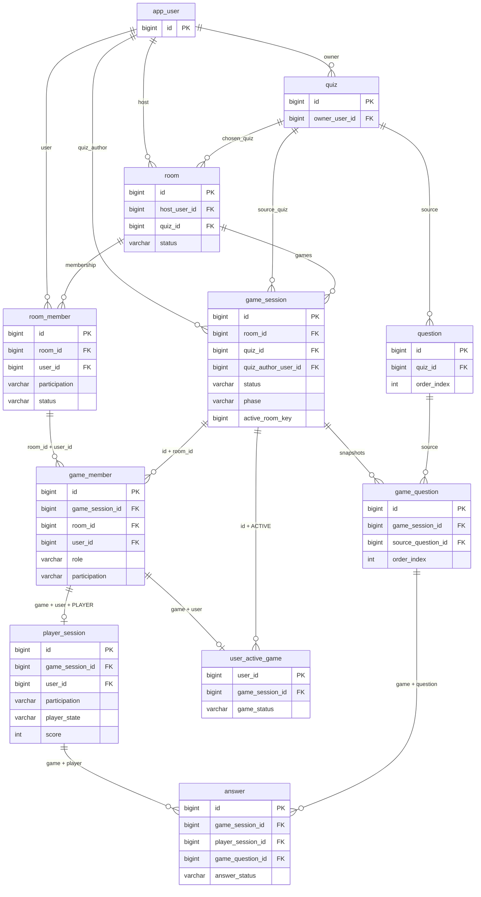

# Schema MySQL — Task 2

Task4 không đổi DDL/ERD/migrations. Quiz CRUD dùng deleted_at_ms/revision hiện có; PUT soft-retire generation câu cũ và insert mới với order_index > max lịch sử, không tái sử dụng UNIQUE(quiz_id,order_index). Owner view position là thứ tự1..N active, không DB index allocator. GET PUBLIC non-owner chỉ metadata. Ảnh PNG local immutable theo sha256/quizId, không thêm bảng ảnh; blob không xóa theo Quiz. Details và media/history access tại [REST contract](rest-api-contract.md#implemented-quiz-crud-và-ảnh-profile-mysql).

Nguồn gameplay: phụ lục Overview của [TASKS.md](../TASKS.md). DDL có thẩm quyền: [V1__quiz_domain.sql](../src/main/resources/db/migration/V1__quiz_domain.sql) và [V2__require_answer_effect_snapshots.sql](../src/main/resources/db/migration/V2__require_answer_effect_snapshots.sql). ERD chỉ hiện khóa và trạng thái; bảng cột dưới đây liệt kê toàn bộ implementation. Không có bảng/dependency ngoài 11 domain bảng và bảng kỹ thuật Flyway.

## ERD

Logical USER dùng tên vật lý `app_user`, tránh tên trùng hàm/keyword SQL. Tất cả PK là BIGINT IDENTITY ngoại trừ `user_active_game.user_id`. Thời điểm epoch UTC và duration đều **BIGINT millisecond**; không dùng giây hoặc DATETIME timezone ngầm. ENUM Java lưu VARCHAR ASCII phân biệt hoa/thường, CHECK SQL giới hạn giá trị. Văn bản utf8mb4; username uniqueness theo collation utf8mb4_0900_ai_ci (không phân biệt hoa/thường/dấu). Task 3 chuẩn hóa/validation username tại API.

## Toàn bộ cột

Dấu NULL/NOT NULL và default bên dưới lấy từ migration V1. Mọi FK dùng RESTRICT mặc định; **không ON DELETE CASCADE**. CHECK/trigger của V2 bổ sung snapshot effect.

### app_user

| Cột | SQL type / nullability / default |
|---|---|
| `id` | `BIGINT NOT NULL AUTO_INCREMENT PRIMARY KEY` |
| `username` | `VARCHAR(64) NOT NULL` |
| `password_hash` | `VARCHAR(255) NOT NULL` |
| `display_name` | `VARCHAR(100) NOT NULL` |
| `created_at_ms` | `BIGINT NOT NULL` |
| `deleted_at_ms` | `BIGINT NULL` |

### quiz

| Cột | SQL type / nullability / default |
|---|---|
| `id` | `BIGINT NOT NULL AUTO_INCREMENT PRIMARY KEY` |
| `owner_user_id` | `BIGINT NOT NULL` |
| `title` | `VARCHAR(200) NOT NULL` |
| `visibility` | `VARCHAR(16) CHARACTER SET ascii COLLATE ascii_bin NOT NULL` |
| `created_at_ms` | `BIGINT NOT NULL` |
| `deleted_at_ms` | `BIGINT NULL` |
| `revision` | `BIGINT NOT NULL DEFAULT 0` |

### question

| Cột | SQL type / nullability / default |
|---|---|
| `id` | `BIGINT NOT NULL AUTO_INCREMENT PRIMARY KEY` |
| `quiz_id` | `BIGINT NOT NULL` |
| `order_index` | `INT NOT NULL` |
| `content` | `TEXT NOT NULL` |
| `option_a` | `TEXT NOT NULL` |
| `option_b` | `TEXT NOT NULL` |
| `option_c` | `TEXT NOT NULL` |
| `option_d` | `TEXT NOT NULL` |
| `correct_option` | `VARCHAR(1) CHARACTER SET ascii COLLATE ascii_bin NOT NULL` |
| `image_ref` | `VARCHAR(71) CHARACTER SET ascii COLLATE ascii_bin NULL` |
| `created_at_ms` | `BIGINT NOT NULL` |
| `deleted_at_ms` | `BIGINT NULL` |

### room

| Cột | SQL type / nullability / default |
|---|---|
| `id` | `BIGINT NOT NULL AUTO_INCREMENT PRIMARY KEY` |
| `host_user_id` | `BIGINT NOT NULL` |
| `quiz_id` | `BIGINT NOT NULL` |
| `room_code` | `VARCHAR(12) CHARACTER SET ascii COLLATE ascii_bin NOT NULL` |
| `name` | `VARCHAR(200) NOT NULL` |
| `status` | `VARCHAR(16) CHARACTER SET ascii COLLATE ascii_bin NOT NULL` |
| `max_players` | `INT NOT NULL` |
| `question_duration_ms` | `BIGINT NOT NULL` |
| `decision_duration_ms` | `BIGINT NOT NULL DEFAULT 7000` |
| `created_at_ms` | `BIGINT NOT NULL` |
| `revision` | `BIGINT NOT NULL DEFAULT 0` |

### room_member

| Cột | SQL type / nullability / default |
|---|---|
| `id` | `BIGINT NOT NULL AUTO_INCREMENT PRIMARY KEY` |
| `room_id` | `BIGINT NOT NULL` |
| `user_id` | `BIGINT NOT NULL` |
| `participation` | `VARCHAR(16) CHARACTER SET ascii COLLATE ascii_bin NOT NULL` |
| `status` | `VARCHAR(16) CHARACTER SET ascii COLLATE ascii_bin NOT NULL` |
| `joined_at_ms` | `BIGINT NOT NULL` |
| `left_at_ms` | `BIGINT NULL` |

### game_session

| Cột | SQL type / nullability / default |
|---|---|
| `id` | `BIGINT NOT NULL AUTO_INCREMENT PRIMARY KEY` |
| `room_id` | `BIGINT NOT NULL` |
| `quiz_id` | `BIGINT NOT NULL` |
| `quiz_author_user_id` | `BIGINT NOT NULL` |
| `quiz_title_snapshot` | `VARCHAR(200) NOT NULL` |
| `status` | `VARCHAR(16) CHARACTER SET ascii COLLATE ascii_bin NOT NULL` |
| `phase` | `VARCHAR(24) CHARACTER SET ascii COLLATE ascii_bin NOT NULL` |
| `end_reason` | `VARCHAR(24) CHARACTER SET ascii COLLATE ascii_bin NULL` |
| `question_count` | `INT NOT NULL` |
| `current_question_index` | `INT NOT NULL DEFAULT 0` |
| `config_snapshot` | `JSON NOT NULL` |
| `started_at_ms` | `BIGINT NOT NULL` |
| `finished_at_ms` | `BIGINT NULL` |
| `phase_opened_at_ms` | `BIGINT NULL` |
| `phase_deadline_at_ms` | `BIGINT NULL` |
| `revision` | `BIGINT NOT NULL DEFAULT 0` |
| `active_room_key` | `BIGINT GENERATED ALWAYS AS (CASE WHEN status = 'ACTIVE' THEN room_id ELSE NULL END) STORED` |

### game_member

| Cột | SQL type / nullability / default |
|---|---|
| `id` | `BIGINT NOT NULL AUTO_INCREMENT PRIMARY KEY` |
| `game_session_id` | `BIGINT NOT NULL` |
| `room_id` | `BIGINT NOT NULL` |
| `user_id` | `BIGINT NOT NULL` |
| `role` | `VARCHAR(16) CHARACTER SET ascii COLLATE ascii_bin NOT NULL` |
| `participation` | `VARCHAR(16) CHARACTER SET ascii COLLATE ascii_bin NOT NULL` |
| `display_name_snapshot` | `VARCHAR(100) NOT NULL` |

### player_session

| Cột | SQL type / nullability / default |
|---|---|
| `id` | `BIGINT NOT NULL AUTO_INCREMENT PRIMARY KEY` |
| `game_session_id` | `BIGINT NOT NULL` |
| `user_id` | `BIGINT NOT NULL` |
| `participation` | `VARCHAR(16) CHARACTER SET ascii COLLATE ascii_bin NOT NULL DEFAULT 'PLAYER'` |
| `player_state` | `VARCHAR(16) CHARACTER SET ascii COLLATE ascii_bin NOT NULL` |
| `score` | `INT NOT NULL DEFAULT 20` |
| `total_answer_time_ms` | `BIGINT NOT NULL DEFAULT 0` |
| `win_streak` | `INT NOT NULL DEFAULT 0` |
| `lose_streak` | `INT NOT NULL DEFAULT 0` |
| `has_momentum` | `BOOLEAN NOT NULL DEFAULT FALSE` |
| `has_recovery` | `BOOLEAN NOT NULL DEFAULT FALSE` |
| `remaining_spins` | `INT NOT NULL` |
| `star_available` | `BOOLEAN NOT NULL DEFAULT TRUE` |
| `remaining_spin_pool` | `JSON NOT NULL` |
| `current_spin` | `VARCHAR(24) CHARACTER SET ascii COLLATE ascii_bin NULL` |
| `star_selected` | `BOOLEAN NOT NULL DEFAULT FALSE` |
| `eliminated_at_ms` | `BIGINT NULL` |
| `eliminated_question_index` | `INT NULL` |
| `final_rank` | `INT NULL` |
| `revision` | `BIGINT NOT NULL DEFAULT 0` |

### game_question

| Cột | SQL type / nullability / default |
|---|---|
| `id` | `BIGINT NOT NULL AUTO_INCREMENT PRIMARY KEY` |
| `game_session_id` | `BIGINT NOT NULL` |
| `source_question_id` | `BIGINT NOT NULL` |
| `order_index` | `INT NOT NULL` |
| `content` | `TEXT NOT NULL` |
| `option_a` | `TEXT NOT NULL` |
| `option_b` | `TEXT NOT NULL` |
| `option_c` | `TEXT NOT NULL` |
| `option_d` | `TEXT NOT NULL` |
| `correct_option` | `VARCHAR(1) CHARACTER SET ascii COLLATE ascii_bin NOT NULL` |
| `image_ref` | `VARCHAR(71) CHARACTER SET ascii COLLATE ascii_bin NULL` |
| `question_duration_ms` | `BIGINT NOT NULL` |
| `phase` | `VARCHAR(24) CHARACTER SET ascii COLLATE ascii_bin NOT NULL` |
| `opened_at_ms` | `BIGINT NULL` |
| `deadline_at_ms` | `BIGINT NULL` |
| `scored_at_ms` | `BIGINT NULL` |

### answer

| Cột | SQL type / nullability / default |
|---|---|
| `id` | `BIGINT NOT NULL AUTO_INCREMENT PRIMARY KEY` |
| `game_session_id` | `BIGINT NOT NULL` |
| `player_session_id` | `BIGINT NOT NULL` |
| `game_question_id` | `BIGINT NOT NULL` |
| `answer_status` | `VARCHAR(24) CHARACTER SET ascii COLLATE ascii_bin NOT NULL` |
| `selected_option` | `VARCHAR(1) CHARACTER SET ascii COLLATE ascii_bin NULL` |
| `received_at_ms` | `BIGINT NULL` |
| `answer_time_ms` | `BIGINT NOT NULL` |
| `scored_at_ms` | `BIGINT NULL` |
| `base_delta` | `INT NULL` |
| `score_delta` | `INT NULL` |
| `score_after` | `INT NULL` |
| `result_snapshot` | `JSON NULL` |

### user_active_game

| Cột | SQL type / nullability / default |
|---|---|
| `user_id` | `BIGINT NOT NULL PRIMARY KEY` |
| `game_session_id` | `BIGINT NOT NULL` |
| `game_status` | `VARCHAR(16) CHARACTER SET ascii COLLATE ascii_bin NOT NULL DEFAULT 'ACTIVE'` |

## Khóa và invariants

| Quy tắc | Enforcement thực tế |
|---|---|
| Username, roomCode duy nhất | UNIQUE username / room_code |
| Thứ tự Question / GameQuestion | UNIQUE(quiz_id,order_index); UNIQUE(game_session_id,order_index) |
| Một membership mỗi Room/User | UNIQUE(room_id,user_id); JOINED: left_at_ms NULL; LEFT: left_at_ms ≥ joined_at_ms |
| Leave → Join lại | Cập nhật cùng row/id bằng RoomMember.leave/rejoin. joined_at_ms là lần Join gần nhất; không phải bảng nhật ký mọi lần Join. Chỉ service Task 5 cho rejoin trong WAITING; ACTIVE không thêm Player mới |
| Roster trận bất biến | UNIQUE(game,user); FK(game,room) → GameSession; FK(room,user) → RoomMember. Trigger bảo vệ role/participation/display name và identity; participation hiện tại ở Room có thể khác lịch sử |
| Player thực sự | participation PLAYER cố định + FK(game,user,participation) → GameMember triple |
| Answer cùng trận | FK(game,player) → PlayerSession(game,id), FK(game,question) → GameQuestion(game,id). Không chỉ kiểm tra bằng Java |
| Một Answer/Player/câu | UNIQUE(player_session_id,game_question_id) |
| Một active Game/Room | UNIQUE generated active_room_key = room_id nếu ACTIVE, NULL nếu FINISHED. Nhiều history cùng Room được phép |
| Một active Game/User | PK user_active_game.user_id; FK → GameMember gồm Spectator; FK(game,ACTIVE) → GameSession(id,status). Finish phải release active-user trước trong cùng transaction |
| Elimination không biến mất | PLAYING score≥0 và metadata elimination NULL; ELIMINATED score<0, time/index bắt buộc. Trigger giữ score đóng băng, state/time/index khi đã loại; final_rank vẫn cập nhật được |
| Enum/value hợp lệ | CHECK cho status/participation/role/option/spin/boolean; duration>0, timestamps≥0, streak0..4, spins0..5, rank>0 |
| Pool Spin hợp lệ | JSON_SCHEMA_VALID array enum, uniqueItems, max6; số lượt còn lại do service Task 6/8 quản lý theo N |
| Không cascade mất history | FK RESTRICT, deleted_at_ms soft delete User/Quiz/Question; GameQuestion và GameSession chứa snapshot riêng |

FK bảo vệ cấu trúc; những điều kiện nhiều hàng như ≥3 Player, author không chơi Quiz mình, đúng Host, chỉ Join/Leave đúng phase, N snapshot đủ liên tục 1..N, Start atomic tạo **mọi** active-user, deadline/score đúng bảng, Spin resource và event ordering thuộc Task 3–9. Chưa có service/command tương ứng; không gọi các invariant này là đã được kiểm chứng gameplay. Generated UNIQUE và PK là chốt chống race; Task 5/8 vẫn phải transaction + lock Room/User.

## Snapshot nội dung, ảnh và cấu hình

GameSession lưu title, author, N và config_snapshot schemaVersion1. [GameplayRulesSnapshot](../src/main/java/vn/edu/quiz/game/dto/GameplayRulesSnapshot.java) chứa toàn bộ điểm thường/Star/6 Spin/trọng số/Star kết hợp; điểm đầu20, floor(N/10) lượt, 1 Star; streak5, Momentum+3, Recovery min(basePenalty+3,0), tiêu thụ khi basePenalty âm dù thành0, effect mới không áp dụng câu tạo streak, elimination trước streak. Snapshot ghi cả hai quyết định người dùng: ONE_SURVIVOR/ALL_ELIMINATED ưu tiên COMPLETED; ALL_ELIMINATED mọi đồng hạng1 là Winner. Đây là dữ liệu luật, **chưa phải scoring engine**. JSON CHECK bảo vệ version, trường bắt buộc, kiểu/range cấu hình chính và flags streak; bảng điểm chuẩn do factory + test đối chiếu Overview, không chạy thuật toán chấm trong migration.

GameQuestion sao chép content, bốn options, correct_option, order_index, duration và image_ref. Trigger cấm thay nội dung/cấu hình sau INSERT; phase/timers/revision được phép cập nhật. Không đọc lại Question gốc để chấm. JPA cũng đánh dấu các cột snapshot updatable=false.

Ảnh nullable hoặc `sha256:<64 hex chữ thường>`, dài71. Reference gắn nội dung, không URL/tên file có thể ghi đè; GameQuestion sao chép reference. Task 4 mới triển khai lưu file local, xác minh digest khi upload, không ghi đè blob cùng digest và không xóa blob còn được Question/GameQuestion tham chiếu. Task 2 kiểm tra định dạng và giữ reference lịch sử; chưa có upload/serve ảnh, không tuyên bố đã kiểm chứng file ảnh thực tế.

PlayerSession lưu đồng thời has_momentum/has_recovery, hai streak, pool/lượt Spin, Star, lựa chọn câu hiện tại, điểm/thời gian cộng dồn và metadata elimination. GameMember giữ Host độc lập PlayerState, nên Host eliminated không mất role; quyền Cancel thuộc Task 3/5.

## Answer trước và sau scoring

| answer_status | selected_option / received_at_ms | outcome |
|---|---|---|
| ACCEPTED_UNSCORED | Bắt buộc; thời gian receipt server | scored_at_ms/base_delta/score_delta/score_after/result_snapshot đều NULL |
| CORRECT hoặc WRONG | Bắt buộc | Tất cả outcome bắt buộc; thời gian scoring ≥ receipt |
| NO_ANSWER | Cả hai NULL | Tất cả outcome bắt buộc; answer_time_ms là toàn duration câu, không bịa receipt timestamp |

Cancel trước scoring giữ ACCEPTED_UNSCORED, không đổi thành CORRECT/WRONG/NO_ANSWER và không cộng vào điểm/thời gian đã chốt. Trường answer_time_ms của Answer đã ACCEPT là duration đã đo, nhưng chỉ được cộng vào PlayerSession khi transaction scoring hoàn tất. base_delta lưu điểm từ scoring mode trước Momentum/Recovery; score_delta sau effect; score_after kết quả. V2 yêu cầu result_snapshot có bốn boolean hasMomentumBefore/hasRecoveryBefore/hasMomentumAfter/hasRecoveryAfter cho mọi Answer đã chấm; có thể bổ sung streak/resources/loại/phiên bản để giải thích kết quả. NO_ANSWER vẫn lưu snapshot effect. Runtime/scoring service và Cancel ordering chưa triển khai ở Task 2.

## JPA và migration

11 entity/11 Spring Data repositories theo feature user/quiz/room/game, trong subpackage entity/repository; enum ở feature/enums theo mapping Task 2.5; khóa liên kết là scalar ID. DB composite FK mới là enforcement, không dùng ORM cascade hoặc serialization entity ra REST. @Version cho Quiz, Room, GameSession, PlayerSession. JSON dùng Hibernate JdbcTypeCode(JSON), enum dùng STRING + VARCHAR rõ ràng vì dialect MySQL có thể chọn native ENUM. Không thêm Lombok/dependency mới.

Flyway migrate/validate chạy trước Hibernate ddl-auto=validate; clean-disabled=true, SQL init never. V1 đã áp dụng thì giữ nguyên checksum; V2 bổ sung constraint riêng. MySQL tối thiểu **8.0.17** cho JSON_SCHEMA_VALID và enforced CHECK, kiểm chứng trên8.0.45. Không dùng H2. [MySqlSchemaIT](../src/test/java/vn/edu/quiz/game/repository/MySqlSchemaIT.java) cố định database quizz_task2_test và rollback fixture; MySqlSmokeIT dùng DB_NAME/quizz, chỉ migration/schema và SELECT/readiness, không insert test vào quizz.

Tài liệu chính thức: [MySQL FK](https://dev.mysql.com/doc/refman/8.0/en/create-table-foreign-keys.html), [CHECK](https://dev.mysql.com/doc/refman/8.0/en/create-table-check-constraints.html), [JSON schema validation](https://dev.mysql.com/doc/refman/8.0/en/json-validation-functions.html), [Hibernate 6.6 mapping](https://docs.hibernate.org/orm/6.6/userguide/html_single/), [Spring Boot database initialization](https://docs.spring.io/spring-boot/3.5/how-to/data-initialization.html). Kết quả chạy thật ghi tại project-status.

### Migration V3 — Decision7000ms

V1/V2 giữ checksum. V3 đổi default Room và cập nhật DRAFT/WAITING cũ, tăng revision cho Room thay đổi; không đụng config_snapshot Game ACTIVE/FINISHED hoặc cấu hình Room ACTIVE/CLOSED. Start mới và terminal cleanup chuẩn hóa Room về7000ms để lần chơi tiếp theo đúng luật mới. Không thêm bảng UI.
