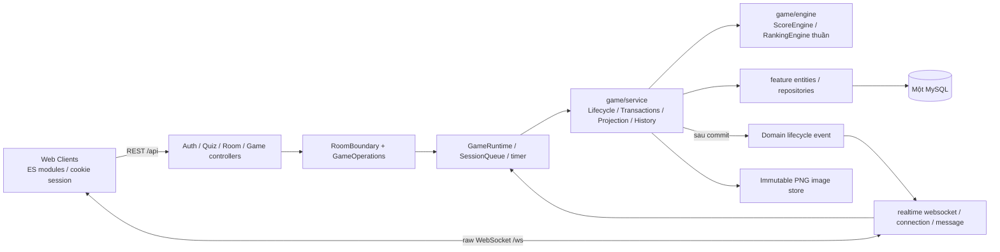
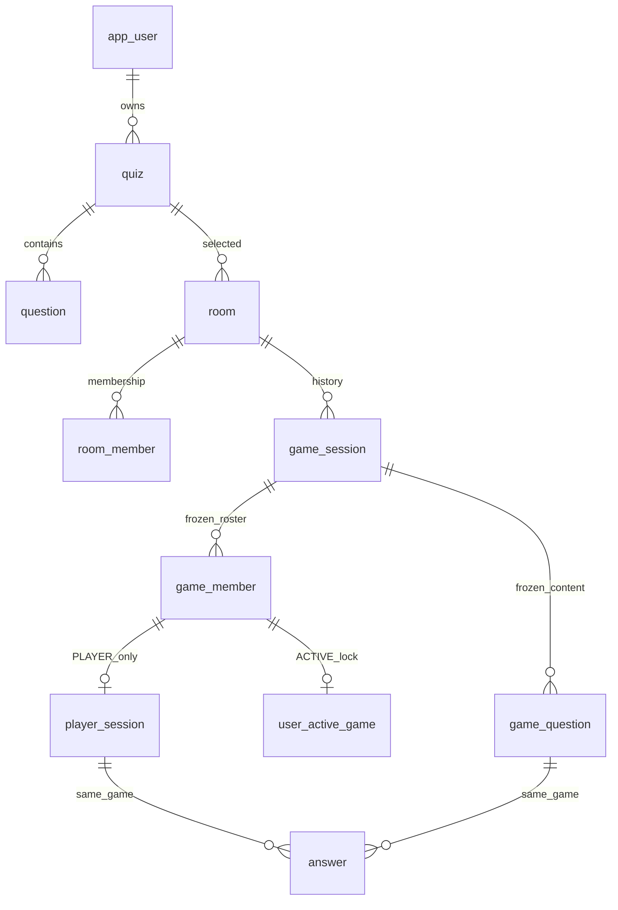
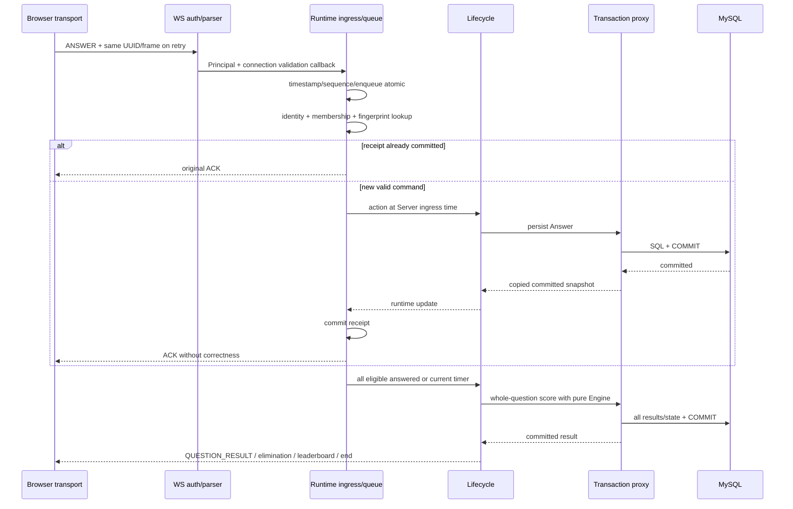
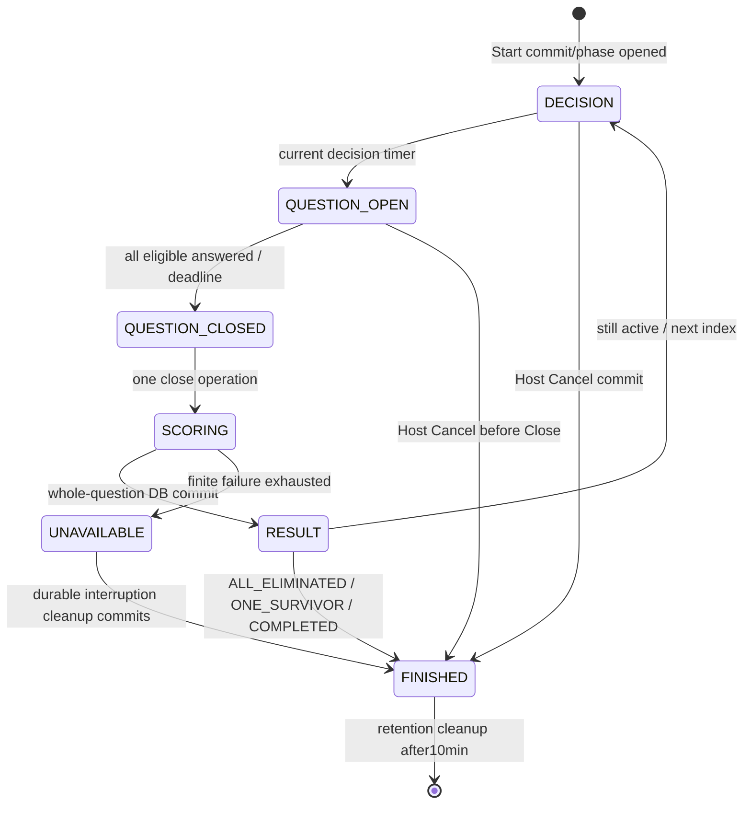
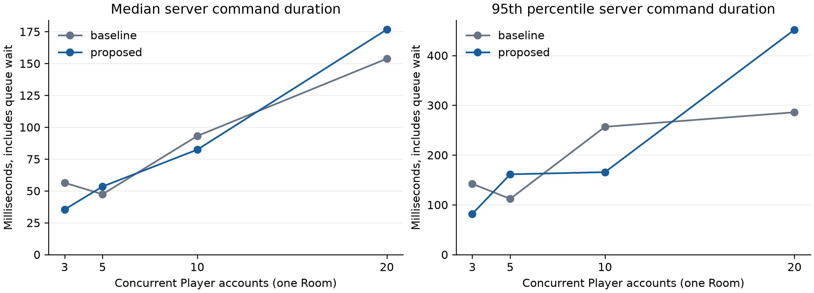
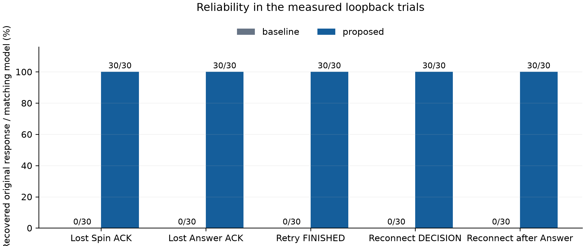

# Competitive Multiplayer Network Quiz System

**Báo cáo kỹ thuật dự án — Task15,06/10/2026, Asia/Bangkok.**

Trạng thái hồ sơ: **PARTIAL**. Chưa có Instruction/Submission/Topics/Topic2/mẫu README môn gốc trong project để đối chiếu định dạng/tên file/cách nộp. Báo cáo dùng cấu trúc technical paper dự án; không tự quy định USB/Drive/deadline. Proposal/Technical Design V2 cũng chưa có; gameplay lấy Overview và quyết định người dùng đã xác nhận. `1.txt`/pasted request là prompt task, không được coi là Instruction môn.

| Nhóm4 người | Họ tên | MSSV | Lớp |
|---|---|---|---|
| Thành viên 1 | | | |
| Thành viên 2 | | | |
| Thành viên 3 | | | |
| Thành viên 4 | | | |

Thông tin cá nhân và contribution thực tế để trống theo yêu cầu. [Bảng phân công](team-contributions.md) là dự kiến để nhóm xác nhận, không bằng chứng tác giả.

## Abstract

Dự án triển khai quiz thi đấu đồng thời bằng Web Client native ES modules, REST/raw WebSocket, Spring Boot/JPA và MySQL trên một Server/database. Trọng tâm là authoritative gameplay, thứ tự ingress command/timer, scoring atomic và khôi phục Client khi mất ACK/kết nối. Replay giữ response đã commit; reconnect dùng snapshot cá nhân theo phase/revision/generation. Thực nghiệm loopback so sánh hai ablation với proposed, mỗi Client Account riêng. Trong30 trial/scenario/mode, proposed khôi phục30/30 original receipt và snapshot matching, baseline0/30; cả hai không ghi nhận duplicate side effect hoặc durable invariant violation trong44 Game checks. Tải3/5/10/20 Client chạy3 round/mức/mode. Số liệu latency có queue wait và overhead instrumentation, không chứng minh Wi-Fi/Internet hoặc hiệu năng proposed luôn tốt hơn. Các yêu cầu môn gốc, Compilatio, máy mới/LAN và contribution cá nhân vẫn cần hoàn thiện.

## 1. Problem, scope và nguồn yêu cầu

Client quiz gửi cùng thời điểm, retry do response mất hoặc reconnect khi phase đã đổi có thể gây double consume, double Answer, trạng thái UI cũ hoặc lịch sử nửa chừng. Server cần kiểm soát danh tính, phase, tài nguyên và deadline; Client không được tự tính điểm hay khai báo timestamp để gia hạn.

Mục tiêu đã thực hiện: Register/Login/Logout; Owner CRUD Quiz4 lựa chọn/một đáp án/ảnh tùy chọn và visibility; Host tạo/mở/đóng Room và Waiting membership; Start snapshot; Decision/Answer/Spin/Star; whole-question scoring/ranking/elimination; reconnect/replacement; Final/History/Cancel và finite DB-failure/startup cleanup. Runtime giữ nguyên stack/local-LAN/one-server-one-DB. Không cloud, Redis, Kafka, multi-server, failover hoặc crash resume.

Nguồn có thẩm quyền: [TASKS.md/Overview](../TASKS.md), [gameplay extract](gameplay-rules.md), [decisions](implementation-decisions.md) và [REST](rest-api-contract.md)/[WS](websocket-contract.md). G-01: ALL_ELIMINATED/ONE_SURVIVOR ưu tiên COMPLETED. G-02: người đồng hạng1 đều Winner, kể cả ALL_ELIMINATED. Đây là xác nhận người dùng, không tự suy Winner. Requirement Overview§19 dẫn lại môn được đối chiếu module/evidence tại [checklist](course-requirements-checklist.md), chưa xác nhận đã đạt môn khi thiếu bản gốc.

## 2. Architecture và feature ownership

Spring Boot3.5.16/Java21/MySQL8.0.45; JPA Hibernate/Flyway phiên bản managed theo pom, không nâng dependency. Frontend phục vụ cùng origin từ Server, rawWS /ws dùng lại auth và envelope Waiting/gameplay. Host là Room.hostUserId, độc lập participation PLAYER/SPECTATOR, không global user role. [README](../README.md) giải thích install/config/entry points cụ thể.

Package-by-feature đã freeze: auth/security và user sở hữu identity; quiz sở hữu question/options/media; room sở hữu config/membership; game sở hữu nghiệp vụ/state/snapshot/persistence/History; realtime sở hữu ingress/queue/timer/cache/socket/wire mapping. Game service và engine không import wire/WS/queue. Controller/realtime adapter nối port business. Root QuizApplication auto-scan11 Entity/Repository; không package global service/controller/dto hoặc Account entity trùng User. Engine pure immutable inputs/outputs, không JPA, network, random hoặc clock trong calculate. CodebaseStructureTest và real Spring context/JPA scan làm evidence, không architecture framework mới.

## 3. Data model và transaction

11 bảng: app_user, quiz, question, room, room_member, game_session, game_member, player_session, game_question, answer, user_active_game. [ERD đầy đủ +columns](database-schema.md) liên kết trực tiếp V1/V2 DDL, không mô tả schema dự kiến. Các constraint gồm FK kép Answer player+question cùng Game, PlayerSession phải GAME_MEMBER PLAYER, UNIQUE(game,order_index), UNIQUE(room,user), unique activeRoom và user_active_game user PK gồm Spectator; CHECK enum/value/JSON snapshot, NOT NULL và nullable unscored đúng nghiệp vụ.

ERD rút gọn trên biểu diễn use-case; các FK composite/quiz author và tất cả khóa ở schema canonical. RoomMember Leave markLEFT và Join lại cùng row theo UNIQUE(room,user), không xóa member lịch sử. GAME_MEMBER roster bất biến/PlayerSession eliminated giữ trạng thái/score đóng băng. Quiz edit soft-retire generation, delete soft; lịch sử không cascade delete. GameQuestion/config snapshot title/content/options/correct/image/weights/Momentum/Recovery fixed từ Start. Immutable normalizedPNG SHA256 được lưu local, reference không bị overwrite, quyền ảnh theo Owner hoặc GameMember/câu đã mở. Không lộ câu tương lai trong OPEN.

Start transaction lock Room→Quiz→Users theoID, snapshot roster/content/config, tạo Game/Player/Question/UAG; ≥3 Player,10–50 câu, HostWAITING/author restriction, initial20/floor(N/10)Spin/1Star. Same-Room Start serialize trước GameID, cross-Room UAG uniqueness giải quyết shared User/Spectator. Runtime install/timer/Start receipt/event sau proxy commit.

Scoring tính tất cả Player còn chơi vào dữ liệu tạm trước persist cả câu; kết quả/score/streak/elimination/phase/end/Room/UAG cùng transaction. Runtime và result event chỉ cập nhật sau commit. Cancel cùng queue: scoring đã vào operation thì chấm toàn câu rồi Cancel; Cancel trước Close giữ Answer ACCEPTED_UNSCORED, không ép CORRECT/WRONG/NO_ANSWER. Unscored selectedOption/receivedAt có khi đã nhận; scoredAt/baseDelta/scoreDelta/scoreAfter/result nullable. NO_ANSWER receivedAt null, answerTimeMs toàn duration; không gán thời điểm nhận giả.

## 4. Protocol, ingress và concurrency

HTTP session cookie HttpOnly/SameSiteLax +BCrypt10/REST CSRF, rawWS mandatory Origin allowlist. AuthPrincipal từ Server, không tin userId/frame. Host removed/outsider/eliminated permissions được kiểm tra ở boundary. Session Logout khi REST chờ Room phải401 trước replay/persistence; broadcast phân biệt SESSION_EXPIRED4001 với DB AUTH_UNAVAILABLE1011. Replacement active socket mới tăng generation, gửi SESSION_REPLACED4002; disconnect cũ không offline socket mới. Command đã enqueue nhưng chưa thực thi bị revalidate generation; transaction đã thực thi không rollback vì replacement đến sau.

Fingerprint gồm action type/target/questionIndex/canonical payload. Pre-game scope User+Room, kể cả START_GAME chưa có GameSession; Create dùng User+USER_CREATE_ROOM. Gameplay scope User+Game. Identity/mismatch vẫn kiểm tra, replay trước phase validation. Spin draw trong action được capture/persist một lần, retry không draw lại. ACK Answer chỉ acceptance, không correctness.

Per-session FIFO/shared4-worker pool, không một global sequential worker hoặc thread tồn tại mãi/Game. Ingress clock sample+sequence+enqueue atomic, command và timer cùng boundary. receivedAt<deadline; exact/+1 bị reject dù timer chưa xử lý. Pre-deadline ingress không bị Close vượt qua khi processor chậm. System.nanoTime/ServerClock cho duration, epoch deadline/serverTime cho UI. Phase/deadline mở theo lúc Server thật mở sau queue/DBwait. Timer identity Game/question/phase/token +session generation; stale/repeated no-op. Offline vẫn nằm eligible roster; close once khi tất cả validAnswer hoặc deadline. Clock/latch race tests kiểm chứng các mốc, không random sleep làm proof.

Replay/cache/route giữ600000ms sau FINISHED, cleanup khi hết retention và actor idle; Client retry receipt cũ trước phase check. Reconnect capture/subscribe/deliver trong actor, snapshot đủ phase, player cá nhân, resources, currentSpin/Star, alreadyAnswered, score/streak, leaderboard/lastResult. Host Spectator player=null. UI không apply revision cũ; các event cùng revision khác type vẫn được consume. RESULT/FINISHED có result vừa chấm, OPEN không correctAnswer/câu tương lai. Disconnect không reset tài nguyên/timer.

## 5. Gameplay và scoring theo nguồn

Initial20; score=0 sống, score<0 eliminated. Mỗi5 Correct/Wrong liên tiếp cấp Momentum/Recovery cho câu sau khi còn sống; NO_ANSWER reset cả streak. Momentum +3 vào Correct kế tiếp; Recovery xét **basePenalty âm**, min(basePenalty+3,0), consume cả final0; base0/Correct giữ effect. Có thể coexist, không stack. Elimination trước streak/grant, effect mới không áp dụng câu tạo streak. Spin/Star không đổi cách đếm outcome. Bảng dưới trích Overview§8, expected tests lấy source, không tự tính expected từ implementation.

| Mode | Correct | Wrong | NO_ANSWER | Spin weight ban đầu |
|---|---:|---:|---:|---:|
| Normal |+10|−4|−1| |
| BONUS/Tăng thưởng |+15|−4|−1|25%|
| SAFE/An toàn |+8|−2|0|20%|
| BREAKTHROUGH/Bứt phá |+18|−7|−3|25%|
| SPEED/Tăng tốc |+22|−10|−4|15%|
| DECISIVE/Quyết định |+28|−15|−7|10%|
| HARDSHIP/Khó khăn |+8|−6|−2|5%|
| Star riêng |+25|−14|−7| |
| BONUS+Star |+30|−4|−1| |
| SAFE+Star |+20|−2|0| |
| BREAKTHROUGH+Star |+30|−12|−6| |
| SPEED+Star |+35|−16|−8| |
| DECISIVE+Star |+40|−22|−10| |
| HARDSHIP+Star |Không cho phép|Không cho phép|Không cho phép| |

Spin pool riêng không replacement, chuẩn hóa trọng số còn lại;1 Spin/Player/câu, floor(N/10) credits/game. Star1/trận: Spin→optional Star hợp lệ; Star riêng khóa Spin; không Star khi HARDSHIP. Không bắt buộc dùng tài nguyên. Recovery theo nguồn:−1→0,−4→−1,−7→−4,−22→−19 đều consume;0→0 giữ effect.5 Wrong normal từ20 đạt0 và cấp Recovery; Wrong tiếp delta−1 thì eliminated.

Cancel sau scoring operation đi FINISHED/CANCELLED theo queue, không chen vào partial scoring. Failure có thể xảy ra ở phase/action khác ngoài SCORING; diagram không giới hạn error policy vào một phase. RESULT publish rồi enqueue phase tiếp, không thêm thời lượng RESULT. Ranking score giảm dần/time tăng dần, bằng cả hai thì competition rank1,1,3. End kiểm tra sau chấm tất cả; rank1 Winners kể cả ALL_ELIMINATED, ưu tiên ONE_SURVIVOR/ALL_ELIMINATED trước COMPLETED. CANCELLED/SERVER_INTERRUPTED có standings nhưng hasOfficialWinner=false/winners[].

## 6. Failure policy và bảo mật dữ liệu

Scoring/phase/action/Cancel với transient failure đã rollback chắc chắn retry tối đa3 attempt, backoff100/300ms; giữ FIFO và nhường worker khi defer. Hết retry/lỗi nontransient/commit bất định: runtime UNAVAILABLE, stop timers, notification phân biệt với durable End; interruption cleanup hữu hạn. DB còn mất thì cleanupPending=true/UAG chưa giải phóng, không báo History/COMMIT thành công giả; restore MySQL/restart để startup cleanup. ACTIVE bỏ lại được chuyển FINISHED/SERVER_INTERRUPTED/Room WAITING và giải phóng UAG trước readiness. Không resume trận sau crash, send failure không score lại.

Quiz non-owner PUBLIC chỉ metadata, PRIVATE Owner quản lý/chọn; serializer không trả Entity/password hash. Answer ACK/OPEN/snapshot không correctness, câu/ảnh tương lai được guard. History chỉ GameMember gồm Spectator, có pagination và DTO timeline snapshot/nullability của unscored. CSRF/origin/session/membership/Host/player state/phase/resource checks phối hợp. Local HTTP/LAN là phạm vi đã chốt, không tuyên bố đủ điều kiện bảo mật production Internet.

## 7. Verification và evidence đầu vào

Đầu vào đã có evidence: Task14 DONE với reproduction và sửa lỗi trọng yếu; Task11A/11B/12 có UI/backend thật. Task13 full suite **224 unit +92 integration =316 pass**; Task14 regression **47 unit +77 integration =124 pass**. Không cộng các bộ test trùng thành một số test mới.

Task15 chạy regression cho observer test classpath mới: **47 unit +26 real MySQL integration =73 pass**, failures/errors/skipped=0, BUILD SUCCESS. Kiểm tra production JAR không chứa ExperimentServer. Build frontend:11 modules/13 assets. Production JAR khởi động từ bản sao cấu hình mẫu không credential, password qua environment; Flyway validate, MySQL8.0.45 và readiness UP. Smoke Chrome mới đạt **32 frontend tests +9 nhóm flow**,4 cookie contexts độc lập, backend HTTP/rawWS/MySQL thật.

Smoke gồm Register/Login/Quiz/ảnh/Waiting; Host Participate3 Player chơi hết10 câu; Spin rồi optional Star, Star riêng khóa Spin; mất Answer ACK, retry cùng UUID sau scoring; offline NO_ANSWER/reconnect; Final/History/RoomWAITING. Các trận riêng kiểm chứng Author Host Spectator+3 Player/Cancel với Accepted-Unscored; Host eliminated score đóng băng vẫn Cancel; socket replacement, outsider History403, FINISHED reconnect/reload, logout/session revoked về Login. Các screenshots được lưu ở handoff, không suy ra4 thiết bị LAN từ4 browser contexts.

| Yêu cầu | Module | Test/evidence có thật |
|---|---|---|
| Bảng điểm/effect/ranking | game/engine | ScoreEngineTest113, RankingEngineTest6, RulesSnapshot16; expected theo Overview |
| Deadline/order/timer/close once | realtime/session/timer | SessionQueueTest21, clock/latch điều khiển; −1/exact/+1, stale token/generation, worker fairness |
| Start cùng/chéo Room/UAG/author | RoomBoundary/Transactions/schema | GameLifecycleIT18, RoomNetworkIT/MySqlSchemaIT12; MySQL constraints/roster thật |
| Replay/resource/retry FINISHED | GameRuntime/cache/command | GameCommandNetworkIT11, cache4; Task15 30 trial/original response scenario |
| Reconnect/generation/phases | registry/runtime/projection/UI | GameReconnectIT12, registry5; phase/privacy/nullability; Task15 60 snapshot attempts |
| Cancel/scoring/History/startup/failure | game/service | GameHistoryCancelIT12, GameIsolationIT2; rollback/KILL đúng connection test/cleanup thật |
| Auth/REST/Waiting/UI | feature controllers/static | Auth/Quiz/Room network tests; Task15 production browser32/9 |
| Ownership/JPA scan/DTO | root context/source checks |11 Entity/Repository, circular references=false; engine thuần, DTO/privacy |

Chi tiết và provenance ở [handoff evidence](../experiments/handoff/evidence-index.md), historical status và JUnit XML. Race tests dùng synchronization/clock điều khiển; timeout/readiness polling chỉ là bound, không dùng sleep ngẫu nhiên để chứng minh race. Không dùng H2/mock để tuyên bố MySQL đạt. Load experiment không thay correctness/fault tests.

## 8. Experimental setup và measurement

[Protocol](../experiments/experiment-protocol.md) ghi toàn bộ metric, clock, denominator và lệnh tái lập. [Run directory](../experiments/results/2026-10-06-loopback) giữ environment/config/seed/CSV/wire/hash. Máy đo: Windows11 Home10.0.26200, i5-13500HX14 cores/20 threads, RAM16886128640 bytes (~15.73GiB), Java21.0.9/Python3.12.10/MySQL8.0.45. Server/MySQL/Client cùng máy qua127.0.0.1;4 workers/JDBC pool5; Decision5000ms/Question10000ms. Không đo CPU/RAM utilization hoặc Wi-Fi/Internet.

Baseline chạy test classpath: xóa committed receipt trước giao response cho adapter, vẫn giữ guard1 Spin/q và1 valid Answer/q; reconnect authenticated socket +Room subscribe nhưng không full Game snapshot. Proposed giữ production replay/full snapshot. Test entry point không đóng trong JAR, không baseline mặc định trong demo. Baseline cache vẫn allocate/put rồi xóa để ablate retention; do đó không phải implementation “no-cache” tối ưu cho performance comparison.

Mỗi mode21 synthetic Account riêng (20 Player tối đa +1 Author HTTP setup),22 Game/Room riêng. Reliability10 Game×3 Player =30 trial/scenario/mode. Load3 round ở3/5/10/20 Player,2 commands Spin/Answer mỗi Client mỗi round →18/30/60/120 mẫu, tổng228/mode. Cả run44 Game, chỉ1 concurrent Room. Benchmark Cancel sau câu1; browser smoke riêng kiểm chứng trận10 câu/Final. Multi-room correctness được kiểm chứng bằng GameIsolationIT2 từ Task13; chưa đo load nhiều Room.

Java System.nanoTime đo entry GameRuntime→future completion gồm queue wait, service/transaction/runtime/cache; không gồm WS parse/auth trước runtime hoặc send/Client receive. Python perf_counter_ns đo send→receipt; snapshot response send RECONNECT→ACK; harness resync open socket→AUTH_READY→ACK→apply deep-copy vào Client model. Không gọi Server sent là Client resync, cũng không gọi model apply là browser paint. Baseline không snapshot nên metric đó N/A.

Model được so status/phase/questionIndex/revision/private player/members với REST oracle sau apply; oracle không feed baseline state. Original-response recovery so equality toàn ACK JSON kể cả timestamp/revision/payload. CSV ghi code và tách business guard rejection với system error. Histories/SQL kiểm tra unique Answer/resource/terminal state; lỗi hệ thống làm harness fail và giữ partial data. Logs flush theo row; p50/p95 nearest rank từ mẫu thật.

Seed15062026 áp dụng workload/fixture, **không seed SecureRandom Spin/UUID/random question**. ACK và History lưu draw thực tế. ACK loss mô phỏng application delivery: harness nhận ACK thật nhưng không apply vào model, oracle giữ bản gốc; không packet-loss hoặc Wi-Fi outage emulation. Mode baseline chạy trước proposed, không counterbalance/warmup/JIT isolation.

## 9. Results — chỉ số liệu đã chạy

Nguồn [tables tự sinh](../experiments/results/2026-10-06-loopback/results.md), [summary JSON](../experiments/results/2026-10-06-loopback/summary.json) và CSV/raw wire. Pilot không trộn. Mỗi mode400 client metric rows; các loại server operation có counts riêng trong summary, không coi mọi row là một scenario trial.

| Scenario | Baseline success/attempts | Proposed success/attempts | Baseline/proposed state mismatch |
|---|---:|---:|---:|
| Lost Spin ACK: original receipt |0/30|30/30|Không phải metric state|
| Lost Answer ACK: original receipt |0/30|30/30|Không phải metric state|
| Retry Answer sau FINISHED |0/30|30/30|Không phải metric state|
| Reconnect DECISION/resource đã commit |0/30|30/30|30/0|
| Reconnect sau Answer/phase advance |0/30|30/30|30/0|

Baseline receipt0/30 là expected business rejection do no-cache ablation, **không phải30 system errors**. Mismatch là Client thiếu state cá nhân, không corruption DB. Cả hai duplicate side effects0 và durable invariant violations0 trên22 Game checks/mode (44 toàn run).30/30 trong tập trial hữu hạn không chứng minh hệ thống luôn100%.

| Player sockets | Samples/mode | Baseline server p50/p95 ms | Proposed server p50/p95 ms | Baseline Client p95 ms | Proposed Client p95 ms |
|---:|---:|---:|---:|---:|---:|
|3|18|56.376/142.149|35.388/81.849|155.855|88.193|
|5|30|47.345/111.948|53.423/161.266|119.450|170.637|
|10|60|93.103/256.693|82.359/165.633|270.455|178.539|
|20|120|153.784/285.865|176.730/451.814|298.568|466.826|

Figure1: duration gồm queue wait, Spin/Answer burst trong1 Room,3 round/mức, p95 nearest-rank. Không Internet latency/throughput capacity. [SVG export](../experiments/results/2026-10-06-loopback/server-latency.svg).

| Proposed snapshot metric | DECISION p50/p95 ms (n30) | After Answer p50/p95 ms (n30) |
|---|---:|---:|
| Snapshot response: send→ACK |8.416/19.942|12.181/21.215|
| Harness Client resync: open→model apply |35.617/52.427|39.533/63.529|

Baseline không snapshot nên N/A; Room subscribe RTT không được gọi là snapshot response. Model apply khác UI paint. Các phase CLOSED/SCORING/RESULT/FINISHED được integration test; không claim30 latency trials cho mọi phase đó.

Figure2: denominator30 cho từng scenario original receipt hoặc model matching. [SVG export](../experiments/results/2026-10-06-loopback/reliability.svg). Không gộp5 scenarios thành success rate chung che mẫu số.

## 10. Discussion, contribution và threats to validity

Baseline chặn duplicate business nhưng không khôi phục response: Client mất ACK không biết draw/resource đã commit, retry gặp phase/resource guard. Proposed replay trả cùng timestamp/revision/payload sau Close/FINISHED, giải quyết ambiguity trong retention. Full snapshot khôi phục state cá nhân/streak/resource/phase đã bỏ lỡ; socket reconnect đơn lẻ chỉ bảo đảm event tương lai.0 duplicate ở cả hai cho thấy guard là safety cơ bản, replay đóng góp recovery thay vì thay guard.

Không kết luận proposed luôn nhanh hơn: proposed20 Client server p95=451.814ms cao hơn baseline285.865ms;5 Client cũng cao hơn. Một Room serialize burst theo thiết kế; instrumentation/JIT/OS/background load/data growth có thể ảnh hưởng. Chưa đo CPU/lock bottleneck để nêu nguyên nhân causal. Chưa counterbalance/warmup, baseline chạy trước;3 round và30 trial không đủ khái quát performance mọi điều kiện. Median không luôn tăng theoN do khác lượt/chế độ/môi trường đo.

Đóng góp ở cấp project: authoritative quiz/Spin/Star/streak guards; atomic ingress/shared actors; Room Start/UAG lock; commit consistency/finite failure policy; bounded original replay/phase snapshot/generation ordering; history nullable unscored và UI thật. Đây là engineering integration theo Overview, không tuyên bố thuật toán nghiên cứu mới. Baselines đo contribution replay/resync; functional tests chứng minh race/guard. Không có contribution cá nhân được xác minh, không tự gán project evidence cho thành viên.

Threats: CPU/RAM/TCP stack chung; synthetic Quiz/one-question loads khác người thật/Wi-Fi; loss ở application layer; SecureRandom không seeded; không crash resume/failover; historical tests dùng clock điều khiển khác clock thực experiment. Không suy ra Internet/Wi-Fi latency, crash-persisted receipt, Compilatio đạt hoặc course compliance khi thiếu nguồn môn.

## 11. Reproducibility và bàn giao

Install/DB/config/build/start/test theo [README](../README.md). [Experimental protocol](../experiments/experiment-protocol.md) lưu clock/denominator/seed/env/source/CSV/hash; script không ghi đè run. Optional plots chạy `python scripts/plot-experiment.py experiments/results/2026-10-06-loopback` (Matplotlib dùng xuất báo cáo, không dependency ứng dụng). Fixture DB experiment tách quizz; evidence không có credential/cookie/password.

[Handoff index](../experiments/handoff/evidence-index.md) gồm JUnit/build/readiness/browser/screenshots/SQL và source manifest. Tables/figures sinh từ số liệu thật; production JAR không có experiment mode. Task15 không commit/push hoặc chuyển task.

Instruction/Submission chưa có nên filenames Markdown hiện tại phục vụ review project, chưa là định dạng/tên nộp bắt buộc. [Team doc](team-contributions.md) có phân công dự kiến cân bằng gần25%/người, riêng contribution thực tế để trống. Còn thông tin nhóm, xác nhận công việc/evidence cá nhân, Compilatio, máy mới/LAN và final format theo môn. Phân công dự kiến không được thay bằng chứng công việc thật.

## 12. References

1. [TASKS/Overview](../TASKS.md), [gameplay extract](gameplay-rules.md), [decisions](implementation-decisions.md), canonical REST/WS, source DDL/tests và evidence project. G-01/G-02 là xác nhận người dùng; prompt không thay Instruction môn.
2. [Spring Boot3.5.16 reference](https://docs.spring.io/spring-boot/3.5/reference/index.html), truy cập06/10/2026. Version theo pom freeze, không nâng major.
3. [MySQL8 CHECK constraints](https://dev.mysql.com/doc/refman/8.0/en/create-table-check-constraints.html), truy cập06/10/2026; căn cứ version hỗ trợ CHECK, evidence MySQL8.0.45 riêng.
4. [Java21 System.nanoTime](https://docs.oracle.com/en/java/javase/21/docs/api/java.base/java/lang/System.html#nanoTime()), truy cập06/10/2026; elapsed duration khác epoch deadline hiển thị.
5. [WHATWG WebSockets Standard](https://websockets.spec.whatwg.org/), truy cập06/10/2026; không thay policy auth/origin/business contract project.

Yêu cầu môn gốc/nhóm/contribution còn chờ xác minh. Báo cáo không tự xác nhận hồ sơ đã đủ điều kiện nộp.
