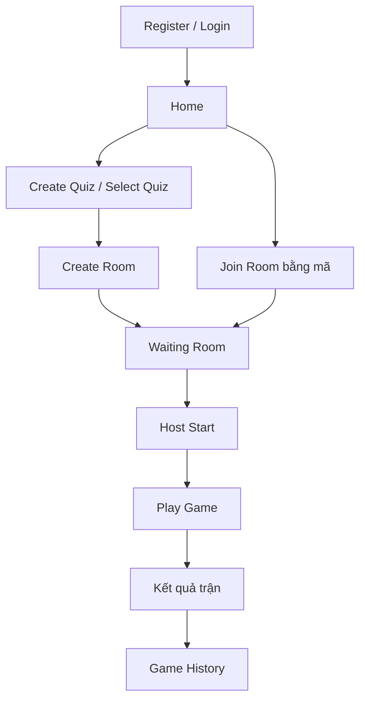
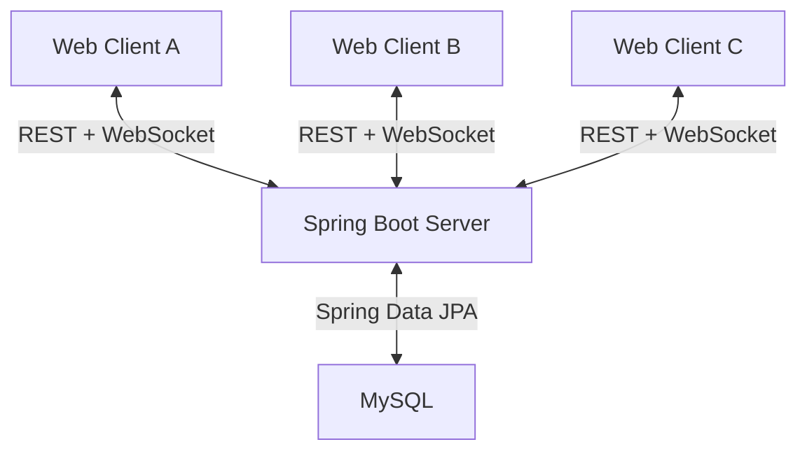
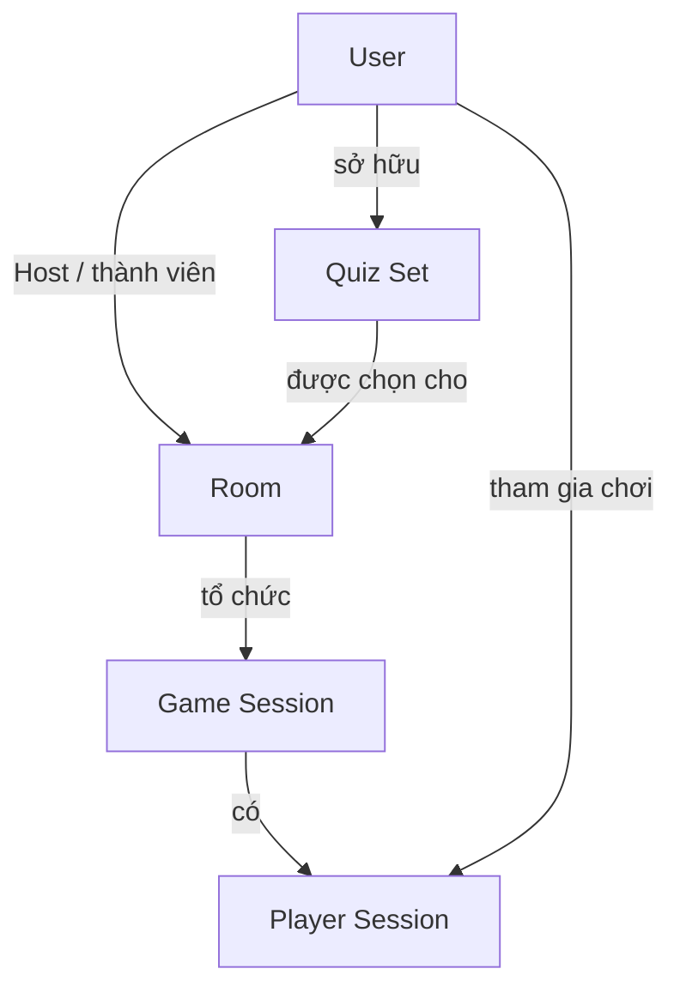
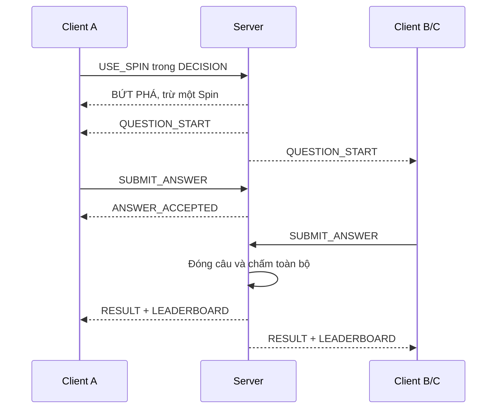

# Gameplay rules — bản trích Overview

Ngày khảo sát: 04/10/2026 (Asia/Bangkok). Nguồn: [TASKS.md](../TASKS.md), phụ lục Overview, nguyên văn mục 1–13 (dòng 445–876 tại thời điểm khảo sát). Trích cả luồng sử dụng, quyền, dữ liệu, gameplay, concurrency, reconnect và idempotency để không bỏ luật nằm ngoài mục Cách chơi. Giữ số mục gốc để đối chiếu.

SHA-256 của TASKS.md gốc: `DDD03F01C6DFEC02A8817FE4B45CE5BBE9D9286DFB66B4EE1611F03A328D5745`.

Khối giữa hai marker bên dưới được sao chép trực tiếp, không diễn giải lại bảng điểm. Các quyết định bổ sung từ người dùng nằm trong [implementation-decisions.md](implementation-decisions.md), mục Nghiệp vụ cần chốt; không sửa âm thầm nguồn. Các nhắc đến Technical Design V2 trong bản trích là lời của Overview, không có nghĩa đã đọc được file đó. Scenario là ví dụ, không phải test đã chạy.

Phạm vi giữ nguyên: Web Client + REST/WebSocket + Spring Boot + JPA + MySQL, Localhost/LAN, một Server và một Database; không Cloud, Redis, Kafka, multi-server hoặc failover. Checklist môn ở file riêng, chưa đối chiếu trực tiếp tài liệu môn.

<!-- BEGIN OVERVIEW EXTRACT -->
## 1. Giới thiệu hệ thống

Đây là game Quiz thi đấu qua mạng. Người dùng đăng nhập, chọn bộ câu hỏi, tạo hoặc tham gia phòng và trả lời cùng những người khác. Trong trận, người chơi theo dõi điểm, bảng xếp hạng và tự chọn thời điểm sử dụng vòng quay chiến thuật (Spin), Ngôi sao Hy vọng (Hope Star).

Đây là game mạng vì mỗi người dùng điều khiển một Client, gửi hành động tới Server và nhận trạng thái trận chung qua mạng. Server điều phối câu hỏi, thời gian, chấm điểm và kết quả; các Client không vận hành những trận riêng biệt.

Mục tiêu chính là tạo một trận Quiz có luật rõ ràng và giao tiếp mạng nhất quán, kể cả khi nhiều người thao tác đồng thời, request được gửi lại hoặc Client mất kết nối.

Hệ thống chạy trên Localhost hoặc các máy cùng LAN/Wi-Fi. Một máy chạy Spring Boot Server và MySQL; người chơi truy cập bằng trình duyệt. Chưa đặt mục tiêu triển khai production trên Internet.

## 2. Một người dùng sẽ sử dụng hệ thống như thế nào?



| Bước | Người dùng nhìn thấy và thực hiện |
|---|---|
| Register/Login | Tạo tài khoản hoặc đăng nhập tài khoản đã có |
| Home | Truy cập Quiz, phòng của mình, tham gia phòng và lịch sử |
| Create/Select Quiz | Người tổ chức tạo bộ câu hỏi hoặc chọn bộ có quyền sử dụng |
| Create Room | Đặt cấu hình phòng, chọn Quiz, thời gian trả lời và giới hạn Player |
| Join Room | Người chơi nhập mã phòng; không phải tự tạo hoặc sở hữu Quiz |
| Waiting Room | Xem thành viên; Host chọn tham gia hoặc quan sát và chuẩn bị trận |
| Host Start | Host yêu cầu bắt đầu; Server kiểm tra điều kiện rồi tạo Game Session |
| Play Game | Quyết định tài nguyên trước câu, trả lời, nhận kết quả và leaderboard |
| Kết quả | Trận bình thường có final leaderboard; trận CANCELLED chỉ có standings, không có Winner chính thức |
| Game History | Xem lại thông tin và kết quả đã lưu |

Luồng tạo/chọn Quiz dành cho người tổ chức; người tham gia có thể đi thẳng từ Home tới Join Room. Một User có thể lưu nhiều Draft Room để dùng sau.

## 3. Kiến trúc tổng thể



| Thành phần | Hiểu đơn giản | Vai trò |
|---|---|---|
| Web Client | Trang web chạy trong trình duyệt của mỗi người | Hiển thị và gửi thao tác |
| Server | Chương trình trung tâm chạy trên máy Server | Quyết định và đồng bộ trạng thái |
| Database | Nơi lưu dữ liệu lâu dài | Tài khoản, Quiz, phòng, lịch sử và kết quả |
| JPA | Thành phần Server dùng để truy cập dữ liệu | Đọc/ghi MySQL; không phải kênh giao tiếp Client |

Client giao tiếp với Server; Server truy cập Database. Client không kết nối trực tiếp tới MySQL.

**Host ≠ Server.** Host là một User có quyền quản lý Room và vẫn sử dụng Web Client. Host không tự chấm điểm hoặc điều khiển đồng hồ của Server. Máy chạy Server có thể đồng thời mở một trình duyệt để chơi, nhưng ứng dụng Server và Client vẫn là hai thành phần khác nhau.

## 4. Client làm gì?

| Nhóm | Trách nhiệm Client |
|---|---|
| Account | Register, Login, Logout; gửi thông tin cần thiết và hiển thị kết quả xác thực |
| Quiz/Room | Tạo/chọn Quiz theo quyền, tạo Room, Join Room, xem thành viên và cấu hình |
| Gameplay | Nhận câu hỏi, chọn/gửi đáp án, yêu cầu Spin/Star, hiển thị Score/Streak/effect/Leaderboard |
| Realtime | Nhận câu mới, kết quả, Join/Leave, Elimination, Game End và trạng thái kết nối |

Client **không tự quyết định** Correct Answer, Score, Spin Result, deadline, Elimination hoặc Ranking. Client có thể hiển thị countdown từ thông tin Server, nhưng countdown trên giao diện không quyết định request còn hợp lệ hay không.

Ví dụ: B bấm đáp án C. Client chỉ gửi lựa chọn C; Server kiểm tra và xác định kết quả. Việc người dùng sửa điểm hiển thị trong trình duyệt không thay đổi điểm thật trên Server.

## 5. Server làm gì?

**Server Authoritative State:** tất cả trạng thái gameplay quan trọng do Server xác định.

| Nhóm | Server chịu trách nhiệm |
|---|---|
| Authentication | Xác thực tài khoản và danh tính gửi hành động; kiểm tra quyền |
| Quiz Management | Lưu Quiz, kiểm tra bốn lựa chọn/một đáp án đúng, áp dụng quyền PUBLIC/PRIVATE |
| Room Management | Lưu Draft, mở phòng, quản lý thành viên/mã phòng và quyền Host |
| Game Session Management | Kiểm tra Start, tạo lần chơi, khóa Player và cấu hình, điều phối tiến trình/kết thúc |
| Game State | Giữ giai đoạn câu, deadline, đáp án đã nhận, tài nguyên, streak và trạng thái Player |
| Score Engine | Chọn bảng điểm, áp dụng Momentum/Recovery, cập nhật điểm và loại người |
| Ranking | Xếp điểm giảm dần, thời gian tăng dần và xử lý đồng hạng |
| Connection Management | Theo dõi kết nối/ngắt kết nối; tách connection state khỏi player state |
| Reconnect | Xác thực người trở lại và trả trạng thái hiện tại |
| Idempotency | Nhận diện request đã xử lý và trả kết quả cũ, không tác động lần hai |
| Persistence | Lưu dữ liệu lâu dài, lịch sử và kết quả; xử lý trạng thái ACTIVE bỏ lại sau restart |

Trước mỗi trận, Server cố định câu hỏi, đáp án, thứ tự random và cấu hình gameplay cho Game Session. Sửa Quiz gốc sau đó không làm thay đổi trận đang chạy.

## 6. Các khái niệm dữ liệu chính

| Khái niệm | Ý nghĩa | Ví dụ |
|---|---|---|
| User | Danh tính/tài khoản đăng nhập | User A |
| Quiz Set | Bộ câu hỏi tái sử dụng | Java Basics |
| Question | Một câu với bốn lựa chọn, một đáp án đúng, ảnh tùy chọn | Câu hỏi về kế thừa Java |
| Room | Không gian tổ chức, cấu hình và thành viên | Room học Java tối thứ 6 |
| Room Member | Quan hệ một User thuộc Room | B tham gia Room đó |
| Game Session | Một lần chơi cụ thể | Lần chơi thứ 3 trong Room |
| Player Session | State/kết quả của một Player trong lần chơi | B có 35 điểm và một Spin còn lại |
| Answer | Ghi nhận kết quả của một Player ở một lượt câu | B chọn C, thời gian Server đo và điểm thay đổi |

**Quiz Set ≠ Room ≠ Game Session.** Quiz là nội dung, Room là nơi tổ chức, Game Session là một lần diễn ra trận. Một Quiz có thể dùng trong nhiều Room; một Room có nhiều Game Session theo lịch sử.



Sơ đồ là quan hệ khái niệm, chưa phải ERD. Host có ROOM_MEMBER; Host quan sát không có PLAYER_SESSION. User không cần sở hữu Quiz để chơi. USER hiện đại diện Account, không mặc định có thêm bảng Account riêng.

Room đi qua DRAFT → WAITING → ACTIVE → WAITING; CLOSED là khi đóng phòng. FINISHED thuộc Game Session. Mỗi Room tối đa một Game Session ACTIVE; mỗi User tối đa một Game Session ACTIVE dù là Host, Player hay Spectator.

## 7. REST và WebSocket dùng vào việc gì?

REST phù hợp với thao tác lấy/lưu dữ liệu theo yêu cầu. WebSocket giữ một kênh giao tiếp để Server chủ động gửi sự kiện khi trận thay đổi.

| Kênh | Thao tác tiêu biểu | Ví dụ dễ hiểu |
|---|---|---|
| HTTP/REST | Register, Login, Create Quiz, Get Quiz, Create Room, History | Người dùng yêu cầu xem lịch sử; Server trả danh sách |
| WebSocket | Join Room, Start Game, Question Start, Submit Answer, Spin, Star, Leaderboard, Elimination, Game End, đồng bộ lại sau reconnect | Host Start; Server gửi sự kiện bắt đầu tới các Client trong phòng |

Get Quiz luôn theo quyền. Người không phải Owner của PUBLIC Quiz chỉ được xem metadata và sử dụng Quiz; không được lấy đáp án đúng trước trận. PRIVATE Quiz chỉ Owner quản lý/sử dụng.

Các message sử dụng JSON. JOIN_ROOM/SUBMIT_ANSWER là hành động Client gửi; QUESTION_START/LEADERBOARD/GAME_END là sự kiện Server gửi. Reconnect bao gồm thiết lập lại kết nối và nhận state từ Server. Endpoint và destination cụ thể sẽ thiết kế sau.

## 8. Cách chơi

### 8.1. Chuẩn bị và đầu trận

| Điều kiện/tài nguyên | Quy tắc |
|---|---|
| Player tối thiểu | 3 người thực sự chơi; Host chỉ tính khi Participate |
| Câu hỏi | 10–50 |
| Điểm ban đầu | 20/người |
| Hope Star | 1/người/trận, có ngay từ đầu |
| Spin | floor(questionCount / 10), có ngay từ đầu |
| Decision Phase | Baseline 5 giây trước mỗi câu, gồm câu đầu |
| Thời gian câu | Host cấu hình trước trận, do Server quản lý |

| Số câu | Spin/người |
|---:|---:|
| 10–19 | 1 |
| 20–29 | 2 |
| 30–39 | 3 |
| 40–49 | 4 |
| 50 | 5 |

Tác giả không được chơi Quiz của mình; vẫn được Host và quan sát. Muốn Host đồng thời chơi, chọn PUBLIC Quiz của người khác hoặc Quiz hệ thống. PUBLIC cho phép sử dụng, không cho phép sửa/xóa Quiz người khác.

### 8.2. Điểm thường và elimination

| Kết quả | Thay đổi điểm |
|---|---:|
| Correct | +10 |
| Wrong | −4 |
| NO_ANSWER | −1 |

Score = 0 vẫn chơi. Score < 0 thì ELIMINATED. Người bị loại có điểm đóng băng, không Answer/Spin/Star hoặc tiếp tục streak; vẫn xem trận và leaderboard.

### 8.3. Win/Lose Streak

Streak đếm theo Correct/Wrong, kể cả khi dùng Spin/Star. Correct tăng winStreak và reset loseStreak; Wrong tăng loseStreak và reset winStreak. NO_ANSWER reset cả hai.

Đạt năm Correct liên tiếp cấp Momentum rồi reset winStreak về 0. Đạt năm Wrong liên tiếp cấp Recovery rồi reset loseStreak về 0, nếu Player còn sống sau câu đó.

### 8.4. Momentum

Lần Correct tiếp theo được cộng thêm 3 điểm vào phần thưởng của scoring mode hiện tại. Ví dụ thường +10 → +13; Bứt phá +18 → +21; Star riêng +25 → +28.

Momentum chỉ tiêu thụ khi Correct; Wrong/NO_ANSWER không làm mất effect. Tối đa một Momentum, không tích dồn.

### 8.5. Recovery

Recovery là hiệu ứng giúp người chơi **giảm 3 điểm phạt trong lần bị phạt tiếp theo**, nhưng không biến mức phạt thành điểm thưởng.

Người chơi nhận một Recovery sau **5 câu trả lời sai liên tiếp**, nếu vẫn chưa bị loại sau khi tính điểm câu thứ 5. Khi đó, `loseStreak` được reset về 0.

Recovery được giữ cho đến khi người chơi gặp một **mức phạt gốc âm**:

- Nếu trả lời đúng, Recovery vẫn còn.
- Nếu mức phạt gốc bằng 0, Recovery không được áp dụng và vẫn còn.
- Nếu mức phạt gốc âm, Recovery được áp dụng rồi tiêu thụ, kể cả khi mức phạt sau xử lý trở thành 0.

Mỗi người chơi giữ tối đa một Recovery. Recovery và Momentum có thể cùng tồn tại.

**Công thức**

`basePenalty` là mức phạt trước khi áp dụng Recovery.

Nếu `basePenalty < 0` và người chơi đang có Recovery:

```text
finalPenalty = min(basePenalty + 3, 0)
→ Recovery bị tiêu thụ
```

Nếu `basePenalty = 0`, không áp dụng Recovery và tiếp tục giữ hiệu ứng.

| Mức phạt gốc | Sau Recovery | Trạng thái Recovery |
|---:|---:|---|
| −1 | 0 | Bị tiêu thụ |
| −4 | −1 | Bị tiêu thụ |
| −7 | −4 | Bị tiêu thụ |
| −22 | −19 | Bị tiêu thụ |
| 0 | 0 | Vẫn còn |

**Ví dụ với 20 điểm đầu trận**

Người chơi trả lời sai liên tiếp năm câu thường, mỗi câu bị trừ 4 điểm:

| Thời điểm | Điểm |
|---|---:|
| Ban đầu | 20 |
| Sai câu 1 | 20 → 16 |
| Sai câu 2 | 16 → 12 |
| Sai câu 3 | 12 → 8 |
| Sai câu 4 | 8 → 4 |
| Sai câu 5 | 4 → 0 |

Sau câu sai thứ 5, người chơi có **0 điểm nên vẫn sống** và nhận một Recovery.

Nếu câu tiếp theo lại trả lời sai thường:

```text
Mức phạt gốc: −4
Recovery giảm phạt 3 điểm
Mức phạt cuối: −1

Score: 0 → −1
→ ELIMINATED
```

**Recovery chỉ giảm mức phạt, không bảo đảm người chơi sống sót.**

Effect mới nhận ở câu tạo streak **không áp dụng ngược vào chính câu đó**. Server tính điểm và kiểm tra elimination trước khi cấp Recovery. Nếu điểm xuống dưới 0 ngay ở câu sai thứ 5, người chơi bị ELIMINATED và **không nhận Recovery cho câu sau**.

### 8.6. Spin và từng effect

Spin chỉ dùng trong DECISION, tối đa một Spin/Player/câu. Server chấp nhận thì trừ lượt và chọn effect; không hủy/không reroll. Effect chỉ áp dụng cho câu ngay sau Decision Phase.

| Effect | Trọng số ban đầu | Correct | Wrong | NO_ANSWER | Ý nghĩa |
|---|---:|---:|---:|---:|---|
| Tăng thưởng | 25% | +15 | −4 | −1 | Thưởng đúng cao hơn, phạt như thường |
| An toàn | 20% | +8 | −2 | 0 | Giảm thưởng để giảm phạt |
| Bứt phá | 25% | +18 | −7 | −3 | Thưởng và phạt đều tăng |
| Tăng tốc | 15% | +22 | −10 | −4 | Cơ hội tăng điểm lớn với rủi ro cao |
| Quyết định | 10% | +28 | −15 | −7 | Tác động điểm mạnh nhất trong Spin riêng |
| Khó khăn | 5% | +8 | −6 | −2 | Effect bất lợi; vẫn có thể kiếm điểm nếu đúng |

Effect đã xuất hiện không lặp với cùng Player trong trận. Pool người khác không đổi. Sau mỗi lần loại effect, Server chuẩn hóa lại trọng số tương đối còn lại; các tỷ lệ trên không giữ nguyên cho mọi lần quay.

Ví dụ loại Tăng thưởng có trọng số 25, tổng còn 75: trọng số An toàn 20 tương ứng xác suất lần sau 20/75. Server không chuyển các effect còn lại thành xác suất bằng nhau.

### 8.7. Hope Star riêng và Star + Spin

Star là lựa chọn chủ động, dùng một lần/trận và chỉ trong DECISION. Dùng riêng thì khóa Star; không Spin tiếp trong cùng Decision Phase. Muốn kết hợp, phải Spin trước, nhận effect rồi chọn Star.

| Scoring mode có Star | Correct | Wrong | NO_ANSWER |
|---|---:|---:|---:|
| Star riêng | +25 | −14 | −7 |
| Tăng thưởng + Star | +30 | −4 | −1 |
| An toàn + Star | +20 | −2 | 0 |
| Bứt phá + Star | +30 | −12 | −6 |
| Tăng tốc + Star | +35 | −16 | −8 |
| Quyết định + Star | +40 | −22 | −10 |
| Khó khăn + Star | Không cho phép | Không cho phép | Không cho phép |

Star không luôn tăng phạt: Tăng thưởng/An toàn + Star tăng thưởng và giữ phạt. Các tổ hợp khác có rủi ro cao hơn. Không có cơ chế cướp/chuyển điểm, tấn công hoặc loại trực tiếp người khác.

Không bắt buộc dùng hết tài nguyên. Nếu hết DECISION mà chưa có lựa chọn hợp lệ, chơi thường. Nếu Server đã chấp nhận Spin/Star, lựa chọn vẫn áp dụng dù Client mất mạng hoặc response đến muộn. Không kéo dài Decision Phase để bù response trễ.

### 8.8. Leaderboard

Xếp Score giảm dần, sau đó Total Answer Time tăng dần. Bằng cả hai thì đồng hạng theo kiểu 1,1,3. Correct/Wrong tính thời gian Server đo; NO_ANSWER tính toàn bộ thời gian câu.

Ví dụ: A và B cùng 50 điểm, A có tổng 40 giây, B 48 giây thì A đứng trước. Đây là minh họa luật, không phải số liệu đo của hệ thống.

### 8.9. Kết thúc trận

| endReason | Điều kiện |
|---|---|
| COMPLETED | Hết câu hỏi |
| ONE_SURVIVOR | Chỉ còn một Player chưa bị loại |
| ALL_ELIMINATED | Không còn Player sống sau khi chấm toàn bộ câu |
| CANCELLED | Host hủy hợp lệ trong ACTIVE |

Server chấm toàn bộ Player của câu trước khi kiểm tra kết thúc; không dùng thứ tự request để chọn Winner. Xếp hạng theo điểm/thời gian đã chốt; ALL_ELIMINATED vẫn có final ranking. CANCELLED không có Winner chính thức, chỉ có current standings. Thứ tự ưu tiên nếu nhiều điều kiện cùng xảy ra sẽ làm rõ trong State Machine.

## 9. Flow của một Question

| State | Player được làm gì? | Server làm gì? | Khi nào chuyển? |
|---|---|---|---|
| DECISION | Không dùng gì, Spin, Star, hoặc Spin rồi Star | Kiểm tra quyền/tài nguyên, chọn effect, ghi nhận lựa chọn | Hết decision deadline |
| QUESTION_OPEN | Chọn và gửi một đáp án hợp lệ | Gửi câu/lựa chọn, quản lý deadline, nhận đáp án và ACK | Tất cả Player của câu đã Answer hoặc hết giờ |
| QUESTION_CLOSED | Không gửi đáp án mới hợp lệ | Khóa nhận đáp án, xác định NO_ANSWER | Chuyển sang chấm câu |
| SCORING | Chờ kết quả | Chọn bảng điểm, dùng effect đã có, cập nhật Score, Elimination và streak | Chấm toàn bộ câu xong |
| RESULT | Xem kết quả/leaderboard | Công bố đáp án và kết quả, kiểm tra kết thúc trận | Trận kết thúc hoặc DECISION câu tiếp |

Trong OPEN: receivedAt < deadline là điều kiện thời gian để có thể chấp nhận; receivedAt >= deadline thì hết giờ. Request vẫn cần đúng danh tính, state và chưa Answer. Client không tự khai báo thời gian để kéo dài hạn.

Scoring theo thứ tự: xác định kết quả → chọn scoring mode → áp dụng Momentum/Recovery đã có → cập nhật điểm → nếu dưới 0 thì loại và dừng streak → nếu còn sống thì cập nhật streak/cấp effect cho câu sau.

**Ví dụ một câu:** A có 20 điểm và dùng Spin, Server chọn Bứt phá. A không dùng Star. Câu mở, A gửi đáp án B. Server gửi ANSWER_ACCEPTED, chưa tiết lộ đúng/sai. Khi tất cả đã trả lời hoặc hết hạn, câu đóng. Nếu A đúng, không có Momentum thì +18, đạt 38 điểm; nếu sai thì −7, còn 13. Server công bố kết quả sau khi chấm cả câu.



Đây là luồng khái niệm, chưa xác định WebSocket destination hay cấu trúc payload cụ thể.

## 10. Một trận hoàn chỉnh với 3 Player

**Scenario minh họa luật, không phải kết quả experiment.** Chọn Quiz PUBLIC 10 câu do một User khác tạo, thời gian 30 giây/câu. A tạo Room, chọn Participate; B và C Join. A không phải tác giả Quiz, nên cả ba được chơi.

### 10.1. Chuẩn bị và câu đầu

A gửi START_GAME. Server kiểm tra quyền, ba Player đủ điều kiện, giới hạn ACTIVE; tạo Session, snapshot và thứ tự câu. Mỗi người có 20 điểm, một Spin, một Star.

Trong DECISION câu 1: A không dùng gì; B dùng Spin nhận Bứt phá, không Star; C dùng Star riêng. Khi OPEN, cả ba gửi Answer và chỉ nhận ACK. A đúng, B sai, C sai: sau scoring A = 30, B = 13, C = 6. Server broadcast leaderboard; chưa ai bị loại.

### 10.2. B mất kết nối rồi trở lại

Trong OPEN câu 2, B mất kết nối trước khi gửi đáp án. Server vẫn chạy, A/C vẫn trả lời, B vẫn là Player của câu nên Server chưa đóng sớm chỉ vì B offline.

B reconnect khi còn thời gian. Server trả câu hiện tại, deadline cũ, Score 13, Spin 0, Star chưa dùng. B không nhận lại Spin đã dùng ở câu 1. B gửi Answer hợp lệ trước hạn và đúng; Server ACK, sau đóng câu B được +10.

### 10.3. Diễn biến điểm toàn trận

| Câu | A: hành động/kết quả → điểm | B: hành động/kết quả → điểm | C: hành động/kết quả → điểm |
|---:|---|---|---|
| Đầu | 20 | 20 | 20 |
| 1 | Thường, đúng → 30 | Bứt phá, sai → 13 | Star riêng, sai → 6 |
| 2 | Thường, đúng → 40 | Reconnect, thường, đúng → 23 | Thường, sai → 2 |
| 3 | Thường, đúng → 50 | Thường, sai → 19 | Thường, sai → −2; bị loại |
| 4 | Thường, đúng → 60 | Thường, đúng → 29 | Điểm đóng băng −2 |
| 5 | Thường, đúng → 70; nhận Momentum | Thường, sai → 25 | Quan sát |
| 6 | Thường, đúng + Momentum → 83 | Thường, đúng → 35 | Quan sát |
| 7 | Thường, đúng → 93 | Thường, đúng → 45 | Quan sát |
| 8 | Thường, đúng → 103 | Thường, sai → 41 | Quan sát |
| 9 | Thường, đúng → 113 | Thường, đúng → 51 | Quan sát |
| 10 | Thường, đúng → 123 | Thường, đúng → 61 | Quan sát |

A dùng Momentum đã có ở câu 6, cộng 13 thay vì 10. Sau năm câu đúng tiếp theo (6–10), A có thể nhận Momentum mới nhưng trận đã hết, nên effect không tạo thêm điểm. Không bắt buộc dùng hết tài nguyên.

C bị loại ở câu 3 nhưng còn hai người sống nên trận tiếp tục. Sau câu 10, endReason = COMPLETED. Leaderboard cuối: A 123, B 61, C −2; điểm khác nhau nên không cần dùng tie-break thời gian trong ví dụ.

Server lưu kết quả; Room trở lại WAITING. Các User xem Game History hoặc chuẩn bị trận mới. Scenario thể hiện Client thao tác, Server xử lý, broadcast, reconnect và persistence trong cùng một luồng.

## 11. Concurrency

A, B, C có thể gửi Answer gần như đồng thời. Timer cũng có thể yêu cầu CLOSE_QUESTION trong lúc request đang đến. Hai tab cùng Account có thể gửi cùng hành động.

| Invariant cần giữ | Lý do |
|---|---|
| Một valid Answer/Player/lượt câu | Không đổi đáp án hoặc ghi nhận hai lần bằng request ID mới |
| Deadline thống nhất | Client không tự kéo dài hạn; timer và nhận request không quyết định trái nhau |
| Score được cập nhật đúng một lần | Retry hoặc hai tác vụ scoring không cộng/trừ lặp |
| Một lần scoring mỗi lượt câu | Không chấm lại câu đã hoàn tất |
| Tài nguyên không bị dùng vượt số còn lại | Hai thao tác đồng thời không cùng thấy một Star còn sẵn rồi cùng dùng |
| State/Room được cô lập | Hành động/timer của Room A không làm thay đổi Room B |
| ACTIVE User được kiểm tra giữa Room | Hai Room không đồng thời nhận cùng User vào trận ACTIVE |

Mỗi Session cần vùng đồng bộ riêng; Technical Design V2 chọn xử lý tuần tự bằng queue cho mỗi Game Session; transaction bảo vệ cập nhật Database. Chi tiết triển khai được hoàn thiện trong task tương ứng. Dùng collection thread-safe không tự bảo đảm cả chuỗi kiểm tra–cập nhật là nguyên tử.

Cancel và scoring phải có thứ tự nhất quán: hoặc chấm xong cả câu rồi Cancel, hoặc Cancel được chấp nhận trước và câu chưa bắt đầu scoring không được chấm một phần.

Đây là phần trọng tâm Lập trình mạng: nhiều kết nối tạo nhiều sự kiện đồng thời lên state dùng chung. UI và CRUD không giải quyết được những xung đột này.

## 12. Disconnect và Reconnect

**B đang chơi → mất kết nối → trận tiếp tục → B kết nối lại → Server trả state hiện tại.**

| Tình huống | Sau reconnect |
|---|---|
| Spin còn 2, Star chưa dùng | Tài nguyên chưa dùng vẫn còn nếu không có action hợp lệ tiêu thụ trong thời gian đó |
| Spin đã hết, Star đã dùng | Không cấp lại |
| USE_SPIN đã ACCEPT rồi mất mạng | Lượt đã trừ, effect vẫn áp dụng cho câu đó |
| USE_HOPE_STAR đã ACCEPT rồi mất mạng | Star đã sử dụng, không hoàn lại |
| Đã gửi Answer hợp lệ | Answer vẫn được giữ, không cho gửi một Answer mới |
| Câu còn mở | Chỉ có thời gian còn lại |
| Câu đã đóng | Không Answer câu cũ |
| Trận đã kết thúc | Nhận final state/kết quả |

Reconnect không reset Score, Streak, Timer, Answer hoặc tài nguyên. Server tiếp tục chấm câu khi B offline; điểm/streak hiện tại có thể đã thay đổi do NO_ANSWER. “Giữ state” nghĩa là giữ tiến trình thật của Server, không quay ngược về lúc B disconnect.

Player State và Connection State độc lập: PLAYING + DISCONNECTED hợp lệ. Người offline chưa Answer vẫn tính trong danh sách của câu; Server chờ tới deadline rồi xử lý NO_ANSWER bằng mức phạt đúng scoring mode.

Reliable Reconnection chỉ áp dụng khi Server còn chạy. Host đóng trình duyệt không dừng Server; nhưng nếu máy chạy Server bị tắt, trận không được cam kết phục hồi. Startup cleanup phải xử lý ACTIVE bị bỏ lại và giải phóng Room/User; Technical Design V2 sử dụng endReason = SERVER_INTERRUPTED.

## 13. Idempotent Messaging

Idempotency giúp một thao tác được gửi lại vẫn chỉ tạo một tác động.

| Bước | Trạng thái Server |
|---|---|
| Ban đầu | remainingSpins = 2 |
| Client gửi USE_SPIN, REQ-100 | Server kiểm tra và xử lý |
| Xử lý lần đầu | Effect = Bứt phá; remainingSpins = 1; giữ response |
| Response bị mất | Client chưa biết kết quả |
| Client gửi lại cùng REQ-100, cùng payload | Server trả lại Bứt phá; remainingSpins vẫn 1 |

Không random lần hai và không trừ lượt lần hai. Phạm vi request ID là User + GameSession + requestId. Cùng ID nhưng payload khác trả INVALID_REQUEST_ID.

Request đã xử lý được retry sau khi câu đóng vẫn trả response cũ; không đổi thành QUESTION_CLOSED. Việc tra kết quả cũ vẫn phải thực hiện trong ngữ cảnh danh tính đã được xác thực.

Idempotency khác giới hạn một Answer: gửi hai ID mới không cho phép trả lời hai lần. Cả hai cơ chế đều cần vì trong hệ thống mạng, Client có thể không biết Server đã xử lý trước khi mất kết nối/response.

<!-- END OVERVIEW EXTRACT -->
